# 第3章
## チェックシート
1. 「ほぼ静的なページ」の「静的」とはどのようなものでしょうか？
    - あらかじめ用意されていて、変わらないということ
    - 静的なウェブページは、サーバー上にあらかじめ作成され、保存されたHTMLファイルで、それがそのままの形でユーザーのウェブブラウザに送信されます。このタイプのページは、ユーザーがアクセスするたびに同じ内容が表示され、コンテンツは手動で更新する必要があります。

2. HTTPメソッドにはどのような種類がありますか？
    - GET
    - POST
    - PUT
    - DELETE

3. HTTPメソッドのうち、GETとPOSTはどのような時に使われるものでしょうか？
    - GET
        - 主にデータの取得するとき
    - POST
        - 何か（アカウントなど）を作成するとき

3. 自動テストを作成するメリットにはどのようなものがあるでしょうか？
以下の単語を用いて説明してください。
・バグ
・リファクタリング
・設計
    - 自動テストの導入は、バグの早期発見を促し、リファクタリングを効率的に行うための信頼性の高い安全網を提供し、より堅牢な設計を推進することで、ソフトウェアの品質とメンテナンス性を向上させます

## 演習
1. GithubがMarkdown記法のREADME (リスト 3.3) をHTMLとして正しく描画しているか、確認してみてください。
    - 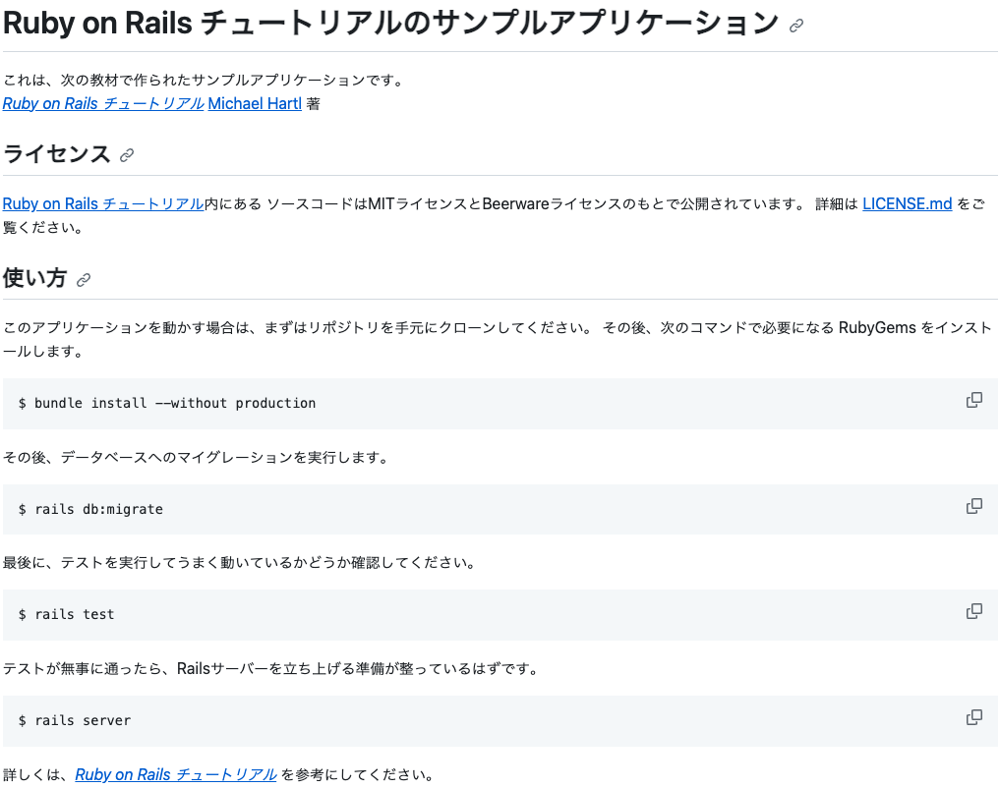

2. 本番環境 (Heroku) のルートURLにアクセスして、デプロイが成功したかどうか確かめてみてください。
    - Heroku使っていないので未対応

3. Fooというコントローラを生成し、その中にbarとbazアクションを追加してみてください。
    - 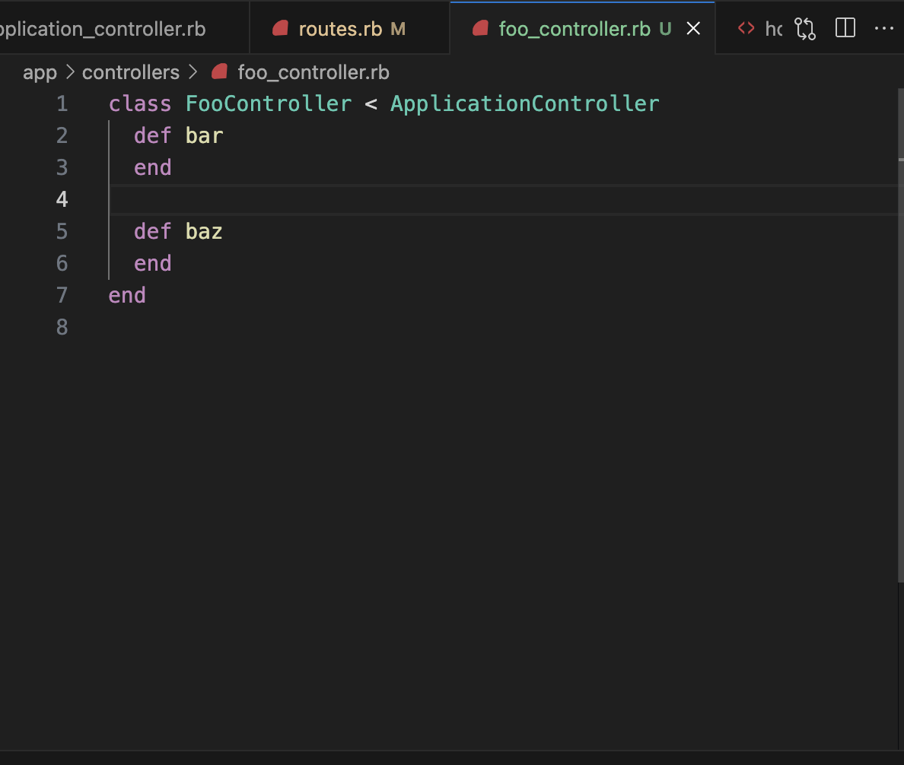

4. コラム 3.1で紹介したテクニックを駆使して、Fooコントローラとそれに関連するアクションを削除してみてください。
    - 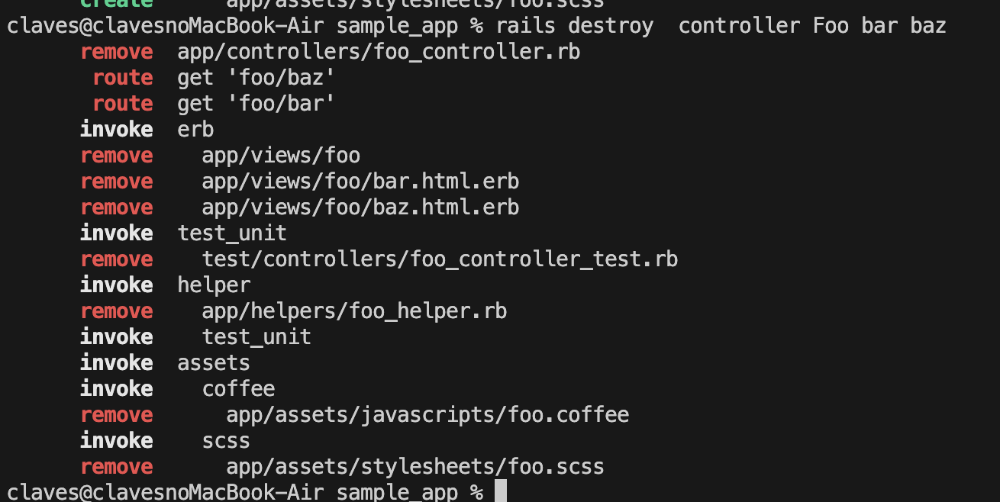

5. サンプルアプリケーションにContact (問い合わせ先) ページを作成してください16 (ヒント: まずはリスト 3.15を参考にして、/static_pages/contactというURLのページに「Contact | Ruby on Rails Tutorial Sample App」というタイトルが存在するかどうかを確認するテストを最初に作成しましょう。次に、3.3.3でAboutページを作ったときのと同じように、Contactページにもリスト 3.40のコンテンツを表示してみましょう。)。
    - 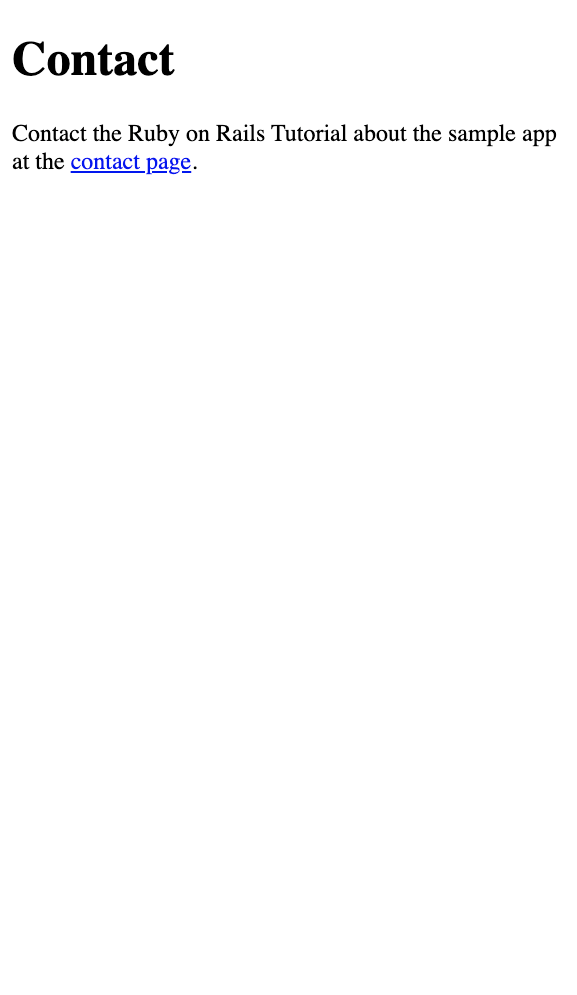

6. リスト 3.41にrootルーティングを追加したことで、root_urlというRailsヘルパーが使えるようになりました (以前、static_pages_home_urlが使えるようになったときと同じです)。リスト 3.42の（コードを書き込む）と記された部分を置き換えて、rootルーティングのテストを書いてみてください。
    - ```
        test "should get root" do
            get  root_url
            assert_response :success
        end
        ```

7. 実はリスト 3.41のコードを書いていたので、先ほどの課題のテストは既に green になっているはずです。このような場合、テストを変更する前から成功していたのか、変更した後に成功するようになったのか、判断が難しいです。リスト 3.41のコードがテスト結果に影響を与えていることを確認するため、リスト 3.43のようにrootルーティングをコメントアウトして見て、 red になるかどうか確かめてみましょう (なおRubyのコメント機能については4.2.1で説明します)。最後に、コメントアウトした箇所を元に戻し (すなわちリスト 3.41に戻し)、テストが green になることを確認してみましょう。
    - コメントアウト時
        - `4 runs, 3 assertions, 0 failures, 1 errors, 0 skips`
    - コメントアウト解除
        - `4 runs, 4 assertions, 0 failures, 0 errors, 0 skips`

# 第4章

## チェックシート
1. 配列とハッシュの違いはなんでしょうか？
以下の単語を用いて説明してください。
・インデックス
・並び順
    - 配列はインデックスによって要素の並び順が決まっているのに対して、ハッシュはキーと値のペアなので並び順はない

2. 文字列でのシングルクォートとダブルクォートの違いはなんでしょうか？
以下の単語を用いて説明してください。
・文字列
・特殊文字
    - 文字列において、シングルクォートは特殊文字をエスケープせず、そのままの文字列を返すのに対し、ダブルクォートは特殊文字を解釈する

3. クラスとインスタンスは、それぞれどのようなものでしょうか？
「メソッド」という単語を用いて説明してください。
    - クラスはメソッドなどを定義した設計図で、インスタンスはそのクラスに基づいて生成されたオブジェクト

4. カスタムヘルパーとは、どのような目的で作っているものでしょうか？
    - 繰り返し使われるロジックなどをモジュール化して、コードの保守性を高めたり、可読性を向上させる

## 演習
1. city変数に適当な市区町村を、prefecture変数に適当な都道府県を代入してください。
2. 先ほど作った変数と式展開を使って、「東京都 新宿区」のような住所の文字列を作ってみましょう。出力にはputsを使ってください。
3. 上記の文字列の間にある半角スペースをタブに置き換えてみてください。(ヒント: 改行文字と同じで、タブも特殊文字です)
4. タブに置き換えた文字列を、ダブルクォートからシングルクォートに置き換えてみるとどうなるでしょうか?
    - 

5. "racecar" の文字列の長さはいくつですか? lengthメソッドを使って調べてみてください。
 
6. reverseメソッドを使って、"racecar"の文字列を逆から読むとどうなるか調べてみてください。

7. 変数sに "racecar" を代入してください。その後、比較演算子 (==) を使って変数sとs.reverseの値が同じであるかどうか、調べてみてください。

8. リスト 4.9を実行すると、どんな結果になるでしょうか? 変数sに "onomatopoeia" という文字列を代入するとどうなるでしょうか? ヒント: 上矢印 (またはCtrl-Pコマンド) を使って以前に使ったコマンドを再利用すると一からコマンドを全部打ち込む必要がなくて便利ですよ。 
- 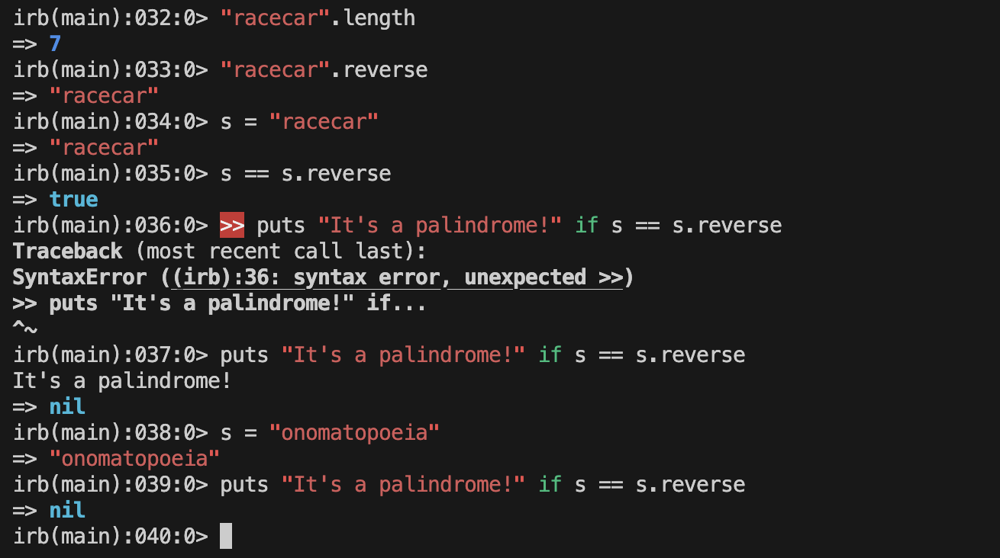

9. リスト 4.10の（コードを書き込む）の部分を適切なコードに置き換え、回文かどうかをチェックするメソッドを定義してみてください。ヒント: リスト 4.9の比較方法を参考にしてください。
    - ```
        def palindrome_tester(s)
            if s == s.reverse
                puts "It's a palindrome!"
            else
                puts "It's not a palindrome."
            end
        end
      ```

9. 上で定義したメソッドを使って “racecar” と “onomatopoeia” が回文かどうかを確かめてみてください。１つ目は回文である、２つ目は回文でない、という結果になれば成功です。
    - 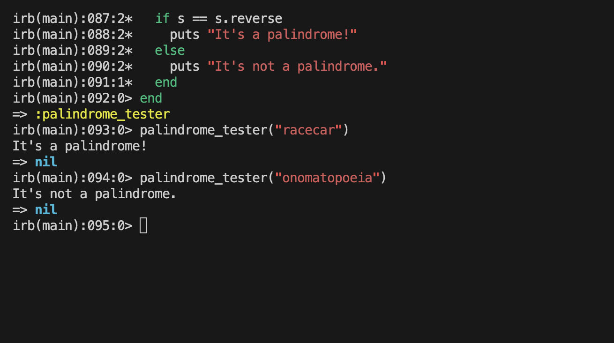

10. palindrome_tester("racecar")に対してnil?メソッドを呼び出し、戻り値がnilであるかどうかを確認してみてください (つまりnil?を呼び出した結果がtrueであることを確認してください)。このメソッドチェーンは、nil?メソッドがリスト 4.10の戻り値を受け取り、その結果を返しているという意味になります。
    - 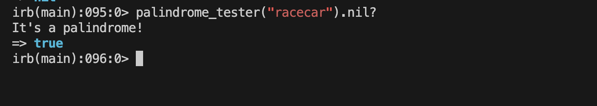

11. 文字列「A man, a plan, a canal, Panama」を ", " で分割して配列にし、変数aに代入してみてください。

12. 今度は、変数aの要素を連結した結果 (文字列) を、変数sに代入してみてください。

13. 変数sを半角スペースで分割した後、もう一度連結して文字列にしてください (ヒント: メソッドチェーンを使うと１行でもできます)。リスト 4.10で使った回文をチェックするメソッドを使って、(現状ではまだ) 変数sが回文ではないことを確認してください。downcaseメソッドを使って、s.downcaseは回文であることを確認してください。

14. aからzまでの範囲オブジェクトを作成し、7番目の要素を取り出してみてください。同様にして、後ろから７番目の要素を取り出してみてください。(ヒント: 範囲オブジェクトを配列に変換するのを忘れないでください)
    - 

15. 範囲オブジェクト0..16を使って、各要素の２乗を出力してください。
16. yeller (大声で叫ぶ) というメソッドを定義してください。このメソッドは、文字列の要素で構成された配列を受け取り、各要素を連結した後、大文字にして結果を返します。例えばyeller(['o', 'l', 'd'])と実行したとき、"OLD"という結果が返ってくれば成功です。ヒント: mapとupcaseとjoinメソッドを使ってみましょう。
17. random_subdomainというメソッドを定義してください。このメソッドはランダムな8文字を生成し、文字列として返します。ヒント: サブドメインを作るときに使ったRubyコードをメソッド化したものです。
18. リスト 4.12の「?」の部分を、それぞれ適切なメソッドに置き換えてみてください。ヒント:split、shuffle、joinメソッドを組み合わせると、メソッドに渡された文字列 (引数) をシャッフルさせることができます。
    - 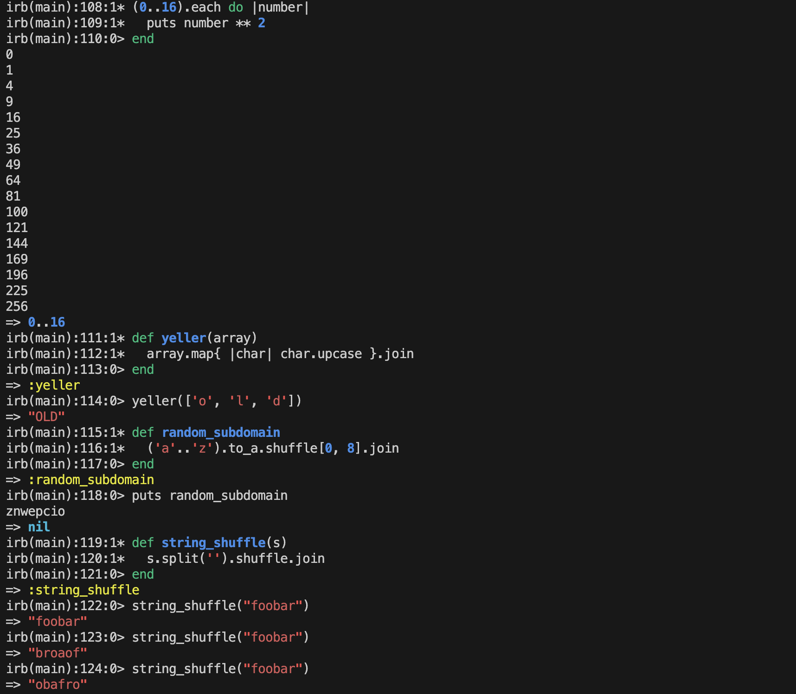

19. キーが'one'、'two'、'three'となっていて、それぞれの値が'uno'、'dos'、'tres'となっているハッシュを作ってみてください。その後、ハッシュの各要素をみて、それぞれのキーと値を"'#{key}'はスペイン語で'#{value}'"といった形で出力してみてください。

20. person1、person2、person3という３つのハッシュを作成し、それぞれのハッシュに:firstと:lastキーを追加し、適当な値 (名前など) を入力してください。その後、次のようなparamsというハッシュのハッシュを作ってみてください。1.) キーparams[:father]の値にperson1を代入、2). キーparams[:mother]の値にperson2を代入、3). キーparams[:child]の値にperson3を代入。最後に、ハッシュのハッシュを調べていき、正しい値になっているか確かめてみてください。(例えばparams[:father][:first]がperson1[:first]と一致しているか確かめてみてください)
    - 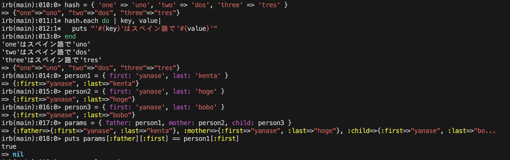

21. userというハッシュを定義してみてください。このハッシュは３つのキー:name、:email、:password_digestを持っていて、それぞれの値にあなたの名前、あなたのメールアドレス、そして16文字からなるランダムな文字列が代入されています。
    - ```
        user = { 
            irb(main):025:1*   name: 'yanase', 
            irb(main):026:1*   email: 'yanase@example.com', 
            irb(main):027:1*   password_digest: SecureRandom.hex(8) # 16文字のランダムな文字列
            irb(main):028:0> }
            => {:name=>"yanase", :email=>"yanase@example.com", :password_digest=>"4cc01ed4105c0516"}
      ```

22. Ruby API (訳注: もしくはるりまサーチ) を使って、Hashクラスのmergeメソッドについて調べてみてください。次のコードを実行せずに、どのような結果が返ってくるか推測できますか? 推測できたら、実際にコードを実行して推測があっていたか確認してみましょう。
    - { "a" => 100, "b" => 300}

23. 1から10の範囲オブジェクトを生成するリテラルコンストラクタは何でしたか? (復習です)
    - (1..10)

24. 今度はRangeクラスとnewメソッドを使って、1から10の範囲オブジェクトを作ってみてください。ヒント: newメソッドに2つの引数を渡す必要があります
    - range = Range.new(1, 10)

25. 比較演算子==を使って、上記２つの課題で作ったそれぞれのオブジェクトが同じであることを確認してみてください。
    - 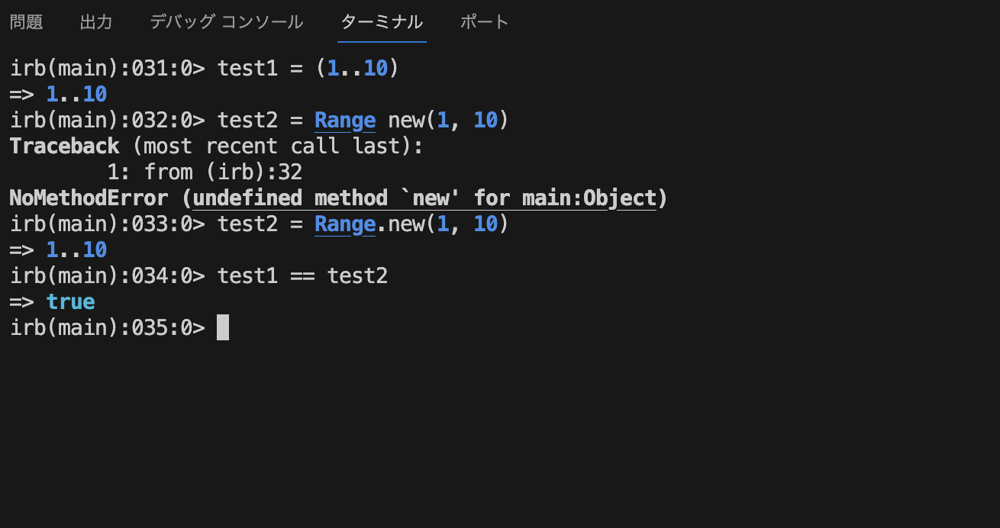

26. Rangeクラスの継承階層を調べてみてください。同様にして、HashとSymbolクラスの継承階層も調べてみてください。
    - ```
        irb(main):036:0> Range.superclass
            => Object
        irb(main):037:0> Object.superclass
            => BasicObject
        irb(main):038:0> BasicObject.superclass
            => nil
        irb(main):039:0> 
      ```

27. リスト 4.15にあるself.reverseのselfを省略し、reverseと書いてもうまく動くことを確認してみてください。
    - 

28. palindrome?メソッドを使って、“racecar”が回文であり、“onomatopoeia”が回文でないことを確認してみてください。南インドの言葉「Malayalam」は回文でしょうか? ヒント: downcaseメソッドで小文字にすることを忘れないで。

29. リスト 4.16を参考に、Stringクラスにshuffleメソッドを追加してみてください。ヒント: リスト 4.12も参考になります。

30. リスト 4.16のコードにおいて、self.を削除してもうまく動くことを確認してください。
    - 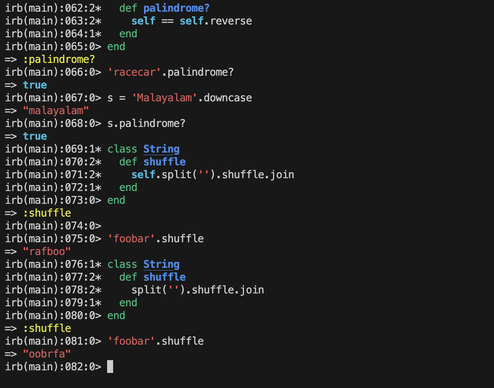

31. 第2章で作ったToyアプリケーションのディレクトリでRailsコンソールを開き、User.newと実行することでuserオブジェクトが生成できることを確認してみましょう。
32. 生成したuserオブジェクトのクラスの継承階層を調べてみてください。
    - 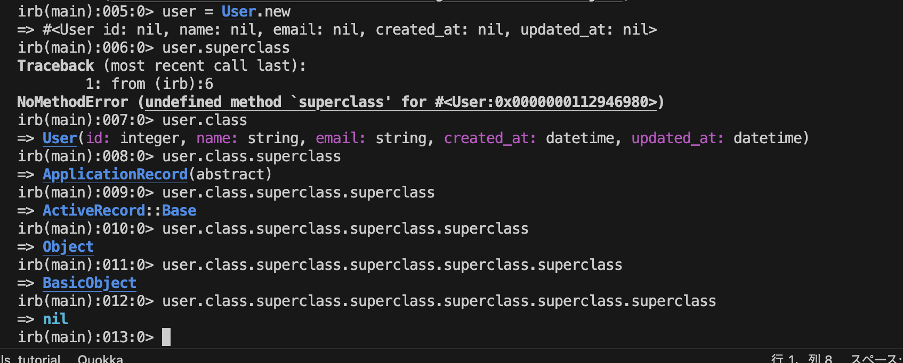

33. Userクラスで定義されているname属性を修正して、first_name属性とlast_name属性に分割してみましょう。また、それらの属性を使って "Michael Hartl" といった文字列を返すfull_nameメソッドを定義してみてください。最後に、formatted_emailメソッドの@nameの部分を、full_nameに置き換えてみましょう (元々の結果と同じになっていれば成功です)
34. "Hartl, Michael" といったフォーマット (苗字と名前がカンマ+半角スペースで区切られている文字列) で返すalphabetical_nameメソッドを定義してみましょう。
35. full_name.splitとalphabetical_name.split(', ').reverseの結果を比較し、同じ結果になるかどうか確認してみましょう。
    - 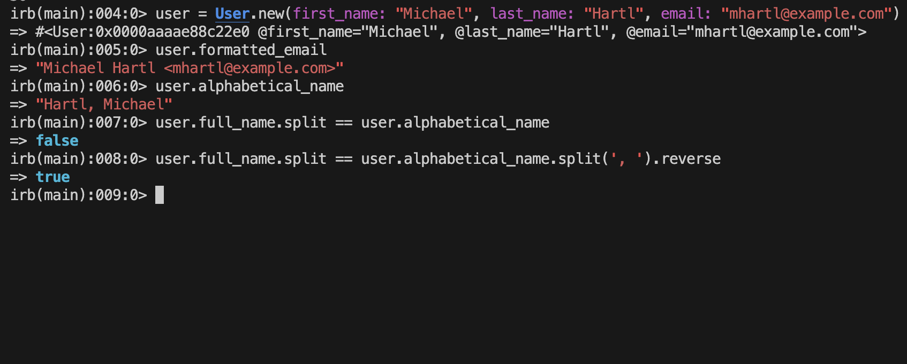


# 第5章
## チェックシート
1. パーシャルにはどのようなメリットがあるでしょうか？
    - 同じコードを繰り返し書く必要がなくなる
    - 可読性や保守性の向上に繋がる
2. Asset Pipelineにはどのような役割があるでしょうか？
    - 開発環境と本番環境という、2つの異なった状況に対してそれぞれ最高の環境を提供してくれる
    - 最大のメリットの1つは、本番のアプリケーションで効率的になるように最適化されたアセットも自動的に生成されること
    - 
3. SCSSを使用するとどのようなメリットがあるでしょうか？以下の単語を用いて説明してください。
・ネスト
・変数
    - スタイルシート内で変数を利用することができ、ネストによって親子関係を直感的に表現することができる


## 演習
1. Webページと言ったらネコ画像、というぐらいにはWebにはネコ画像が溢れていますよね。リスト 5.4のコマンドを使って、図 5.3のネコ画像をダウンロードしてきましょう8 。
2. mvコマンドを使って、ダウンロードしたkitten.jpgファイルを適切なアセットディレクトリに移動してください (参考: 5.2.1)。
    - 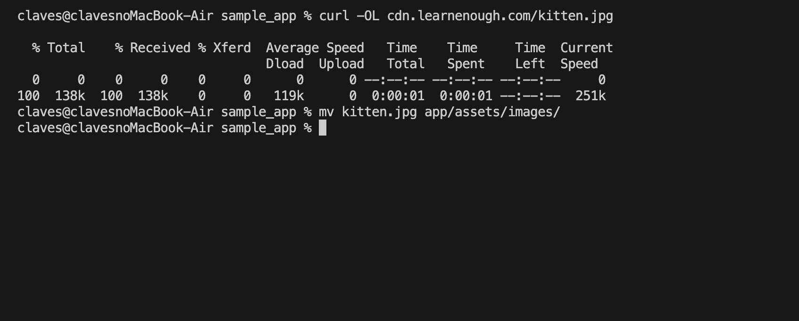

3. image_tagを使って、kitten.jpg画像を表示してみてください
    - 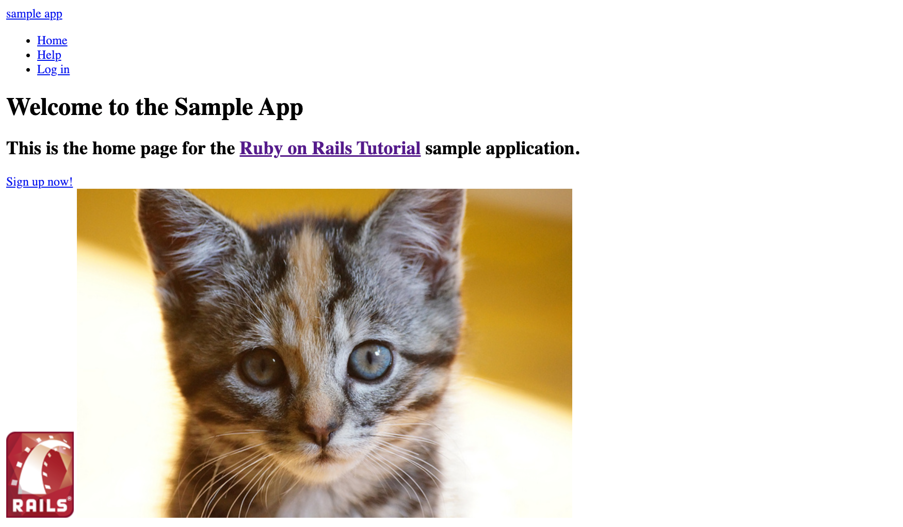

4. リスト 5.10を参考にして、5.1.1.1で使ったネコ画像をコメントアウトしてみてください。また、ブラウザのHTMLインスペクタ機能を使って、コメントアウトするとHTMLのソースからも消えていることを確認してみてください。
    - 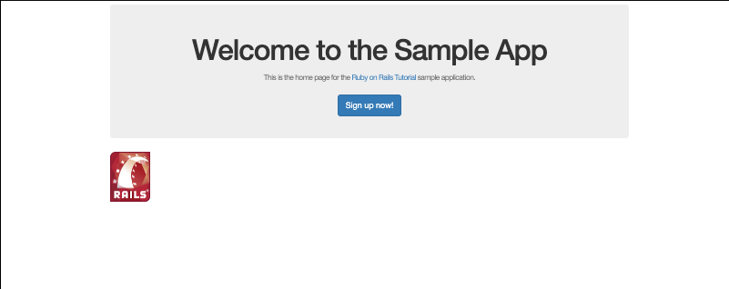

5. リスト 5.11のコードをcustom.scssに追加し、すべての画像を非表示にしてみてください。うまくいけば、Railsのロゴ画像がHomeページから消えるはずです。先ほどと同様にインスペクタ機能を使って、今度はHTMLのソースコードは残ったままで、画像だけが表示されなくなっていることを確認してみてください。
    - 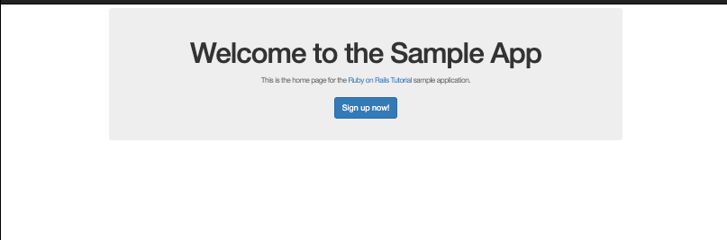

6. Railsがデフォルトで生成するheadタグの部分を、リスト 5.18のようにrenderに置き換えてみてください。ヒント: 単純に削除してしまうと後でパーシャルを１から書き直す必要が出てくるので、削除する前にどこかに退避しておきましょう。

7. リスト 5.18のようなパーシャルはまだ作っていないので、現時点ではテストは redになっているはずです。実際にテストを実行して確認してみましょう。
    - 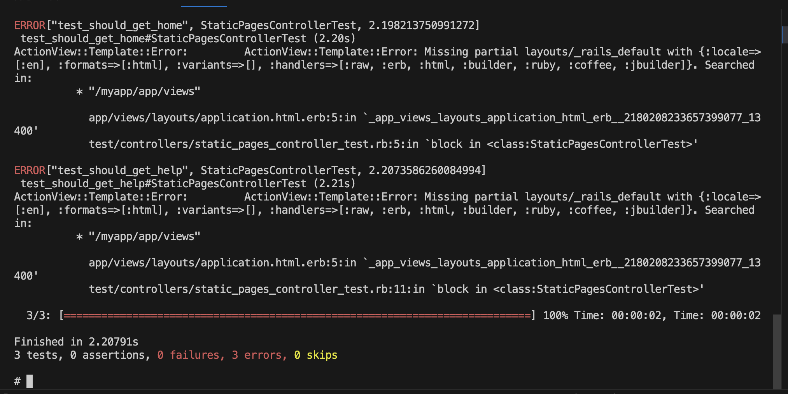
 
8. layoutsディレクトリにheadタグ用のパーシャルを作成し、先ほど退避しておいたコードを書き込み、最後にテストが green に戻ることを確認しましょう。
    - 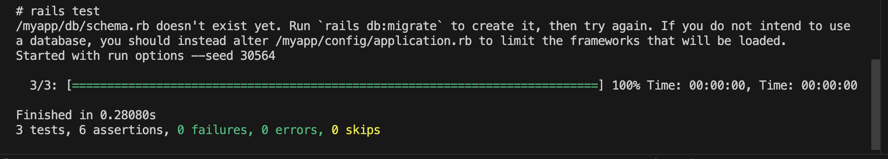

9. 5.2.2で提案したように、footerのCSSを手作業で変換してみましょう。具体的には、リスト 5.17の内容を１つずつ変換していき、リスト 5.20のようにしてみてください。
    -  ```
        footer {
            margin-top: 45px;
            padding-top: 5px;
            border-top: 1px solid $gray-medium-light;
            color: $gray-light;
            a {
                color: $gray;
                &:hover {
                color: $gray-darker;
                }
            }
            small {
                float: left;
            }
            ul {
                float: right;
                list-style: none;
                li {
                float: left;
                margin-left: 15px;
                }
            }
        }
     ```

10. 実は名前付きルートは、as:オプションを使って変更することができます。有名なFar Sideの漫画に倣って、Helpページの名前付きルートをhelfに変更してみてください (リスト 5.29)。
    - ```
        Rails.application.routes.draw do
            root 'static_pages#home'
            get  '/help',    to: 'static_pages#help', as: :helf
            get  '/about',   to: 'static_pages#about'
            get  '/contact', to: 'static_pages#contact'
        end
      ```

11. 先ほどの変更により、テストが redになっていることを確認してください。リスト 5.28を参考にルーティングを更新して、テストを greenにして見てください。
    - ```
        // static_pages_controller_test.rb

        test "should get help" do
            get helf_path
            assert_response :success
            assert_select "title", "Help | Ruby on Rails Tutorial Sample App"
        end
      ```

12. エディタのUndo機能を使って、今回の演習で行った変更を元に戻して見てください。
    - 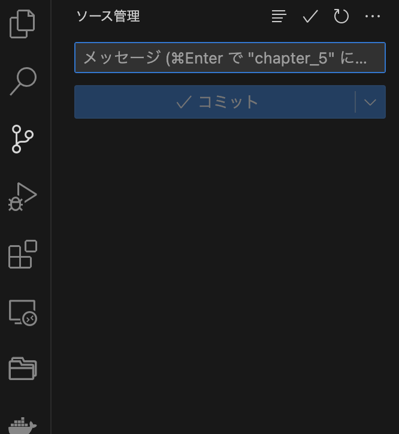

13. リスト 5.29のようにhelfルーティングを作成し、レイアウトのリンクを更新してみてください。
    - [変更コミット](https://github.com/yanase-kenta0505/rails_tutorial_sample_app/commit/ab0e7755d2374bcfec211ec4475ea8edc1c2178a)

14. 前回の演習と同様に、エディタのUndo機能を使ってこの演習で行った変更を元に戻してみてください。
    - [変更を戻すコミット](https://github.com/yanase-kenta0505/rails_tutorial_sample_app/commit/2f16e6efdcba1272d39b969b558936f3b9985473)

15. footerパーシャルのabout_pathをcontact_pathに変更してみて、テストが正しくエラーを捕まえてくれるかどうか確認してみてください。
    - 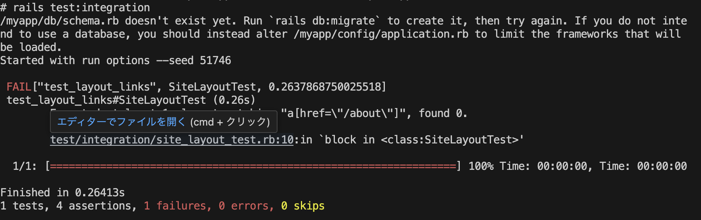

16. リスト 5.35で示すように、Applicationヘルパーで使っているfull_titleヘルパーを、test環境でも使えるようにすると便利です。こうしておくと、リスト 5.36のようなコードを使って、正しいタイトルをテストすることができます。ただし、これは完璧なテストではありません。例えばベースタイトルに「Ruby on Rails Tutoial」といった誤字があったとしても、このテストでは発見することができないでしょう。この問題を解決するためには、full_titleヘルパーに対するテストを書く必要があります。そこで、Applicationヘルパーをテストするファイルを作成し、リスト 5.37の（コードを書き込む）の部分を適切なコードに置き換えてみてください。ヒント: リスト 5.37ではassert_equal <期待される値>, <実際の値>といった形で使っていましたが、内部では==演算子で期待される値と実際の値を比較し、正しいかどうかのテストをしています。
    - [演習対応](https://github.com/yanase-kenta0505/rails_tutorial_sample_app/commit/29cfaea06ac2ff9affa056961378c38a5538ebc3)

17. 表 5.1を参考にしながらリスト 5.41を変更し、users_new_urlではなくsignup_pathを使えるようにしてみてください。
    - ```
        // users_controller_test.rb

        class UsersControllerTest < ActionDispatch::IntegrationTest
            test "should get new" do
                get signup_path
                assert_response :success
            end
        end
      ```

18. 先ほどの変更を加えたことにより、テストが redになったことを確認してください。なお、この演習はテスト駆動開発 (コラム 3.3) で説明した red/green のリズムを作ることを目的としています。このテストは次の5.4.2で greenになるよう修正します。
    - 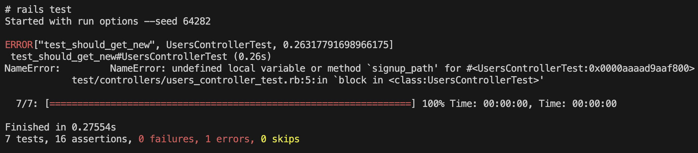

19. もしまだ5.4.1.1の演習に取り掛かっていなければ、まずはリスト 5.41のように変更し、名前付きルートsignup_pathを使えるようにしてください。また、リスト 5.43で名前付きルートが使えるようになったので、現時点でテストが greenになっていることを確認してください。
    - 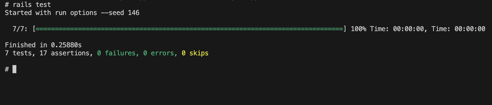

20. 先ほどのテストが正しく動いていることを確認するため、signupルートの部分をコメントアウトし、テスト redになることを確認してください。確認できたら、コメントアウトを解除して greenの状態に戻してください。
    - 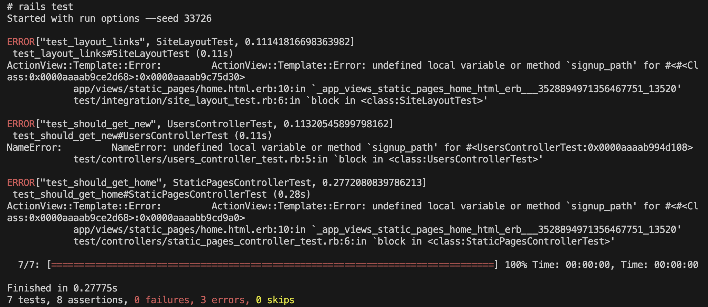

21. リスト 5.32の統合テストにsignupページにアクセスするコードを追加してください (getメソッドを使います)。コードを追加したら実際にテストを実行し、結果が正しいことを確認してください。ヒント: リスト 5.36で紹介したfull_titleヘルパーを使ってみてください。
    - 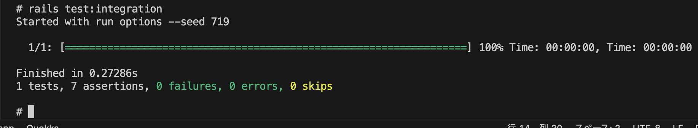

# 第6章
## チェックシ-ト
1. 今回の章で追加した各バリデーションは、どのような目的があったでしょうか？
    - presence: true（空でないことの確認）
    - length: { minimum: 6 }（最小文字数）
    - uniqueness（一意性）
2. Userのパスワードを保存する際にした工夫とは、どういうものだったでしょうか？「ハッシュ化」という単語を用いて説明してください。
    - Userのパスワードを保存する際の工夫は、「ハッシュ化」というプロセスを使用することです。ハッシュ化は、任意の長さの入力データを取り、ランダムな文字列（ハッシュ）に変換するプロセスです。
3. データベースにインデックスを追加するメリットはなんでしょうか？
以下の単語を用いて説明して下さい。
・検索効率
・一意性
    - 検索効率が向上し、一意性が保証されるので、データの重複を防げる
4. 今回の章の変更で、Userモデルはどのような構造になったでしょうか？
    - バリデーションやパスワード、インデックスなどが追加された。
    - より堅牢でセキュリティが強化された構造になった。

## 演習
1. Railsはdb/ディレクトリの中にあるschema.rbというファイルを使っています。これはデータベースの構造 (スキーマ (schema) と呼びます) を追跡するために使われます。さて、あなたの環境にあるdb/schema.rbの内容を調べ、その内容とマイグレーションファイル (リスト 6.2) の内容を比べてみてください。
    - 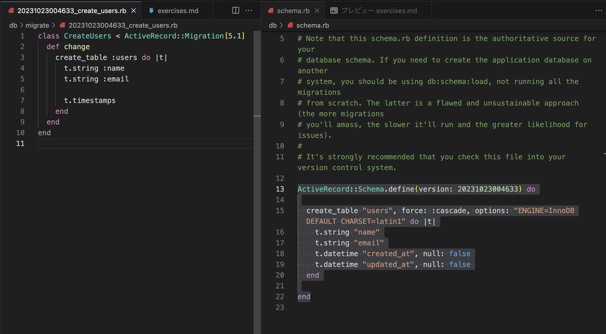

2. ほぼすべてのマイグレーションは、元に戻すことが可能です (少なくとも本チュートリアルにおいてはすべてのマイグレーションを元に戻すことができます)。元に戻すことを「ロールバック (rollback)と呼び、Railsではdb:rollbackというコマンドで実現できます。
  $ rails db:rollback
上のコマンドを実行後、db/schema.rbの内容を調べてみて、ロールバックが成功したかどうか確認してみてください (コラム 3.1ではマイグレーションに関する他のテクニックもまとめているので、参考にしてみてください)。上のコマンドでは、データベースからusersテーブルを削除するためにdrop_tableコマンドを内部で呼び出しています。これがうまくいくのは、drop_tableとcreate_tableがそれぞれ対応していることをchangeメソッドが知っているからです。この対応関係を知っているため、ロールバック用の逆方向のマイグレーションを簡単に実現することができるのです。なお、あるカラムを削除するような不可逆なマイグレーションの場合は、changeメソッドの代わりに、upとdownのメソッドを別々に定義する必要があります。詳細については、Railsガイドの「Active Record マイグレーション」を参照してください。
    - 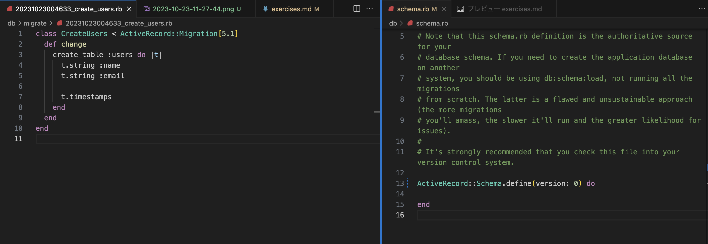

3. もう一度rails db:migrateコマンドを実行し、db/schema.rbの内容が元に戻ったことを確認してください。
    - 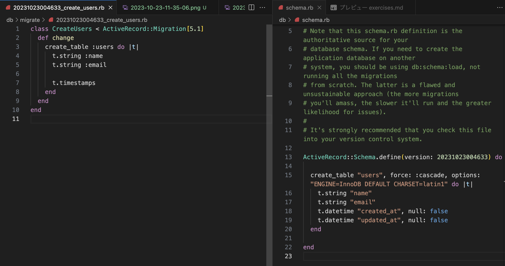

4. Railsコンソールを開き、User.newでUserクラスのオブジェクトが生成されること、そしてそのオブジェクトがApplicationRecordを継承していることを確認してみてください (ヒント: 4.4.4で紹介したテクニックを使ってみてください)。
    - 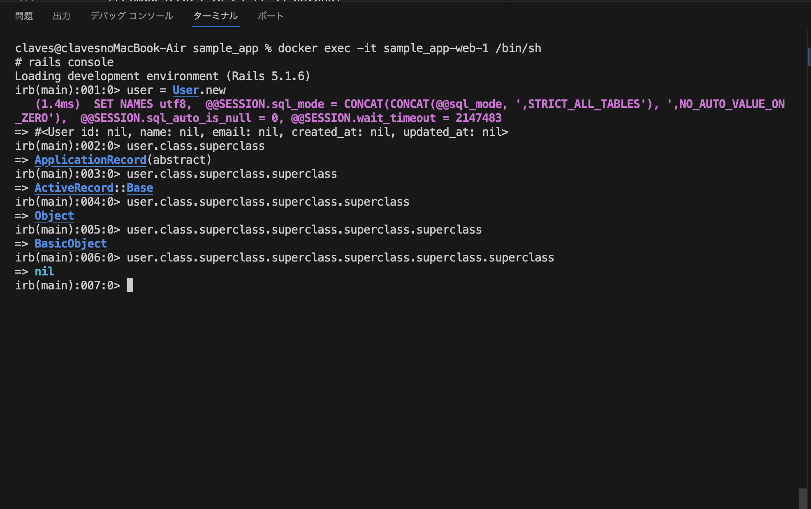

5. 同様にして、ApplicationRecordがActiveRecord::Baseを継承していることについて確認してみてください。
    - 

6. user.nameとuser.emailが、どちらもStringクラスのインスタンスであることを確認してみてください。
    - 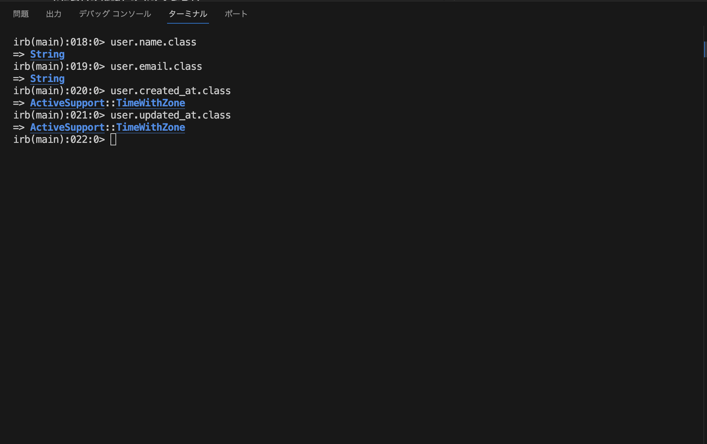

7. created_atとupdated_atは、どのクラスのインスタンスでしょうか?
    - 

8. nameを使ってユーザーオブジェクトを検索してみてください。また、 find_by_nameメソッドが使えることも確認してみてください (古いRailsアプリケーションでは、古いタイプのfind_byをよく見かけることでしょう)。
    - 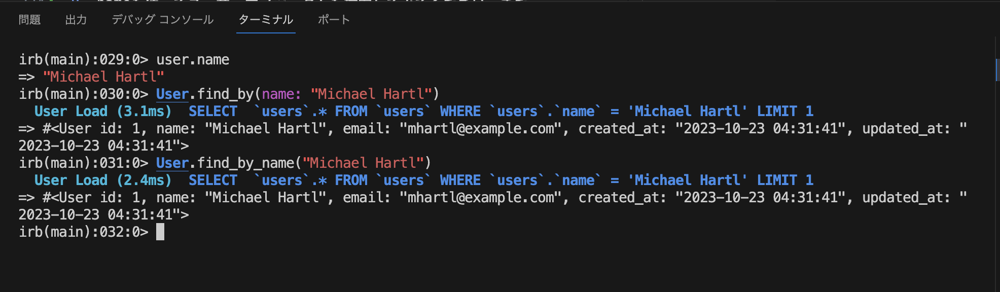

9. 実用的な目的のため、User.allはまるで配列のように扱うことができますが、実際には配列ではありません。User.allで生成されるオブジェクトを調べ、ArrayクラスではなくUser::ActiveRecord_Relationクラスであることを確認してみてください。
    - 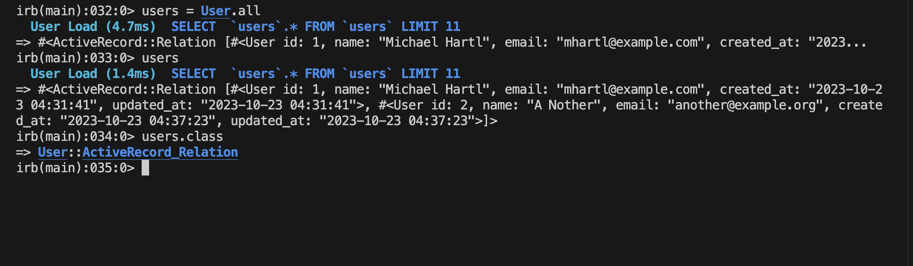

10. User.allに対してlengthメソッドを呼び出すと、その長さを求められることを確認してみてください (4.2.3)。Rubyの性質として、そのクラスを詳しく知らなくてもなんとなくオブジェクトをどう扱えば良いかわかる、という性質があります。これをダックタイピング (duck typing) と呼び、よく次のような格言で言い表されています「もしアヒルのような容姿で、アヒルのように鳴くのであれば、それはもうアヒルだろう」。
    - 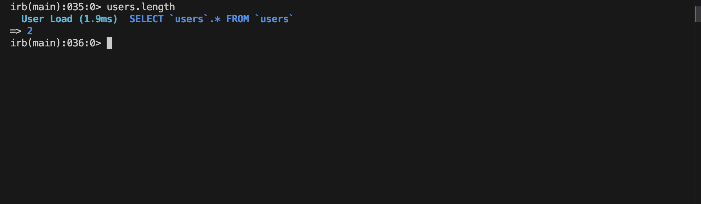

11. userオブジェクトへの代入を使ってname属性を使って更新し、saveで保存してみてください。
    - 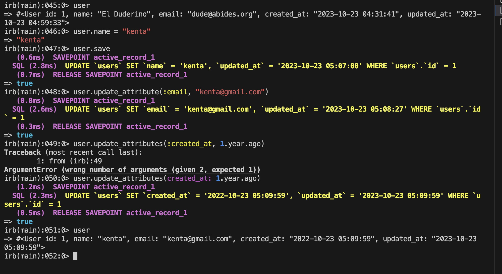

12. 今度はupdate_attributesを使って、email属性を更新および保存してみてください。
    - 

13. 同様にして、マジックカラムであるcreated_atも直接更新できることを確認してみてください。ヒント: 更新するときは「1.year.ago」を使うと便利です。これはRails流の時間指定の１つで、現在の時刻から１年前の時間を算出してくれます。
    - 

14. コンソールから、新しく生成したuserオブジェクトが有効 (valid) であることを確認してみましょう。
15. 6.1.3で生成したuserオブジェクトも有効であるかどうか、確認してみましょう。
    - 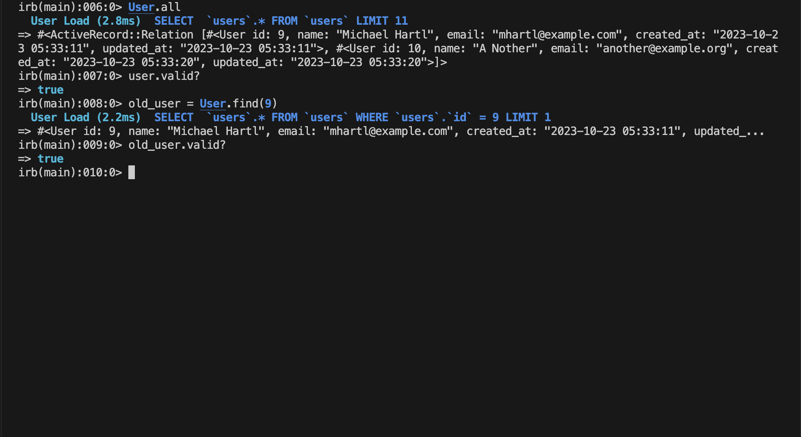

16. 新しいユーザーuを作成し、作成した時点では有効ではない (invalid) ことを確認してください。なぜ有効ではないのでしょうか? エラーメッセージを確認してみましょう。

17. u.errors.messagesを実行すると、ハッシュ形式でエラーが取得できることを確認してください。emailに関するエラー情報だけを取得したい場合、どうやって取得すれば良いでしょうか?
    - 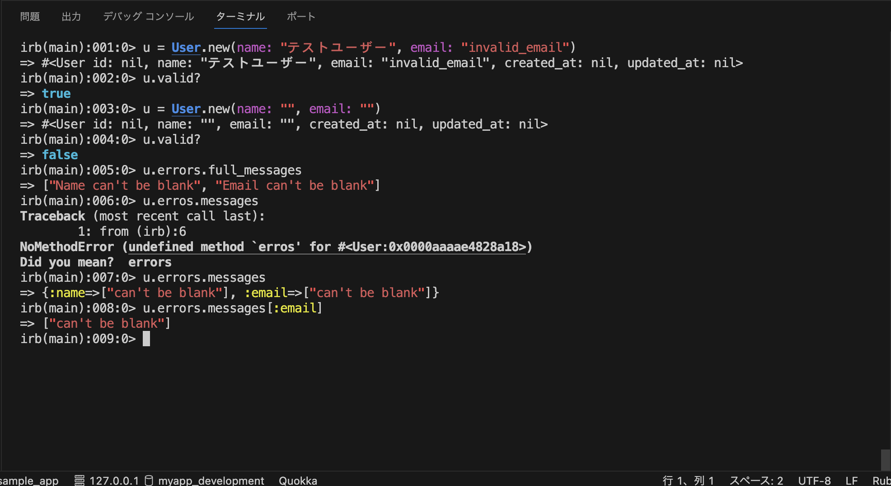

18. 長すぎるnameとemail属性を持ったuserオブジェクトを生成し、有効でないことを確認してみましょう。
19. 長さに関するバリデーションが失敗した時、どんなエラーメッセージが生成されるでしょうか? 確認してみてください。
    - 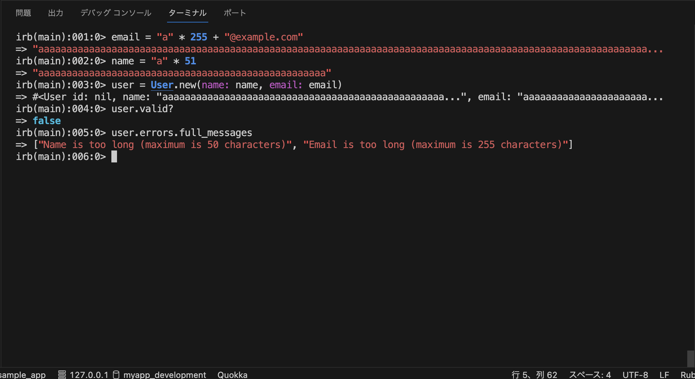

20. リスト 6.18にある有効なメールアドレスのリストと、リスト 6.19にある無効なメールアドレスのリストをRubularのYour test string:に転記してみてください。その後、リスト 6.21の正規表現をYour regular expression:に転記して、有効なメールアドレスのみがすべてマッチし、無効なメールアドレスはすべてマッチしないことを確認してみましょう。
    - 

21. 先ほど触れたように、リスト 6.21のメールアドレスチェックする正規表現は、foo@bar..comのようにドットが連続した無効なメールアドレスを許容してしまいます。まずは、このメールアドレスをリスト 6.19の無効なメールアドレスリストに追加し、これによってテストが失敗することを確認してください。次に、リスト 6.23で示した、少し複雑な正規表現を使ってこのテストがパスすることを確認してください。
     - 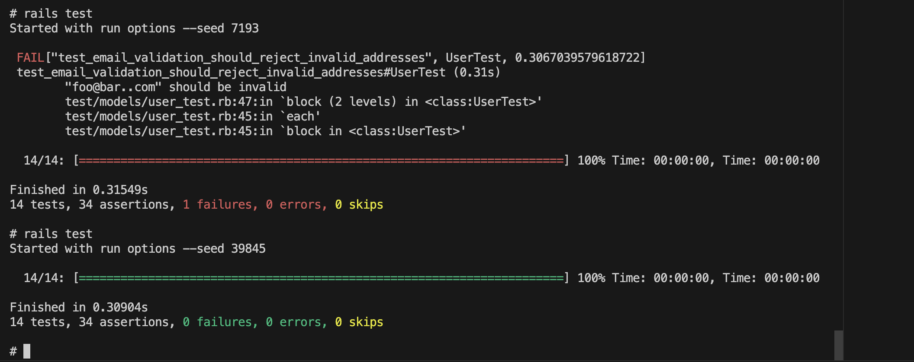

22. foo@bar..comをRubularのメールアドレスのリストに追加し、リスト 6.23の正規表現をRubularで使ってみてください。有効なメールアドレスのみがすべてマッチし、無効なメールアドレスはすべてマッチしないことを確認してみましょう。
    - 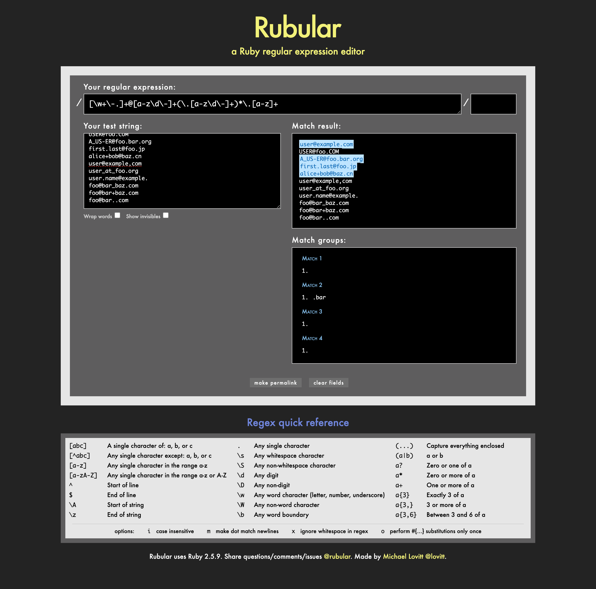

23. リスト 6.33のように、メールアドレスを小文字にするテストをリスト 6.26に追加してみましょう。ちなみに追加するテストコードでは、データベースの値に合わせて更新するreloadメソッドと、値が一致しているかどうか確認するassert_equalメソッドを使っています。リスト 6.33のテストがうまく動いているか確認するためにも、before_saveの行をコメントアウトして redになることを、また、コメントアウトを解除すると greenになることを確認してみましょう。
    - 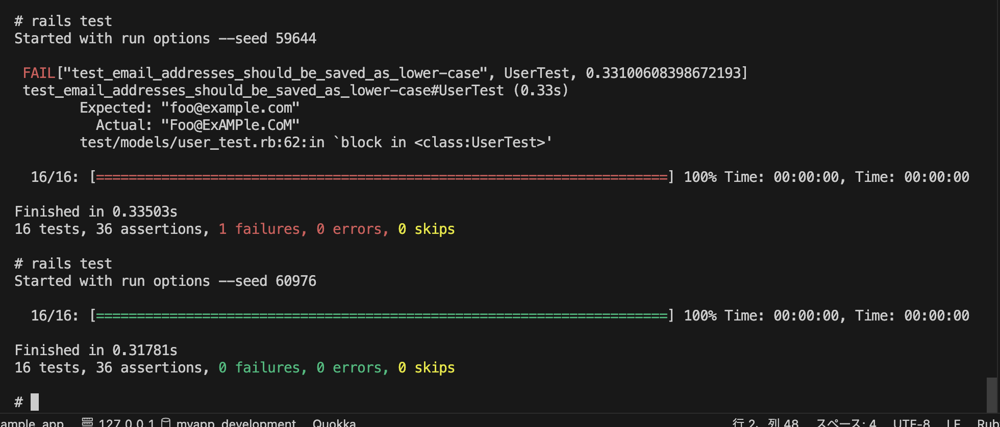

24. テストスイートの実行結果を確認しながら、before_saveコールバックをemail.downcase!に書き換えてみましょう。ヒント: メソッドの末尾に!を付け足すことにより、email属性を直接変更できるようになります (リスト 6.34)。
    - ```
        class User < ApplicationRecord
            before_save { email.downcase! }
            validates :name, presence: true
            validates :email, presence: true
            validates :name, presence: true, length: { maximum: 50 }
            VALID_EMAIL_REGEX = /\A[\w+\-.]+@[a-z\d\-]+(\.[a-z\d\-]+)*\.[a-z]+\z/i
            validates :email, presence: true, length: { maximum: 255 },
            format: { with: VALID_EMAIL_REGEX },
            uniqueness: { case_sensitive: false }
        end
      ```

25. この時点では、userオブジェクトに有効な名前とメールアドレスを与えても、valid?で失敗してしまうことを確認してみてください。
26. なぜ失敗してしまうのでしょうか? エラーメッセージを確認してみてください。
    - 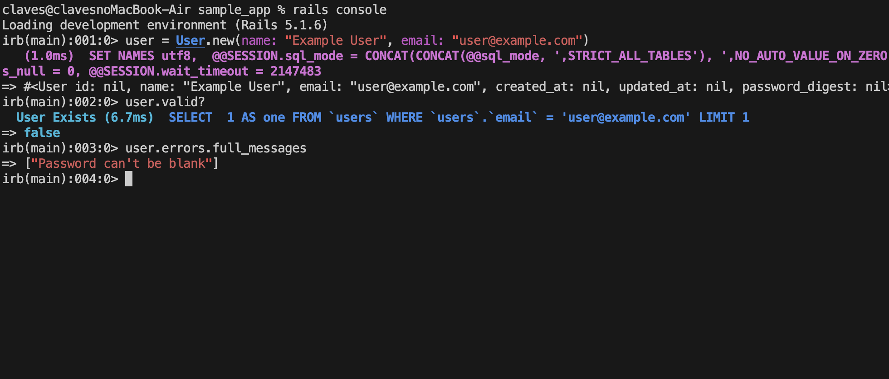

27. 有効な名前とメールアドレスでも、パスワードが短すぎるとuserオブジェクトが有効にならないことを確認してみましょう。
28. 上で失敗した時、どんなエラーメッセージになるでしょうか? 確認してみましょう。
    - 

29. コンソールを一度再起動して (userオブジェクトを消去して)、このセクションで作ったuserオブジェクトを検索してみてください。
30. オブジェクトが検索できたら、名前を新しい文字列に置き換え、saveメソッドで更新してみてください。うまくいきませんね...、なぜうまくいかなかったのでしょうか?
31. 今度は6.1.5で紹介したテクニックを使って、userの名前を更新してみてください。
    - 

# 第7章
## チェックシート
1. Railsではデフォルトで3つの環境が用意されていますが、この「環境」とは何を目的に用意されているものでしょうか？
    - development
        - 開発を手助けするようにデバックが容易になるるように設定されている
    - test
        - テストを実行するため
        - テスト実行の速度が優先され、テストデータベースはテストのたびにリセットされることが一般的
    - production
        - 実際にユーザーが使用する際の設定が適用される
2. Strong Parametersはどのような目的で使用するものでしょうか？
    - マスアサインメントの脆弱性を防ぐために使用される。
    不正なユーザーがフォームを通じて送信されたデータを操作し、許可されていない属性を変更するのを防ぐ。
    開発者は許可されたパラメータのみを明示的に指定することで、セキュリティを強化できる。
3. flashとflash.nowの違いはなんでしょうか？以下の単語を用いて説明してください。
・アクション
・データ
    - flashは一度設定すると次のアクションが完了するまで持続する。成功やエラーメッセージを表示するときに使われる
    - 一方flash.nowは現在のアクションのみで使用され、データは次のアクションには持続しない。

## 演習
1. ブラウザから /about にアクセスし、デバッグ情報が表示されていることを確認してください。このページを表示するとき、どのコントローラとアクションが使われていたでしょうか? paramsの内容から確認してみましょう。
    - コントローラ
        - static_pages
    - アクション
        - about

2. Railsコンソールを開き、データベースから最初のユーザー情報を取得し、変数userに格納してください。その後、puts user.attributes.to_yamlを実行すると何が表示されますか? ここで表示された結果と、yメソッドを使ったy user.attributesの実行結果を比較してみましょう。
    - 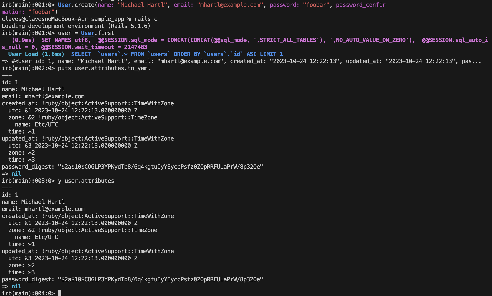

3. 埋め込みRubyを使って、マジックカラム (created_atとupdated_at) の値をshowページに表示してみましょう (リスト 7.4)。
4. 埋め込みRubyを使って、Time.nowの結果をshowページに表示してみましょう。ページを更新すると、その結果はどう変わっていますか? 確認してみてください。
    - 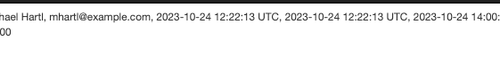
5. showアクションの中にdebuggerを差し込み (リスト 7.6)、ブラウザから /users/1 にアクセスしてみましょう。その後コンソールに移り、putsメソッドを使ってparamsハッシュの中身をYAML形式で表示してみましょう。ヒント: 7.1.1.1の演習を参考にしてください。その演習ではdebugメソッドで表示したデバッグ情報を、どのようにしてYAML形式で表示していたでしょうか?
    - 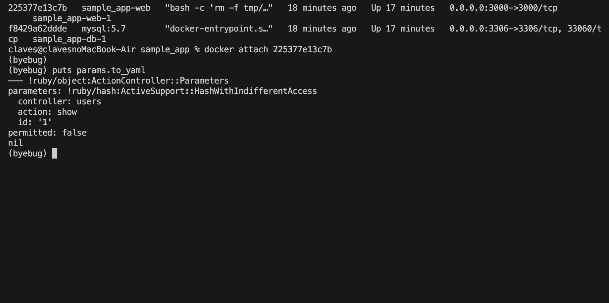
6. newアクションの中にdebuggerを差し込み、/users/new にアクセスしてみましょう。@userの内容はどのようになっているでしょうか? 確認してみてください。
    - 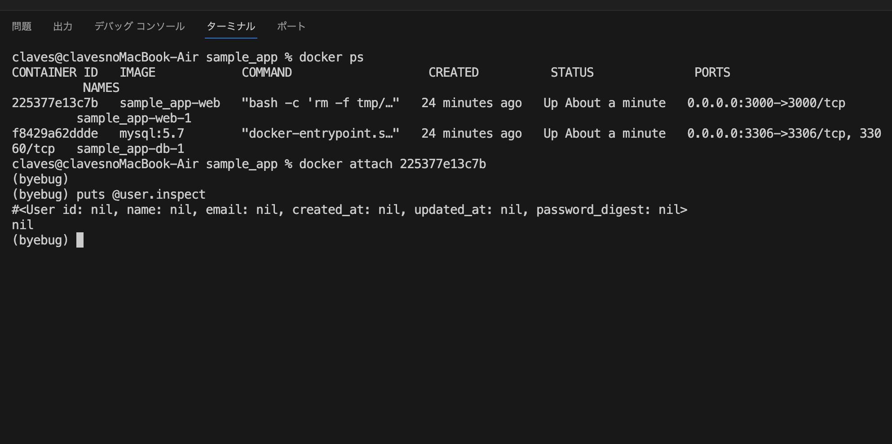

7. (任意) Gravatar上にアカウントを作成し、あなたのメールアドレスと適当な画像を紐付けてみてください。メールアドレスをMD5ハッシュ化して、紐付けた画像がちゃんと表示されるかどうか試してみましょう。
    - 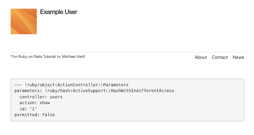

8. 7.1.4で定義したgravatar_forヘルパーをリスト 7.12のように変更して、sizeをオプション引数として受け取れるようにしてみましょう。うまく変更できると、gravatar_for user, size: 50といった呼び出し方ができるようになります。重要: この改善したヘルパーは10.3.1で実際に使います。忘れずに実装しておきましょう。
    - 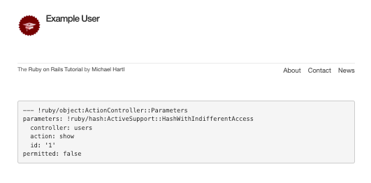

9. オプション引数は今でもRubyコミュニティで一般的に使われていますが、Ruby 2.0から導入された新機能「キーワード引数 (Keyword Arguments)」でも実現することができます。先ほど変更したリスト 7.12を、リスト 7.13のように置き換えてもうまく動くことを確認してみましょう。この２つの実装方法はどういった違いがあるのでしょうか? 考えてみてください。
    - 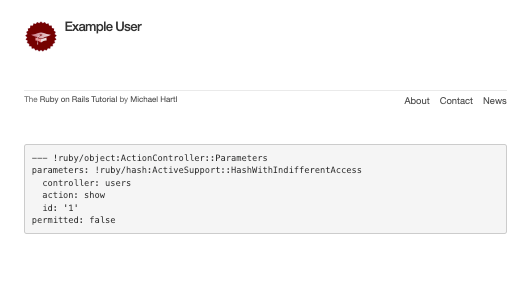

10. 試しに、リスト 7.15にある:nameを:nomeに置き換えてみましょう。どんなエラーメッセージが表示されるようになりますか?
    - 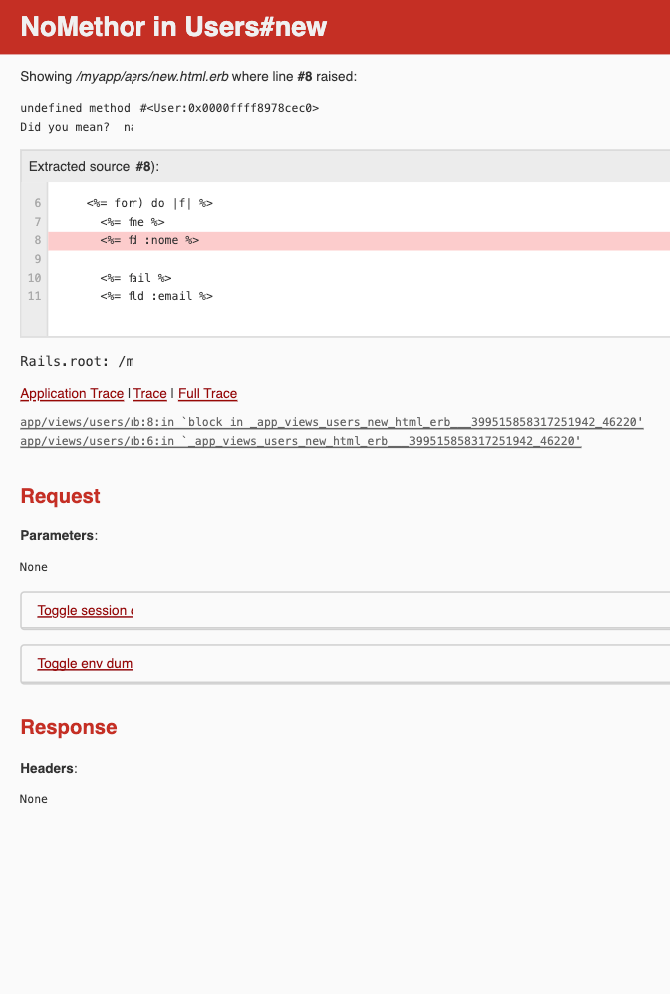

11. 試しに、ブロックの変数fをすべてfoobarに置き換えてみて、結果が変わらないことを確認してみてください。確かに結果は変わりませんが、変数名をfoobarとするのはあまり良い変更ではなさそうですね。その理由について考えてみてください。
    - 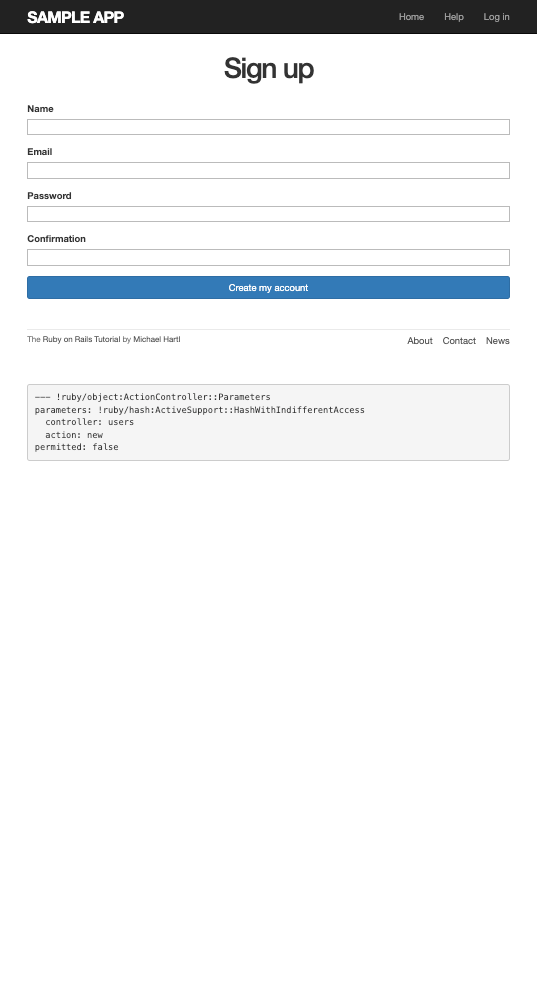
    - fはフォームビルダーオブジェクトを指す慣習的な変数名であり、多くのRails開発者がこの慣習に従っています。
    一方、foobarは具体的な意味を持たないため、コードを読む他の開発者にとってはわかりにくくなります。

12. 『HTML編』ではHTMLをすべて手動で書き起こしていますが、なぜformタグを使わなかったのでしょうか? 理由を考えてみてください。
    - Railsではヘルパーメソッドを使用することが推奨されているから

13. /signup?admin=1 にアクセスし、paramsの中にadmin属性が含まれていることをデバッグ情報から確認してみましょう。
    - 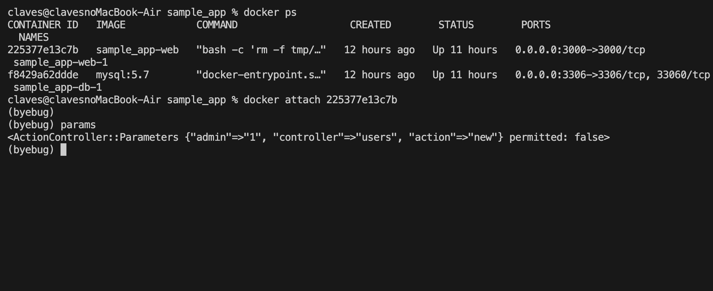

14. 最小文字数を5に変更すると、エラーメッセージも自動的に更新されることを確かめてみましょう。
    - 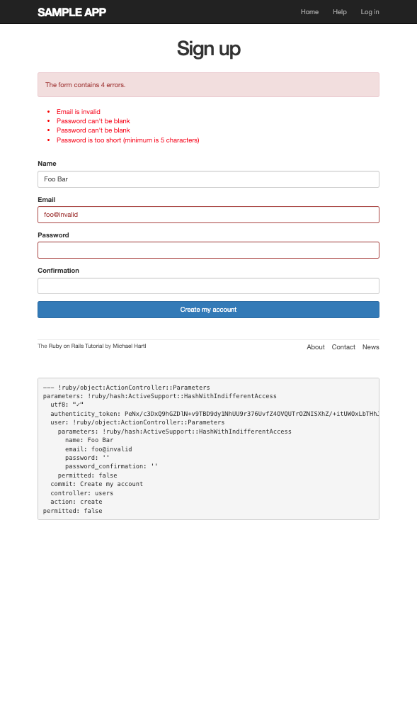

15. 未送信のユーザー登録フォーム (図 7.12) のURLと、送信済みのユーザー登録フォーム (図 7.18) のURLを比べてみましょう。なぜURLは違っているのでしょうか? 考えてみてください。
    - 未送信
        - /signup
    - 送信済み
        - /users
    - 新しいユーザーを作成するためのフォームを表示するアクションはnewアクション（GETリクエスト）であり、実際に作成するアクションはcreateアクション（POSTリクエスト）であるためURLが異なる

16. リスト 7.20で実装したエラーメッセージに対するテストを書いてみてください。どのくらい細かくテストするかはお任せします。リスト 7.25にテンプレートを用意しておいたので、参考にしてください。
    - ```
        require 'test_helper'

        class UsersSignupTest < ActionDispatch::IntegrationTest

        test "invalid signup information" do
            get signup_path
            assert_no_difference 'User.count' do
            post users_path, params: { user: { name:  "",
                                                email: "user@invalid",
                                                password:              "foo",
                                                password_confirmation: "bar" } }
            end
            assert_template 'users/new'
            assert_select 'div#<CSS id for error explanation>'
            assert_select 'div.<CSS class for field with error>'
        end

        test "email should be valid format" do
            get signup_path
            assert_no_difference 'User.count' do
            post users_path, params: { user: { name:  "Example User",
                                                email: "user@invalid,com",
                                                password:              "password123",
                                                password_confirmation: "password123" } }
            end
            assert_template 'users/new'
            assert_select 'div#error_explanation'
            assert_select 'div.field_with_errors', text: "Email is invalid"
        end

        test "email should be valid format" do
            get signup_path
            assert_no_difference 'User.count' do
            post users_path, params: { user: { name:  "Example User",
                                                email: "user@invalid,com",
                                                password:              "password123",
                                                password_confirmation: "password123" } }
            end
            assert_template 'users/new'
            assert_select 'div#error_explanation'
            assert_select 'div.field_with_errors', text: "Email is invalid"
        end

        test "password should be at least 6 characters" do
            get signup_path
            assert_no_difference 'User.count' do
            post users_path, params: { user: { name:  "Example User",
                                                email: "user@example.com",
                                                password:              "pass",
                                                password_confirmation: "pass" } }
            end
            assert_template 'users/new'
            assert_select 'div#error_explanation'
            assert_select 'div.field_with_errors', text: "Password is too short (minimum is 6 characters)"
        end
        
        end

      ```

17. ユーザー登録フォームのURLは /signup ですが、無効なユーザー登録データを送付するとURLが /users に変わってしまいます。これはリスト 5.43で追加した名前付きルート (/signup) と、RESTfulなルーティング (リスト 7.3) のデフォルト設定との差異によって生じた結果です。リスト 7.26とリスト 7.27の内容を参考に、この問題を解決してみてください。うまくいけばどちらのURLも /signup になるはずです。あれ、でもテストは greenのままになっていますね...、なぜでしょうか? (考えてみてください)
    - テストがURLの変更を検知していないから
18. リスト 7.25のpost部分を変更して、先ほどの演習課題で作った新しいURL (/signup) に合わせてみましょう。また、テストが greenのままになっている点も確認してください。
    - 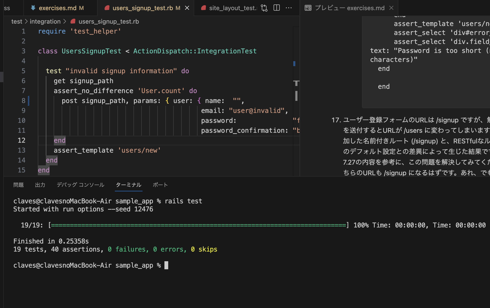
19. リスト 7.27のフォームを以前の状態 (リスト 7.20) に戻してみて、テストがやはり greenになっていることを確認してください。これは問題です! なぜなら、現在postが送信されているURLは正しくないのですから。assert_selectを使ったテストをリスト 7.25に追加し、このバグを検知できるようにしてみましょう (テストを追加して redになれば成功です)。その後、変更後のフォーム (リスト 7.27) に戻してみて、テストが green になることを確認してみましょう。ヒント: フォームから送信してテストするのではなく、'form[action="/signup"]'という部分が存在するかどうかに着目してテストしてみましょう。
    - 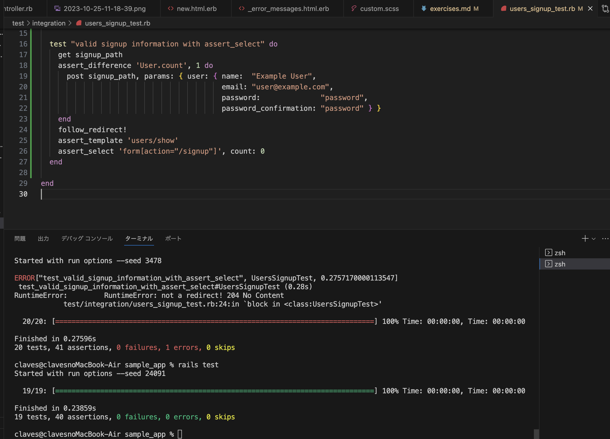

20. 有効な情報を送信し、ユーザーが実際に作成されたことを、Railsコンソールを使って確認してみましょう。
    - 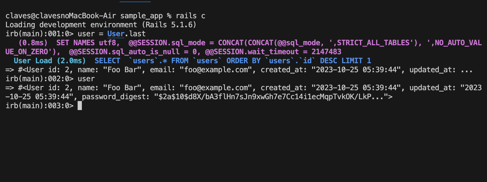

21. リスト 7.28を更新し、redirect_to user_url(@user)とredirect_to @userが同じ結果になることを確認してみましょう。
    - 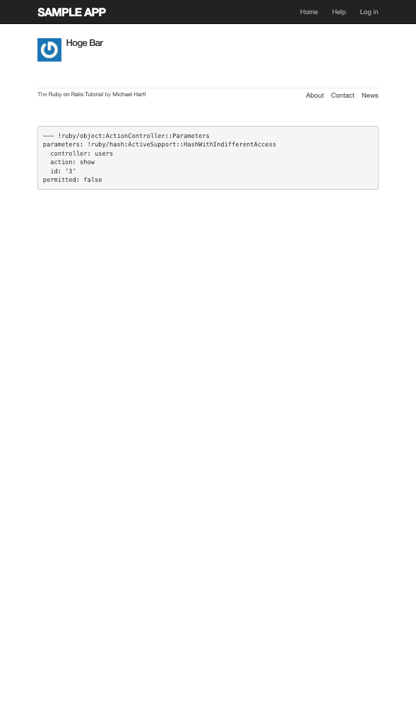

22. コンソールに移り、文字列内の式展開 (4.2.2) でシンボルを呼び出してみましょう。例えば"#{:success}"といったコードを実行すると、どんな値が返ってきますか? 確認してみてください。
    - ```
        irb(main):009:0> puts "#{:success}"
        success
        => nil
        irb(main):010:0> 
      ```

23. 先ほどの演習で試した結果を参考に、リスト 7.30のflashはどのような結果になるか考えてみてください。
    - ```
        irb(main):012:1* flash.each do |key, value|
        irb(main):013:1*   puts "#{key}"
        irb(main):014:1*   puts "#{value}"
        irb(main):015:0> end
        success
        It worked!
        danger
        It failed.
        => {:success=>"It worked!", :danger=>"It failed."}
        irb(main):016:0> puts "#{:flash}"
        flash
        => nil
      ```

24. Railsコンソールを使って、新しいユーザーが本当に作成されたのかもう一度チェックしてみましょう。結果は、リスト 7.32のようになるはずです。
    - ```
        user = User.first
        (1.0ms)  SET NAMES utf8,  @@SESSION.sql_mode = CONCAT(CONCAT(@@sql_mode, ',STRICT_ALL_TABLES'), ',NO_AUTO_VALUE_ON_ZERO'),  @@SESSION.sql_auto_is_null = 0, @@SESSION.wait_timeout = 2147483
        User Load (0.9ms)  SELECT  `users`.* FROM `users` ORDER BY `users`.`id` ASC LIMIT 1
        => #<User id: 1, name: "Rails Tutorial", email: "example@railstutorial.org", created_at: "2023-10-25 06:25:14", updated_at: "2023-10-25 06:25:...
        irb(main):002:0> user
        => #<User id: 1, name: "Rails Tutorial", email: "example@railstutorial.org", created_at: "2023-10-25 06:25:14", updated_at: "2023-10-25 06:25:14", password_digest: "$2a$10$e4699Wb1ouSEJrmJGQ4gXe/oIUS63s1jC8nLpCTlYOb...">
      ``` 

25. 自分のメールアドレスでユーザー登録を試してみましょう。既にGravatarに登録している場合、適切な画像が表示されているか確認してみてください。
    - 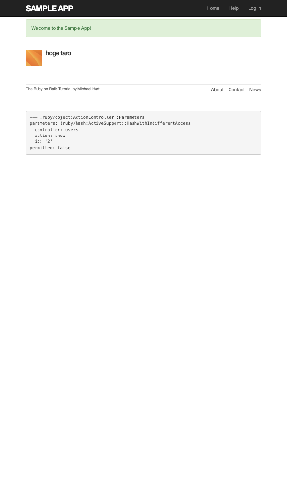

26. 7.4.2で実装したflashに対するテストを書いてみてください。どのくらい細かくテストするかはお任せします。リスト 7.34に最小限のテンプレートを用意しておいたので、参考にしてください (（コードを書き込む）の部分を適切なコードに置き換えると完成します)。ちなみに、テキストに対するテストは壊れやすいです。文量の少ないflashのキーであっても、それは同じです。筆者の場合、flashが空でないかをテストするだけの場合が多いです。
    - ```
        test "valid signup information" do
            get signup_path
            assert_difference 'User.count', 1 do
            post users_path, params: { user: { name:  "Example User",
                                                email: "user@example.com",
                                                password:              "password",
                                                password_confirmation: "password" } }
            end
            follow_redirect!
            assert_template 'users/show'
            assert_not flash.empty?
        end
      ```

27. 本文中でも指摘しましたが、flash用のHTML (リスト 7.31) は読みにくいです。より読みやすくしたリスト 7.35のコードに変更してみましょう。変更が終わったらテストスイートを実行し、正常に動作することを確認してください。なお、このコードでは、Railsのcontent_tagというヘルパーを使っています。
    - 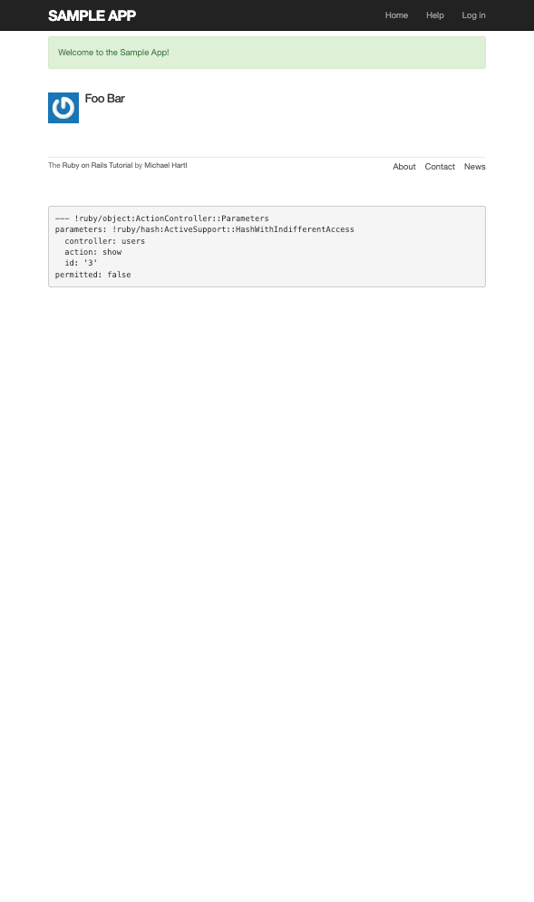

28. リスト 7.28のリダイレクトの行をコメントアウトすると、テストが失敗することを確認してみましょう。
    - 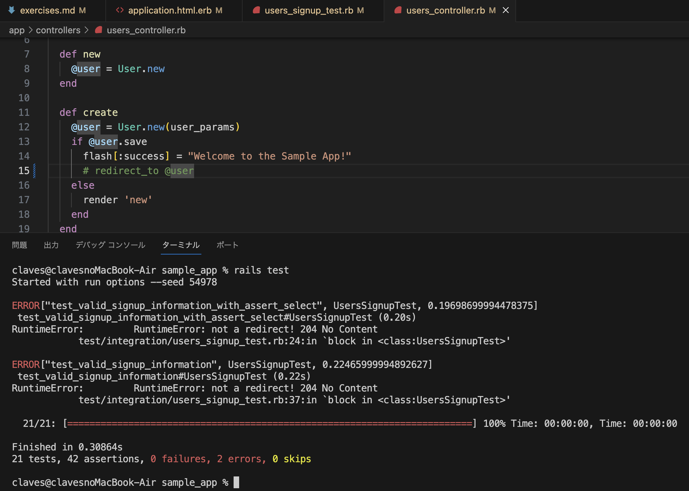

29. リスト 7.28で、@user.saveの部分をfalseに置き換えたとしましょう (バグを埋め込んでしまったと仮定してください)。このとき、assert_differenceのテストではどのようにしてこのバグを検知するでしょうか? テストコードを追って考えてみてください。
    - @user.saveをfalseに置き換えると、ユーザーは保存されない。User.countが増加しないため、assert_differenceの期待値と実際の値が一致しないことになり、バグを検知する

30. ブラウザから本番環境 (Heroku) にアクセスし、SSLの鍵マークがかかっているか、URLがhttpsになっているかどうかを確認してみましょう。
    - Herokuを使わないので飛ばす
31. 本番環境でユーザーを作成してみましょう。Gravatarの画像は正しく表示されているでしょうか?
    - Herokuを使わないので飛ばす


# 第8章
## チェックシート
1. HTTPはステートレスなプロトコルですが、ステートレスとはどのような意味でしょうか？
「リクエスト」という単語を用いて説明して下さい
    - HTTPプロトコルが各リクエストを独立したものとして扱う性質を指す。
    一度のリクエストとそのレスポンスが完了すると、サーバーはそのリクエストに関する情報を保持しない。
2. セッションとはどのようなものでしょうか？
    - サーバーはユーザーごとにセッションIDを生成し、これを使ってユーザーの状態やデータをサーバー上に保存する。
    ユーザーはセッションIDをクッキーとしてブラウザに保存し、次回のリクエスト時にこのセッションIDをサーバーに送信することで、サーバーはユーザーを識別し、以前の状態を復元できる。
3. cookiesとはどのようなものでしょうか？
以下の観点で説明して下さい。
・どこに保存されているデータか？
・有効期限について
    - cookiesはブラウザに保存するデータ
    - cookiesには有効期限があり、期限がキレると自動的に削除される
4. RailsのSessionリソースはどのようにすると破棄されますか？
    - 開発者ツールで手動削除する
    - ブラウザを再起動する  
## 演習
1. GET login_pathとPOST login_pathとの違いを説明できますか? 少し考えてみましょう。
    - GET
        - ログインフォームを入力するためのページをブラウザに表示する
    - POST
        - 入力されたログイン情報をサーバーに送信し、認証を行う
2. ターミナルのパイプ機能を使ってrails routesの実行結果とgrepコマンドを繋ぐことで、Usersリソースに関するルーティングだけを表示させることができます。同様にして、Sessionsリソースに関する結果だけを表示させてみましょう。現在、いくつのSessionsリソースがあるでしょうか? ヒント: パイプやgrepの使い方が分からない場合は 『コマンドライン編』の 「grepで検索する」を参考にしてみてください。
    - ```
        claves@clavesnoMacBook-Air sample_app % rails routes | grep session
        login  GET    /login(.:format)          sessions#new
               POST   /login(.:format)          sessions#create
        logout DELETE /logout(.:format)         sessions#destroy
      ```
3. リスト 8.4で定義したフォームで送信すると、Sessionsコントローラのcreateアクションに到達します。Railsはこれをどうやって実現しているでしょうか? 考えてみてください。ヒント:表 8.1とリスト 8.5の１行目に注目してください。
    - loginというパスに対してcreateアクションを割り当てています。具体的には、post 'login', to: 'sessions#create'というルーティングが定義されています。

4. Railsコンソールを使って、表 8.2のそれぞれの式が合っているか確かめてみましょう. まずはuser = nilの場合を、次にuser = User.firstとした場合を確かめてみてください。ヒント: 必ず論理値オブジェクトとなるように、4.2.3で紹介した!!のテクニックを使ってみましょう。例: !!(user && user.authenticate('foobar'))
    - 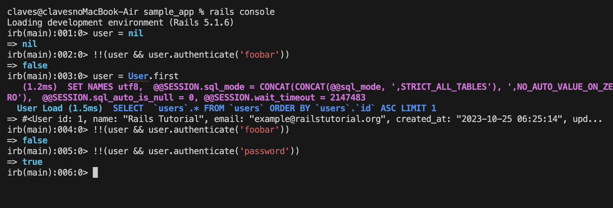

5. 8.1.4の処理の流れが正しく動いているかどうか、ブラウザで確認してみてください。特に、flashがうまく機能しているかどうか、フラッシュメッセージの表示後に違うページに移動することを忘れないでください。
    - https://www.loom.com/share/31ea8d6c8e314e1f872a7c400ffe1dbf?sid=93e59172-a663-4c4f-905e-b0490c0fbc4d


6. 有効なユーザーで実際にログインし、ブラウザからcookiesの情報を調べてみてください。このとき、sessionの値はどうなっているでしょうか? ヒント: ブラウザでcookiesを調べる方法が分からない? 今こそググってみるときです! (コラム 1.2)
    - エンコードされた文字列になっている

7. 先ほどの演習課題と同様に、Expires（有効期限）の値について調べてみてください。
    - 2024-11-28T00:47:13.878Z

8. Railsコンソールを使って、User.find_by(id: ...)で対応するユーザーが検索に引っかからなかったとき、nilを返すことを確認してみましょう。
9. 先ほどと同様に、今度は:user_idキーを持つsessionハッシュを作成してみましょう。リスト 8.17に記したステップに従って、||=演算子がうまく動くことも確認してみましょう。
    - 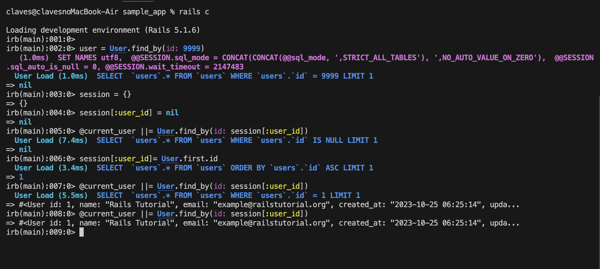

10. ブラウザのcookieインスペクタ機能を使って (8.2.1.1)、セッション用のcookieを削除してみてください。ヘッダー部分にあるリンクは非ログイン状態のものになっているでしょうか? 確認してみましょう。
11. もう一度ログインしてみて、ヘッダーのレイアウトが変わったことを確認してみましょう。その後、ブラウザを再起動させ、再び非ログイン状態に戻ったことも確認してみてください。注意: もしブラウザの [閉じたときの状態に戻す] 機能をオンにしていると、セッション情報も復元される可能性があります。もしその機能をオンにしている場合、忘れずにオフにしておきましょう (コラム 1.2)。
    - 

12. 試しにSessionヘルパーのlogged_in?メソッドから!を削除してみて、リスト 8.23が redになることを確認してみましょう。
13. 先ほど削除した部分 (!) を元に戻して、テストが greenに戻ることを確認してみましょう。
    - 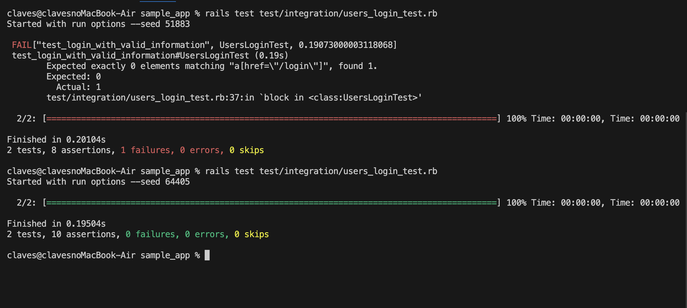

14. リスト 8.25のlog_inの行をコメントアウトすると、テストスイートは red になるでしょうか? それとも green になるでしょうか? 確認してみましょう。
    - red

15. 現在使っているテキストエディタの機能を使って、リスト 8.25をまとめてコメントアウトできないか調べてみましょう。また、コメントアウトの前後でテストスイートを実行し、コメントアウトすると red に、コメントアウトを元に戻すと green になることを確認してみましょう。ヒント: コメントアウト後にファイルを保存することを忘れないようにしましょう。また、テキストエディタのコメントアウト機能については『テキストエディタ編』の 「コメントアウト機能」などを参照してみてください。
    - 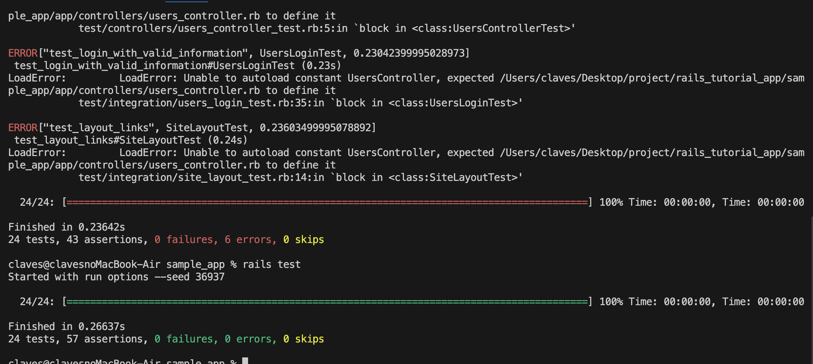

16. ブラウザから [Log out] リンクをクリックし、どんな変化が起こるか確認してみましょう。また、リスト 8.31で定義した３つのステップを実行してみて、うまく動いているかどうか確認してみましょう。
    - どんな変化が起こるか確認
        - ホームページにリダイレクトされる

17. cookiesの内容を調べてみて、ログアウト後にはsessionが正常に削除されていることを確認してみましょう。
    - 確認しました。


# 第9章
## チェックシート
## 演習
1. コンソールを開き、データベースにある最初のユーザーを変数userに代入してください。その後、そのuserオブジェクトからrememberメソッドがうまく動くかどうか確認してみましょう。また、remember_tokenとremember_digestの違いも確認してみてください。
    - ```sh
        irb(main):001:0> user = User.first
        (0.8ms)  SET NAMES utf8,  @@SESSION.sql_mode = CONCAT(CONCAT(@@sql_mode, ',STRICT_ALL_TABLES'), ',NO_AUTO_VALUE_ON_ZERO'),  @@SESSION.sql_auto_is_null = 0, @@SESSION.wait_timeout = 2147483
        User Load (0.5ms)  SELECT  `users`.* FROM `users` ORDER BY `users`.`id` ASC LIMIT 1
        => #<User id: 1, name: "Rails Tutorial", email: "example@railstutorial.org", created_at: "2023-10-25 06:25:14", updated_at: "2023-1...
        irb(main):002:0> user.remember
        (1.7ms)  BEGIN
        SQL (21.6ms)  UPDATE `users` SET `updated_at` = '2023-10-26 09:36:14', `remember_digest` = '$2a$10$uRoubNJ2vJfIdC/.q4ASe.C6ROropjuLsIqLpo/qRP0msEzJKtkJu' WHERE `users`.`id` = 1
        (2.4ms)  COMMIT
        => true
        irb(main):003:0> user.remember_token
        => "COU4iSpUNRS8092sLflDKw"
        irb(main):004:0> user.remember_digest
        => "$2a$10$uRoubNJ2vJfIdC/.q4ASe.C6ROropjuLsIqLpo/qRP0msEzJKtkJu"
        irb(main):005:0> 
      ```
    - remember_tokenは平文のトークン、remember_digestはハッシュ化されたダイジェスト

2. リスト 9.3では、明示的にUserクラスを呼び出すことで、新しいトークンやダイジェスト用のクラスメソッドを定義しました。実際、User.new_tokenやUser.digestを使って呼び出せるようになったので、おそらく最も明確なクラスメソッドの定義方法であると言えるでしょう。しかし実は、より「Ruby的に正しい」クラスメソッドの定義方法が２通りあります。1つはややわかりにくく、もう1つは非常に混乱するでしょう。テストスイートを実行して、ややわかりにくいリスト 9.4の実装でも、非常に混乱しやすいリスト 9.5の実装でも、いずれも正しく動くことを確認してみてください。ヒント: selfは、通常の文脈ではUser「モデル」、つまりユーザーオブジェクトのインスタンスを指しますが、リスト 9.4やリスト 9.5の文脈では、selfはUser「クラス」を指すことにご注意ください。わかりにくさの原因の一部はこの点にあります。
    - ```sh
        claves@clavesnoMacBook-Air sample_app % rails test

        Started with run options --seed 43093

        25/25: [=========================================================================================] 100% Time: 00:00:00, Time: 00:00:00

        Finished in 0.33003s
        25 tests, 69 assertions, 0 failures, 0 errors, 0 skips
      ```

3. ブラウザのcookieを調べ、ログイン後のブラウザではremember_tokenと暗号化されたuser_idがあることを確認してみましょう。
    - 確認しました

4. コンソールを開き、リスト 9.6のauthenticated?メソッドがうまく動くかどうか確かめてみましょう。
    - ```sh
        irb(main):002:0> user = User.first
        (1.0ms)  SET NAMES utf8,  @@SESSION.sql_mode = CONCAT(CONCAT(@@sql_mode, ',STRICT_ALL_TABLES'), ',NO_AUTO_VALUE_ON_ZERO'),  @@SESSION.sql_auto_is_null = 0, @@SESSION.wait_timeout = 2147483
        User Load (1.1ms)  SELECT  `users`.* FROM `users` ORDER BY `users`.`id` ASC LIMIT 1
        => #<User id: 1, name: "Rails Tutorial", email: "example@railstutorial.org", created_at: "2023-10-26 22:01...
        irb(main):003:0> user.authenticated?('5HYs7lmjd3U1QBm760UEMA')
        => true
      ```