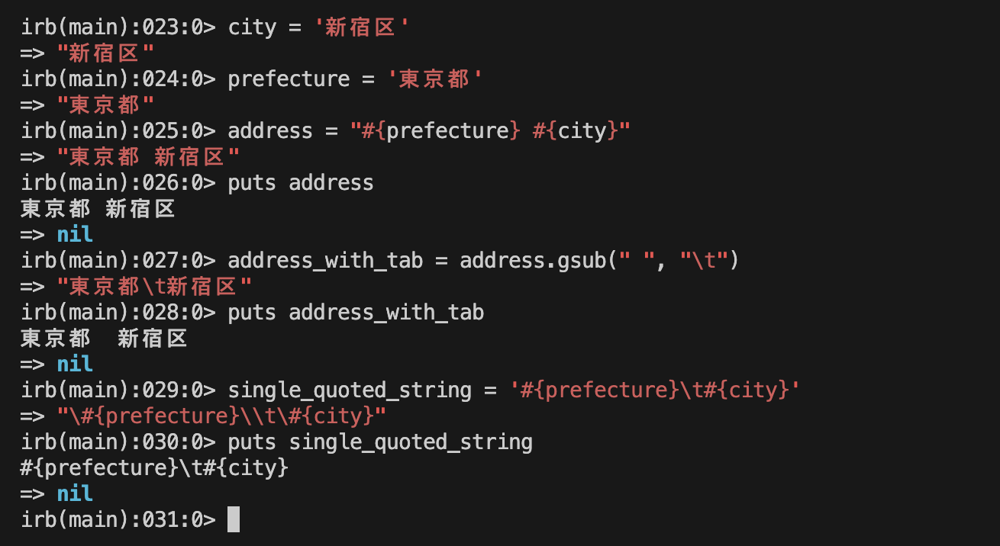
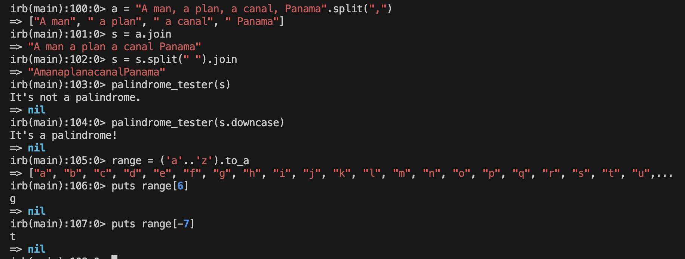
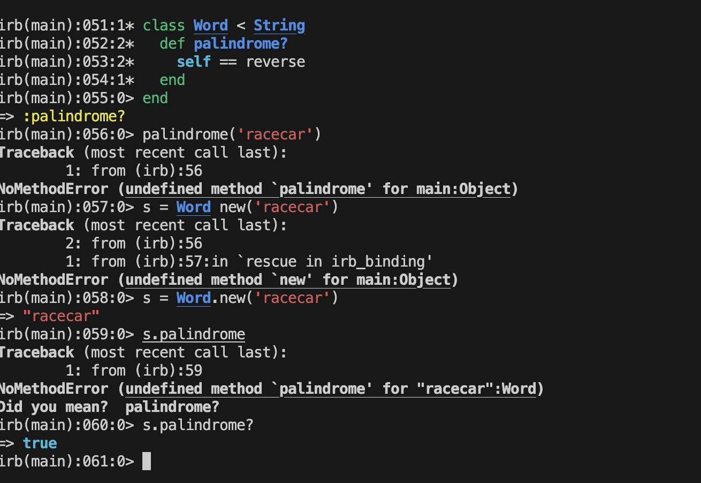
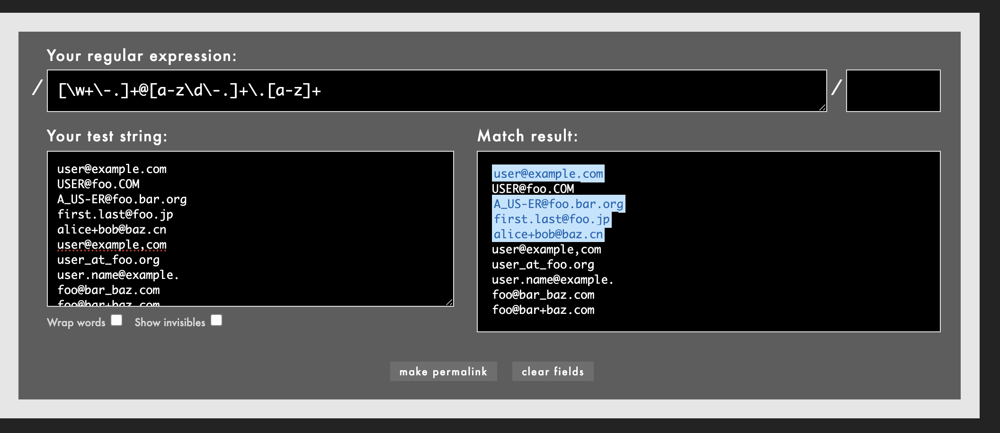
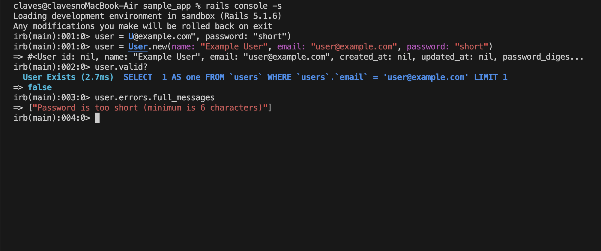
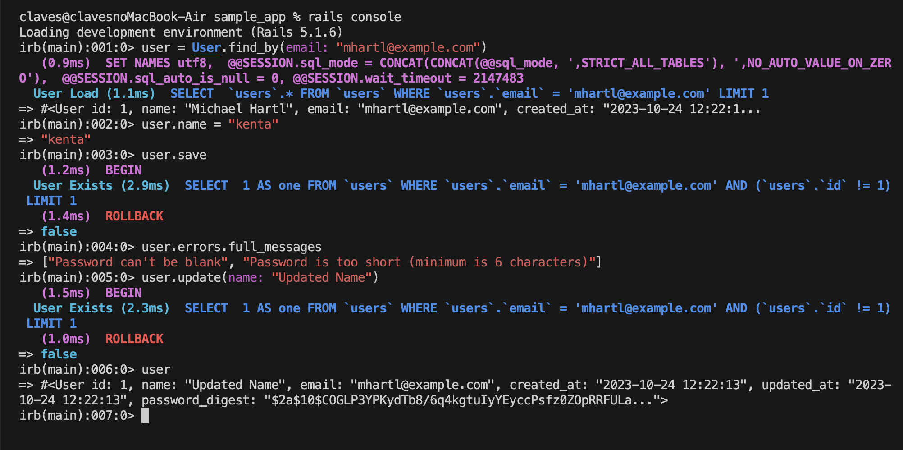

# 第3章
## チェックシート
1. 「ほぼ静的なページ」の「静的」とはどのようなものでしょうか？
    - あらかじめ用意されていて、変わらないということ
    - 静的なウェブページは、サーバー上にあらかじめ作成され、保存されたHTMLファイルで、それがそのままの形でユーザーのウェブブラウザに送信されます。このタイプのページは、ユーザーがアクセスするたびに同じ内容が表示され、コンテンツは手動で更新する必要があります。

2. HTTPメソッドにはどのような種類がありますか？
    - GET
    - POST
    - PUT
    - DELETE

3. HTTPメソッドのうち、GETとPOSTはどのような時に使われるものでしょうか？
    - GET
        - 主にデータの取得するとき
    - POST
        - 何か（アカウントなど）を作成するとき

3. 自動テストを作成するメリットにはどのようなものがあるでしょうか？
以下の単語を用いて説明してください。
・バグ
・リファクタリング
・設計
    - 自動テストの導入は、バグの早期発見を促し、リファクタリングを効率的に行うための信頼性の高い安全網を提供し、より堅牢な設計を推進することで、ソフトウェアの品質とメンテナンス性を向上させます

## 演習
1. GithubがMarkdown記法のREADME (リスト 3.3) をHTMLとして正しく描画しているか、確認してみてください。
    - 

2. 本番環境 (Heroku) のルートURLにアクセスして、デプロイが成功したかどうか確かめてみてください。
    - Heroku使っていないので未対応

3. Fooというコントローラを生成し、その中にbarとbazアクションを追加してみてください。
    - 

4. コラム 3.1で紹介したテクニックを駆使して、Fooコントローラとそれに関連するアクションを削除してみてください。
    - 

5. サンプルアプリケーションにContact (問い合わせ先) ページを作成してください16 (ヒント: まずはリスト 3.15を参考にして、/static_pages/contactというURLのページに「Contact | Ruby on Rails Tutorial Sample App」というタイトルが存在するかどうかを確認するテストを最初に作成しましょう。次に、3.3.3でAboutページを作ったときのと同じように、Contactページにもリスト 3.40のコンテンツを表示してみましょう。)。
    - 

6. リスト 3.41にrootルーティングを追加したことで、root_urlというRailsヘルパーが使えるようになりました (以前、static_pages_home_urlが使えるようになったときと同じです)。リスト 3.42の（コードを書き込む）と記された部分を置き換えて、rootルーティングのテストを書いてみてください。
    - ```
        test "should get root" do
            get  root_url
            assert_response :success
        end
        ```

7. 実はリスト 3.41のコードを書いていたので、先ほどの課題のテストは既に green になっているはずです。このような場合、テストを変更する前から成功していたのか、変更した後に成功するようになったのか、判断が難しいです。リスト 3.41のコードがテスト結果に影響を与えていることを確認するため、リスト 3.43のようにrootルーティングをコメントアウトして見て、 red になるかどうか確かめてみましょう (なおRubyのコメント機能については4.2.1で説明します)。最後に、コメントアウトした箇所を元に戻し (すなわちリスト 3.41に戻し)、テストが green になることを確認してみましょう。
    - コメントアウト時
        - `4 runs, 3 assertions, 0 failures, 1 errors, 0 skips`
    - コメントアウト解除
        - `4 runs, 4 assertions, 0 failures, 0 errors, 0 skips`

# 第4章

## チェックシート
1. 配列とハッシュの違いはなんでしょうか？
以下の単語を用いて説明してください。
・インデックス
・並び順
    - 配列はインデックスによって要素の並び順が決まっているのに対して、ハッシュはキーと値のペアなので並び順はない

2. 文字列でのシングルクォートとダブルクォートの違いはなんでしょうか？
以下の単語を用いて説明してください。
・文字列
・特殊文字
    - 文字列において、シングルクォートは特殊文字をエスケープせず、そのままの文字列を返すのに対し、ダブルクォートは特殊文字を解釈する

3. クラスとインスタンスは、それぞれどのようなものでしょうか？
「メソッド」という単語を用いて説明してください。
    - クラスはメソッドなどを定義した設計図で、インスタンスはそのクラスに基づいて生成されたオブジェクト

4. カスタムヘルパーとは、どのような目的で作っているものでしょうか？
    - 繰り返し使われるロジックなどをモジュール化して、コードの保守性を高めたり、可読性を向上させる

## 演習
1. city変数に適当な市区町村を、prefecture変数に適当な都道府県を代入してください。
2. 先ほど作った変数と式展開を使って、「東京都 新宿区」のような住所の文字列を作ってみましょう。出力にはputsを使ってください。
3. 上記の文字列の間にある半角スペースをタブに置き換えてみてください。(ヒント: 改行文字と同じで、タブも特殊文字です)
4. タブに置き換えた文字列を、ダブルクォートからシングルクォートに置き換えてみるとどうなるでしょうか?
    - 

5. "racecar" の文字列の長さはいくつですか? lengthメソッドを使って調べてみてください。
 
6. reverseメソッドを使って、"racecar"の文字列を逆から読むとどうなるか調べてみてください。

7. 変数sに "racecar" を代入してください。その後、比較演算子 (==) を使って変数sとs.reverseの値が同じであるかどうか、調べてみてください。

8. リスト 4.9を実行すると、どんな結果になるでしょうか? 変数sに "onomatopoeia" という文字列を代入するとどうなるでしょうか? ヒント: 上矢印 (またはCtrl-Pコマンド) を使って以前に使ったコマンドを再利用すると一からコマンドを全部打ち込む必要がなくて便利ですよ。 
- 

9. リスト 4.10の（コードを書き込む）の部分を適切なコードに置き換え、回文かどうかをチェックするメソッドを定義してみてください。ヒント: リスト 4.9の比較方法を参考にしてください。
    - ```
        def palindrome_tester(s)
            if s == s.reverse
                puts "It's a palindrome!"
            else
                puts "It's not a palindrome."
            end
        end
      ```

9. 上で定義したメソッドを使って “racecar” と “onomatopoeia” が回文かどうかを確かめてみてください。１つ目は回文である、２つ目は回文でない、という結果になれば成功です。
    - 

10. palindrome_tester("racecar")に対してnil?メソッドを呼び出し、戻り値がnilであるかどうかを確認してみてください (つまりnil?を呼び出した結果がtrueであることを確認してください)。このメソッドチェーンは、nil?メソッドがリスト 4.10の戻り値を受け取り、その結果を返しているという意味になります。
    - 

11. 文字列「A man, a plan, a canal, Panama」を ", " で分割して配列にし、変数aに代入してみてください。

12. 今度は、変数aの要素を連結した結果 (文字列) を、変数sに代入してみてください。

13. 変数sを半角スペースで分割した後、もう一度連結して文字列にしてください (ヒント: メソッドチェーンを使うと１行でもできます)。リスト 4.10で使った回文をチェックするメソッドを使って、(現状ではまだ) 変数sが回文ではないことを確認してください。downcaseメソッドを使って、s.downcaseは回文であることを確認してください。

14. aからzまでの範囲オブジェクトを作成し、7番目の要素を取り出してみてください。同様にして、後ろから７番目の要素を取り出してみてください。(ヒント: 範囲オブジェクトを配列に変換するのを忘れないでください)
    - 

15. 範囲オブジェクト0..16を使って、各要素の２乗を出力してください。
16. yeller (大声で叫ぶ) というメソッドを定義してください。このメソッドは、文字列の要素で構成された配列を受け取り、各要素を連結した後、大文字にして結果を返します。例えばyeller(['o', 'l', 'd'])と実行したとき、"OLD"という結果が返ってくれば成功です。ヒント: mapとupcaseとjoinメソッドを使ってみましょう。
17. random_subdomainというメソッドを定義してください。このメソッドはランダムな8文字を生成し、文字列として返します。ヒント: サブドメインを作るときに使ったRubyコードをメソッド化したものです。
18. リスト 4.12の「?」の部分を、それぞれ適切なメソッドに置き換えてみてください。ヒント:split、shuffle、joinメソッドを組み合わせると、メソッドに渡された文字列 (引数) をシャッフルさせることができます。
    - 

19. キーが'one'、'two'、'three'となっていて、それぞれの値が'uno'、'dos'、'tres'となっているハッシュを作ってみてください。その後、ハッシュの各要素をみて、それぞれのキーと値を"'#{key}'はスペイン語で'#{value}'"といった形で出力してみてください。

20. person1、person2、person3という３つのハッシュを作成し、それぞれのハッシュに:firstと:lastキーを追加し、適当な値 (名前など) を入力してください。その後、次のようなparamsというハッシュのハッシュを作ってみてください。1.) キーparams[:father]の値にperson1を代入、2). キーparams[:mother]の値にperson2を代入、3). キーparams[:child]の値にperson3を代入。最後に、ハッシュのハッシュを調べていき、正しい値になっているか確かめてみてください。(例えばparams[:father][:first]がperson1[:first]と一致しているか確かめてみてください)
    - 

21. userというハッシュを定義してみてください。このハッシュは３つのキー:name、:email、:password_digestを持っていて、それぞれの値にあなたの名前、あなたのメールアドレス、そして16文字からなるランダムな文字列が代入されています。
    - ```
        user = { 
            irb(main):025:1*   name: 'yanase', 
            irb(main):026:1*   email: 'yanase@example.com', 
            irb(main):027:1*   password_digest: SecureRandom.hex(8) # 16文字のランダムな文字列
            irb(main):028:0> }
            => {:name=>"yanase", :email=>"yanase@example.com", :password_digest=>"4cc01ed4105c0516"}
      ```

22. Ruby API (訳注: もしくはるりまサーチ) を使って、Hashクラスのmergeメソッドについて調べてみてください。次のコードを実行せずに、どのような結果が返ってくるか推測できますか? 推測できたら、実際にコードを実行して推測があっていたか確認してみましょう。
    - { "a" => 100, "b" => 300}

23. 1から10の範囲オブジェクトを生成するリテラルコンストラクタは何でしたか? (復習です)
    - (1..10)

24. 今度はRangeクラスとnewメソッドを使って、1から10の範囲オブジェクトを作ってみてください。ヒント: newメソッドに2つの引数を渡す必要があります
    - range = Range.new(1, 10)

25. 比較演算子==を使って、上記２つの課題で作ったそれぞれのオブジェクトが同じであることを確認してみてください。
    - 

26. Rangeクラスの継承階層を調べてみてください。同様にして、HashとSymbolクラスの継承階層も調べてみてください。
    - ```
        irb(main):036:0> Range.superclass
            => Object
        irb(main):037:0> Object.superclass
            => BasicObject
        irb(main):038:0> BasicObject.superclass
            => nil
        irb(main):039:0> 
      ```

27. リスト 4.15にあるself.reverseのselfを省略し、reverseと書いてもうまく動くことを確認してみてください。
    - 

28. palindrome?メソッドを使って、“racecar”が回文であり、“onomatopoeia”が回文でないことを確認してみてください。南インドの言葉「Malayalam」は回文でしょうか? ヒント: downcaseメソッドで小文字にすることを忘れないで。

29. リスト 4.16を参考に、Stringクラスにshuffleメソッドを追加してみてください。ヒント: リスト 4.12も参考になります。

30. リスト 4.16のコードにおいて、self.を削除してもうまく動くことを確認してください。
    - 

31. 第2章で作ったToyアプリケーションのディレクトリでRailsコンソールを開き、User.newと実行することでuserオブジェクトが生成できることを確認してみましょう。
32. 生成したuserオブジェクトのクラスの継承階層を調べてみてください。
    - 

33. Userクラスで定義されているname属性を修正して、first_name属性とlast_name属性に分割してみましょう。また、それらの属性を使って "Michael Hartl" といった文字列を返すfull_nameメソッドを定義してみてください。最後に、formatted_emailメソッドの@nameの部分を、full_nameに置き換えてみましょう (元々の結果と同じになっていれば成功です)
34. "Hartl, Michael" といったフォーマット (苗字と名前がカンマ+半角スペースで区切られている文字列) で返すalphabetical_nameメソッドを定義してみましょう。
35. full_name.splitとalphabetical_name.split(', ').reverseの結果を比較し、同じ結果になるかどうか確認してみましょう。
    - 


# 第5章
## チェックシート
1. パーシャルにはどのようなメリットがあるでしょうか？
    - 同じコードを繰り返し書く必要がなくなる
    - 可読性や保守性の向上に繋がる
2. Asset Pipelineにはどのような役割があるでしょうか？
    - 開発環境と本番環境という、2つの異なった状況に対してそれぞれ最高の環境を提供してくれる
    - 最大のメリットの1つは、本番のアプリケーションで効率的になるように最適化されたアセットも自動的に生成されること
    - 
3. SCSSを使用するとどのようなメリットがあるでしょうか？以下の単語を用いて説明してください。
・ネスト
・変数
    - スタイルシート内で変数を利用することができ、ネストによって親子関係を直感的に表現することができる


## 演習
1. Webページと言ったらネコ画像、というぐらいにはWebにはネコ画像が溢れていますよね。リスト 5.4のコマンドを使って、図 5.3のネコ画像をダウンロードしてきましょう8 。
2. mvコマンドを使って、ダウンロードしたkitten.jpgファイルを適切なアセットディレクトリに移動してください (参考: 5.2.1)。
    - 

3. image_tagを使って、kitten.jpg画像を表示してみてください
    - 

4. リスト 5.10を参考にして、5.1.1.1で使ったネコ画像をコメントアウトしてみてください。また、ブラウザのHTMLインスペクタ機能を使って、コメントアウトするとHTMLのソースからも消えていることを確認してみてください。
    - 

5. リスト 5.11のコードをcustom.scssに追加し、すべての画像を非表示にしてみてください。うまくいけば、Railsのロゴ画像がHomeページから消えるはずです。先ほどと同様にインスペクタ機能を使って、今度はHTMLのソースコードは残ったままで、画像だけが表示されなくなっていることを確認してみてください。
    - 

6. Railsがデフォルトで生成するheadタグの部分を、リスト 5.18のようにrenderに置き換えてみてください。ヒント: 単純に削除してしまうと後でパーシャルを１から書き直す必要が出てくるので、削除する前にどこかに退避しておきましょう。

7. リスト 5.18のようなパーシャルはまだ作っていないので、現時点ではテストは redになっているはずです。実際にテストを実行して確認してみましょう。
    - 
 
8. layoutsディレクトリにheadタグ用のパーシャルを作成し、先ほど退避しておいたコードを書き込み、最後にテストが green に戻ることを確認しましょう。
    - 

9. 5.2.2で提案したように、footerのCSSを手作業で変換してみましょう。具体的には、リスト 5.17の内容を１つずつ変換していき、リスト 5.20のようにしてみてください。
    -  ```
        footer {
            margin-top: 45px;
            padding-top: 5px;
            border-top: 1px solid $gray-medium-light;
            color: $gray-light;
            a {
                color: $gray;
                &:hover {
                color: $gray-darker;
                }
            }
            small {
                float: left;
            }
            ul {
                float: right;
                list-style: none;
                li {
                float: left;
                margin-left: 15px;
                }
            }
        }
     ```

10. 実は名前付きルートは、as:オプションを使って変更することができます。有名なFar Sideの漫画に倣って、Helpページの名前付きルートをhelfに変更してみてください (リスト 5.29)。
    - ```
        Rails.application.routes.draw do
            root 'static_pages#home'
            get  '/help',    to: 'static_pages#help', as: :helf
            get  '/about',   to: 'static_pages#about'
            get  '/contact', to: 'static_pages#contact'
        end
      ```

11. 先ほどの変更により、テストが redになっていることを確認してください。リスト 5.28を参考にルーティングを更新して、テストを greenにして見てください。
    - ```
        // static_pages_controller_test.rb

        test "should get help" do
            get helf_path
            assert_response :success
            assert_select "title", "Help | Ruby on Rails Tutorial Sample App"
        end
      ```

12. エディタのUndo機能を使って、今回の演習で行った変更を元に戻して見てください。
    - 

13. リスト 5.29のようにhelfルーティングを作成し、レイアウトのリンクを更新してみてください。
    - [変更コミット](https://github.com/yanase-kenta0505/rails_tutorial_sample_app/commit/ab0e7755d2374bcfec211ec4475ea8edc1c2178a)

14. 前回の演習と同様に、エディタのUndo機能を使ってこの演習で行った変更を元に戻してみてください。
    - [変更を戻すコミット](https://github.com/yanase-kenta0505/rails_tutorial_sample_app/commit/2f16e6efdcba1272d39b969b558936f3b9985473)

15. footerパーシャルのabout_pathをcontact_pathに変更してみて、テストが正しくエラーを捕まえてくれるかどうか確認してみてください。
    - 

16. リスト 5.35で示すように、Applicationヘルパーで使っているfull_titleヘルパーを、test環境でも使えるようにすると便利です。こうしておくと、リスト 5.36のようなコードを使って、正しいタイトルをテストすることができます。ただし、これは完璧なテストではありません。例えばベースタイトルに「Ruby on Rails Tutoial」といった誤字があったとしても、このテストでは発見することができないでしょう。この問題を解決するためには、full_titleヘルパーに対するテストを書く必要があります。そこで、Applicationヘルパーをテストするファイルを作成し、リスト 5.37の（コードを書き込む）の部分を適切なコードに置き換えてみてください。ヒント: リスト 5.37ではassert_equal <期待される値>, <実際の値>といった形で使っていましたが、内部では==演算子で期待される値と実際の値を比較し、正しいかどうかのテストをしています。
    - [演習対応](https://github.com/yanase-kenta0505/rails_tutorial_sample_app/commit/29cfaea06ac2ff9affa056961378c38a5538ebc3)

17. 表 5.1を参考にしながらリスト 5.41を変更し、users_new_urlではなくsignup_pathを使えるようにしてみてください。
    - ```
        // users_controller_test.rb

        class UsersControllerTest < ActionDispatch::IntegrationTest
            test "should get new" do
                get signup_path
                assert_response :success
            end
        end
      ```

18. 先ほどの変更を加えたことにより、テストが redになったことを確認してください。なお、この演習はテスト駆動開発 (コラム 3.3) で説明した red/green のリズムを作ることを目的としています。このテストは次の5.4.2で greenになるよう修正します。
    - 

19. もしまだ5.4.1.1の演習に取り掛かっていなければ、まずはリスト 5.41のように変更し、名前付きルートsignup_pathを使えるようにしてください。また、リスト 5.43で名前付きルートが使えるようになったので、現時点でテストが greenになっていることを確認してください。
    - 

20. 先ほどのテストが正しく動いていることを確認するため、signupルートの部分をコメントアウトし、テスト redになることを確認してください。確認できたら、コメントアウトを解除して greenの状態に戻してください。
    - 

21. リスト 5.32の統合テストにsignupページにアクセスするコードを追加してください (getメソッドを使います)。コードを追加したら実際にテストを実行し、結果が正しいことを確認してください。ヒント: リスト 5.36で紹介したfull_titleヘルパーを使ってみてください。
    - 

# 第6章
## チェックシ-ト
1. 今回の章で追加した各バリデーションは、どのような目的があったでしょうか？
    - presence: true（空でないことの確認）
    - length: { minimum: 6 }（最小文字数）
    - uniqueness（一意性）
2. Userのパスワードを保存する際にした工夫とは、どういうものだったでしょうか？「ハッシュ化」という単語を用いて説明してください。
    - Userのパスワードを保存する際の工夫は、「ハッシュ化」というプロセスを使用することです。ハッシュ化は、任意の長さの入力データを取り、ランダムな文字列（ハッシュ）に変換するプロセスです。
3. データベースにインデックスを追加するメリットはなんでしょうか？
以下の単語を用いて説明して下さい。
・検索効率
・一意性
    - 検索効率が向上し、一意性が保証されるので、データの重複を防げる
4. 今回の章の変更で、Userモデルはどのような構造になったでしょうか？
    - バリデーションやパスワード、インデックスなどが追加された。
    - より堅牢でセキュリティが強化された構造になった。

## 演習
1. Railsはdb/ディレクトリの中にあるschema.rbというファイルを使っています。これはデータベースの構造 (スキーマ (schema) と呼びます) を追跡するために使われます。さて、あなたの環境にあるdb/schema.rbの内容を調べ、その内容とマイグレーションファイル (リスト 6.2) の内容を比べてみてください。
    - 

2. ほぼすべてのマイグレーションは、元に戻すことが可能です (少なくとも本チュートリアルにおいてはすべてのマイグレーションを元に戻すことができます)。元に戻すことを「ロールバック (rollback)と呼び、Railsではdb:rollbackというコマンドで実現できます。
  $ rails db:rollback
上のコマンドを実行後、db/schema.rbの内容を調べてみて、ロールバックが成功したかどうか確認してみてください (コラム 3.1ではマイグレーションに関する他のテクニックもまとめているので、参考にしてみてください)。上のコマンドでは、データベースからusersテーブルを削除するためにdrop_tableコマンドを内部で呼び出しています。これがうまくいくのは、drop_tableとcreate_tableがそれぞれ対応していることをchangeメソッドが知っているからです。この対応関係を知っているため、ロールバック用の逆方向のマイグレーションを簡単に実現することができるのです。なお、あるカラムを削除するような不可逆なマイグレーションの場合は、changeメソッドの代わりに、upとdownのメソッドを別々に定義する必要があります。詳細については、Railsガイドの「Active Record マイグレーション」を参照してください。
    - 

3. もう一度rails db:migrateコマンドを実行し、db/schema.rbの内容が元に戻ったことを確認してください。
    - 

4. Railsコンソールを開き、User.newでUserクラスのオブジェクトが生成されること、そしてそのオブジェクトがApplicationRecordを継承していることを確認してみてください (ヒント: 4.4.4で紹介したテクニックを使ってみてください)。
    - 

5. 同様にして、ApplicationRecordがActiveRecord::Baseを継承していることについて確認してみてください。
    - 

6. user.nameとuser.emailが、どちらもStringクラスのインスタンスであることを確認してみてください。
    - 

7. created_atとupdated_atは、どのクラスのインスタンスでしょうか?
    - 

8. nameを使ってユーザーオブジェクトを検索してみてください。また、 find_by_nameメソッドが使えることも確認してみてください (古いRailsアプリケーションでは、古いタイプのfind_byをよく見かけることでしょう)。
    - 

9. 実用的な目的のため、User.allはまるで配列のように扱うことができますが、実際には配列ではありません。User.allで生成されるオブジェクトを調べ、ArrayクラスではなくUser::ActiveRecord_Relationクラスであることを確認してみてください。
    - 

10. User.allに対してlengthメソッドを呼び出すと、その長さを求められることを確認してみてください (4.2.3)。Rubyの性質として、そのクラスを詳しく知らなくてもなんとなくオブジェクトをどう扱えば良いかわかる、という性質があります。これをダックタイピング (duck typing) と呼び、よく次のような格言で言い表されています「もしアヒルのような容姿で、アヒルのように鳴くのであれば、それはもうアヒルだろう」。
    - 

11. userオブジェクトへの代入を使ってname属性を使って更新し、saveで保存してみてください。
    - 

12. 今度はupdate_attributesを使って、email属性を更新および保存してみてください。
    - 

13. 同様にして、マジックカラムであるcreated_atも直接更新できることを確認してみてください。ヒント: 更新するときは「1.year.ago」を使うと便利です。これはRails流の時間指定の１つで、現在の時刻から１年前の時間を算出してくれます。
    - 

14. コンソールから、新しく生成したuserオブジェクトが有効 (valid) であることを確認してみましょう。
15. 6.1.3で生成したuserオブジェクトも有効であるかどうか、確認してみましょう。
    - 

16. 新しいユーザーuを作成し、作成した時点では有効ではない (invalid) ことを確認してください。なぜ有効ではないのでしょうか? エラーメッセージを確認してみましょう。

17. u.errors.messagesを実行すると、ハッシュ形式でエラーが取得できることを確認してください。emailに関するエラー情報だけを取得したい場合、どうやって取得すれば良いでしょうか?
    - 

18. 長すぎるnameとemail属性を持ったuserオブジェクトを生成し、有効でないことを確認してみましょう。
19. 長さに関するバリデーションが失敗した時、どんなエラーメッセージが生成されるでしょうか? 確認してみてください。
    - 

20. リスト 6.18にある有効なメールアドレスのリストと、リスト 6.19にある無効なメールアドレスのリストをRubularのYour test string:に転記してみてください。その後、リスト 6.21の正規表現をYour regular expression:に転記して、有効なメールアドレスのみがすべてマッチし、無効なメールアドレスはすべてマッチしないことを確認してみましょう。
    - 

21. 先ほど触れたように、リスト 6.21のメールアドレスチェックする正規表現は、foo@bar..comのようにドットが連続した無効なメールアドレスを許容してしまいます。まずは、このメールアドレスをリスト 6.19の無効なメールアドレスリストに追加し、これによってテストが失敗することを確認してください。次に、リスト 6.23で示した、少し複雑な正規表現を使ってこのテストがパスすることを確認してください。
     - 

22. foo@bar..comをRubularのメールアドレスのリストに追加し、リスト 6.23の正規表現をRubularで使ってみてください。有効なメールアドレスのみがすべてマッチし、無効なメールアドレスはすべてマッチしないことを確認してみましょう。
    - 

23. リスト 6.33のように、メールアドレスを小文字にするテストをリスト 6.26に追加してみましょう。ちなみに追加するテストコードでは、データベースの値に合わせて更新するreloadメソッドと、値が一致しているかどうか確認するassert_equalメソッドを使っています。リスト 6.33のテストがうまく動いているか確認するためにも、before_saveの行をコメントアウトして redになることを、また、コメントアウトを解除すると greenになることを確認してみましょう。
    - 

24. テストスイートの実行結果を確認しながら、before_saveコールバックをemail.downcase!に書き換えてみましょう。ヒント: メソッドの末尾に!を付け足すことにより、email属性を直接変更できるようになります (リスト 6.34)。
    - ```
        class User < ApplicationRecord
            before_save { email.downcase! }
            validates :name, presence: true
            validates :email, presence: true
            validates :name, presence: true, length: { maximum: 50 }
            VALID_EMAIL_REGEX = /\A[\w+\-.]+@[a-z\d\-]+(\.[a-z\d\-]+)*\.[a-z]+\z/i
            validates :email, presence: true, length: { maximum: 255 },
            format: { with: VALID_EMAIL_REGEX },
            uniqueness: { case_sensitive: false }
        end
      ```

25. この時点では、userオブジェクトに有効な名前とメールアドレスを与えても、valid?で失敗してしまうことを確認してみてください。
26. なぜ失敗してしまうのでしょうか? エラーメッセージを確認してみてください。
    - 

27. 有効な名前とメールアドレスでも、パスワードが短すぎるとuserオブジェクトが有効にならないことを確認してみましょう。
28. 上で失敗した時、どんなエラーメッセージになるでしょうか? 確認してみましょう。
    - 

29. コンソールを一度再起動して (userオブジェクトを消去して)、このセクションで作ったuserオブジェクトを検索してみてください。
30. オブジェクトが検索できたら、名前を新しい文字列に置き換え、saveメソッドで更新してみてください。うまくいきませんね...、なぜうまくいかなかったのでしょうか?
31. 今度は6.1.5で紹介したテクニックを使って、userの名前を更新してみてください。
    - 

# 第7章
## チェックシート
1. Railsではデフォルトで3つの環境が用意されていますが、この「環境」とは何を目的に用意されているものでしょうか？
    - development
        - 開発を手助けするようにデバックが容易になるるように設定されている
    - test
        - テストを実行するため
        - テスト実行の速度が優先され、テストデータベースはテストのたびにリセットされることが一般的
    - production
        - 実際にユーザーが使用する際の設定が適用される
2. Strong Parametersはどのような目的で使用するものでしょうか？
    - マスアサインメントの脆弱性を防ぐために使用される。
    不正なユーザーがフォームを通じて送信されたデータを操作し、許可されていない属性を変更するのを防ぐ。
    開発者は許可されたパラメータのみを明示的に指定することで、セキュリティを強化できる。
3. flashとflash.nowの違いはなんでしょうか？以下の単語を用いて説明してください。
・アクション
・データ
    - flashは一度設定すると次のアクションが完了するまで持続する。成功やエラーメッセージを表示するときに使われる
    - 一方flash.nowは現在のアクションのみで使用され、データは次のアクションには持続しない。

## 演習
1. ブラウザから /about にアクセスし、デバッグ情報が表示されていることを確認してください。このページを表示するとき、どのコントローラとアクションが使われていたでしょうか? paramsの内容から確認してみましょう。
    - コントローラ
        - static_pages
    - アクション
        - about

2. Railsコンソールを開き、データベースから最初のユーザー情報を取得し、変数userに格納してください。その後、puts user.attributes.to_yamlを実行すると何が表示されますか? ここで表示された結果と、yメソッドを使ったy user.attributesの実行結果を比較してみましょう。
    - 

3. 埋め込みRubyを使って、マジックカラム (created_atとupdated_at) の値をshowページに表示してみましょう (リスト 7.4)。
4. 埋め込みRubyを使って、Time.nowの結果をshowページに表示してみましょう。ページを更新すると、その結果はどう変わっていますか? 確認してみてください。
    - 
5. showアクションの中にdebuggerを差し込み (リスト 7.6)、ブラウザから /users/1 にアクセスしてみましょう。その後コンソールに移り、putsメソッドを使ってparamsハッシュの中身をYAML形式で表示してみましょう。ヒント: 7.1.1.1の演習を参考にしてください。その演習ではdebugメソッドで表示したデバッグ情報を、どのようにしてYAML形式で表示していたでしょうか?
    - 
6. newアクションの中にdebuggerを差し込み、/users/new にアクセスしてみましょう。@userの内容はどのようになっているでしょうか? 確認してみてください。
    - 

7. (任意) Gravatar上にアカウントを作成し、あなたのメールアドレスと適当な画像を紐付けてみてください。メールアドレスをMD5ハッシュ化して、紐付けた画像がちゃんと表示されるかどうか試してみましょう。
    - 

8. 7.1.4で定義したgravatar_forヘルパーをリスト 7.12のように変更して、sizeをオプション引数として受け取れるようにしてみましょう。うまく変更できると、gravatar_for user, size: 50といった呼び出し方ができるようになります。重要: この改善したヘルパーは10.3.1で実際に使います。忘れずに実装しておきましょう。
    - 

9. オプション引数は今でもRubyコミュニティで一般的に使われていますが、Ruby 2.0から導入された新機能「キーワード引数 (Keyword Arguments)」でも実現することができます。先ほど変更したリスト 7.12を、リスト 7.13のように置き換えてもうまく動くことを確認してみましょう。この２つの実装方法はどういった違いがあるのでしょうか? 考えてみてください。
    - 

10. 試しに、リスト 7.15にある:nameを:nomeに置き換えてみましょう。どんなエラーメッセージが表示されるようになりますか?
    - 

11. 試しに、ブロックの変数fをすべてfoobarに置き換えてみて、結果が変わらないことを確認してみてください。確かに結果は変わりませんが、変数名をfoobarとするのはあまり良い変更ではなさそうですね。その理由について考えてみてください。
    - 
    - fはフォームビルダーオブジェクトを指す慣習的な変数名であり、多くのRails開発者がこの慣習に従っています。
    一方、foobarは具体的な意味を持たないため、コードを読む他の開発者にとってはわかりにくくなります。

12. 『HTML編』ではHTMLをすべて手動で書き起こしていますが、なぜformタグを使わなかったのでしょうか? 理由を考えてみてください。
    - Railsではヘルパーメソッドを使用することが推奨されているから

13. /signup?admin=1 にアクセスし、paramsの中にadmin属性が含まれていることをデバッグ情報から確認してみましょう。
    - 

14. 最小文字数を5に変更すると、エラーメッセージも自動的に更新されることを確かめてみましょう。
    - 

15. 未送信のユーザー登録フォーム (図 7.12) のURLと、送信済みのユーザー登録フォーム (図 7.18) のURLを比べてみましょう。なぜURLは違っているのでしょうか? 考えてみてください。
    - 未送信
        - /signup
    - 送信済み
        - /users
    - 新しいユーザーを作成するためのフォームを表示するアクションはnewアクション（GETリクエスト）であり、実際に作成するアクションはcreateアクション（POSTリクエスト）であるためURLが異なる

16. リスト 7.20で実装したエラーメッセージに対するテストを書いてみてください。どのくらい細かくテストするかはお任せします。リスト 7.25にテンプレートを用意しておいたので、参考にしてください。
    - ```
        require 'test_helper'

        class UsersSignupTest < ActionDispatch::IntegrationTest

        test "invalid signup information" do
            get signup_path
            assert_no_difference 'User.count' do
            post users_path, params: { user: { name:  "",
                                                email: "user@invalid",
                                                password:              "foo",
                                                password_confirmation: "bar" } }
            end
            assert_template 'users/new'
            assert_select 'div#<CSS id for error explanation>'
            assert_select 'div.<CSS class for field with error>'
        end

        test "email should be valid format" do
            get signup_path
            assert_no_difference 'User.count' do
            post users_path, params: { user: { name:  "Example User",
                                                email: "user@invalid,com",
                                                password:              "password123",
                                                password_confirmation: "password123" } }
            end
            assert_template 'users/new'
            assert_select 'div#error_explanation'
            assert_select 'div.field_with_errors', text: "Email is invalid"
        end

        test "email should be valid format" do
            get signup_path
            assert_no_difference 'User.count' do
            post users_path, params: { user: { name:  "Example User",
                                                email: "user@invalid,com",
                                                password:              "password123",
                                                password_confirmation: "password123" } }
            end
            assert_template 'users/new'
            assert_select 'div#error_explanation'
            assert_select 'div.field_with_errors', text: "Email is invalid"
        end

        test "password should be at least 6 characters" do
            get signup_path
            assert_no_difference 'User.count' do
            post users_path, params: { user: { name:  "Example User",
                                                email: "user@example.com",
                                                password:              "pass",
                                                password_confirmation: "pass" } }
            end
            assert_template 'users/new'
            assert_select 'div#error_explanation'
            assert_select 'div.field_with_errors', text: "Password is too short (minimum is 6 characters)"
        end
        
        end

      ```

17. ユーザー登録フォームのURLは /signup ですが、無効なユーザー登録データを送付するとURLが /users に変わってしまいます。これはリスト 5.43で追加した名前付きルート (/signup) と、RESTfulなルーティング (リスト 7.3) のデフォルト設定との差異によって生じた結果です。リスト 7.26とリスト 7.27の内容を参考に、この問題を解決してみてください。うまくいけばどちらのURLも /signup になるはずです。あれ、でもテストは greenのままになっていますね...、なぜでしょうか? (考えてみてください)
    - テストがURLの変更を検知していないから
18. リスト 7.25のpost部分を変更して、先ほどの演習課題で作った新しいURL (/signup) に合わせてみましょう。また、テストが greenのままになっている点も確認してください。
    - 
19. リスト 7.27のフォームを以前の状態 (リスト 7.20) に戻してみて、テストがやはり greenになっていることを確認してください。これは問題です! なぜなら、現在postが送信されているURLは正しくないのですから。assert_selectを使ったテストをリスト 7.25に追加し、このバグを検知できるようにしてみましょう (テストを追加して redになれば成功です)。その後、変更後のフォーム (リスト 7.27) に戻してみて、テストが green になることを確認してみましょう。ヒント: フォームから送信してテストするのではなく、'form[action="/signup"]'という部分が存在するかどうかに着目してテストしてみましょう。
    - 

20. 有効な情報を送信し、ユーザーが実際に作成されたことを、Railsコンソールを使って確認してみましょう。
    - 

21. リスト 7.28を更新し、redirect_to user_url(@user)とredirect_to @userが同じ結果になることを確認してみましょう。
    - 

22. コンソールに移り、文字列内の式展開 (4.2.2) でシンボルを呼び出してみましょう。例えば"#{:success}"といったコードを実行すると、どんな値が返ってきますか? 確認してみてください。
    - ```
        irb(main):009:0> puts "#{:success}"
        success
        => nil
        irb(main):010:0> 
      ```

23. 先ほどの演習で試した結果を参考に、リスト 7.30のflashはどのような結果になるか考えてみてください。
    - ```
        irb(main):012:1* flash.each do |key, value|
        irb(main):013:1*   puts "#{key}"
        irb(main):014:1*   puts "#{value}"
        irb(main):015:0> end
        success
        It worked!
        danger
        It failed.
        => {:success=>"It worked!", :danger=>"It failed."}
        irb(main):016:0> puts "#{:flash}"
        flash
        => nil
      ```

24. Railsコンソールを使って、新しいユーザーが本当に作成されたのかもう一度チェックしてみましょう。結果は、リスト 7.32のようになるはずです。
    - ```
        user = User.first
        (1.0ms)  SET NAMES utf8,  @@SESSION.sql_mode = CONCAT(CONCAT(@@sql_mode, ',STRICT_ALL_TABLES'), ',NO_AUTO_VALUE_ON_ZERO'),  @@SESSION.sql_auto_is_null = 0, @@SESSION.wait_timeout = 2147483
        User Load (0.9ms)  SELECT  `users`.* FROM `users` ORDER BY `users`.`id` ASC LIMIT 1
        => #<User id: 1, name: "Rails Tutorial", email: "example@railstutorial.org", created_at: "2023-10-25 06:25:14", updated_at: "2023-10-25 06:25:...
        irb(main):002:0> user
        => #<User id: 1, name: "Rails Tutorial", email: "example@railstutorial.org", created_at: "2023-10-25 06:25:14", updated_at: "2023-10-25 06:25:14", password_digest: "$2a$10$e4699Wb1ouSEJrmJGQ4gXe/oIUS63s1jC8nLpCTlYOb...">
      ``` 

25. 自分のメールアドレスでユーザー登録を試してみましょう。既にGravatarに登録している場合、適切な画像が表示されているか確認してみてください。
    - 

26. 7.4.2で実装したflashに対するテストを書いてみてください。どのくらい細かくテストするかはお任せします。リスト 7.34に最小限のテンプレートを用意しておいたので、参考にしてください (（コードを書き込む）の部分を適切なコードに置き換えると完成します)。ちなみに、テキストに対するテストは壊れやすいです。文量の少ないflashのキーであっても、それは同じです。筆者の場合、flashが空でないかをテストするだけの場合が多いです。
    - ```
        test "valid signup information" do
            get signup_path
            assert_difference 'User.count', 1 do
            post users_path, params: { user: { name:  "Example User",
                                                email: "user@example.com",
                                                password:              "password",
                                                password_confirmation: "password" } }
            end
            follow_redirect!
            assert_template 'users/show'
            assert_not flash.empty?
        end
      ```

27. 本文中でも指摘しましたが、flash用のHTML (リスト 7.31) は読みにくいです。より読みやすくしたリスト 7.35のコードに変更してみましょう。変更が終わったらテストスイートを実行し、正常に動作することを確認してください。なお、このコードでは、Railsのcontent_tagというヘルパーを使っています。
    - 

28. リスト 7.28のリダイレクトの行をコメントアウトすると、テストが失敗することを確認してみましょう。
    - 

29. リスト 7.28で、@user.saveの部分をfalseに置き換えたとしましょう (バグを埋め込んでしまったと仮定してください)。このとき、assert_differenceのテストではどのようにしてこのバグを検知するでしょうか? テストコードを追って考えてみてください。
    - @user.saveをfalseに置き換えると、ユーザーは保存されない。User.countが増加しないため、assert_differenceの期待値と実際の値が一致しないことになり、バグを検知する

30. ブラウザから本番環境 (Heroku) にアクセスし、SSLの鍵マークがかかっているか、URLがhttpsになっているかどうかを確認してみましょう。
    - Herokuを使わないので飛ばす
31. 本番環境でユーザーを作成してみましょう。Gravatarの画像は正しく表示されているでしょうか?
    - Herokuを使わないので飛ばす


# 第8章
## チェックシート
1. HTTPはステートレスなプロトコルですが、ステートレスとはどのような意味でしょうか？
「リクエスト」という単語を用いて説明して下さい
    - HTTPプロトコルが各リクエストを独立したものとして扱う性質を指す。
    一度のリクエストとそのレスポンスが完了すると、サーバーはそのリクエストに関する情報を保持しない。
2. セッションとはどのようなものでしょうか？
    - サーバーはユーザーごとにセッションIDを生成し、これを使ってユーザーの状態やデータをサーバー上に保存する。
    ユーザーはセッションIDをクッキーとしてブラウザに保存し、次回のリクエスト時にこのセッションIDをサーバーに送信することで、サーバーはユーザーを識別し、以前の状態を復元できる。
3. cookiesとはどのようなものでしょうか？
以下の観点で説明して下さい。
・どこに保存されているデータか？
・有効期限について
    - cookiesはブラウザに保存するデータ
    - cookiesには有効期限があり、期限がキレると自動的に削除される
4. RailsのSessionリソースはどのようにすると破棄されますか？
    - 開発者ツールで手動削除する
    - ブラウザを終了する
## 演習
1. GET login_pathとPOST login_pathとの違いを説明できますか? 少し考えてみましょう。
    - GET
        - ログインフォームを入力するためのページをブラウザに表示する
    - POST
        - 入力されたログイン情報をサーバーに送信し、認証を行う
2. ターミナルのパイプ機能を使ってrails routesの実行結果とgrepコマンドを繋ぐことで、Usersリソースに関するルーティングだけを表示させることができます。同様にして、Sessionsリソースに関する結果だけを表示させてみましょう。現在、いくつのSessionsリソースがあるでしょうか? ヒント: パイプやgrepの使い方が分からない場合は 『コマンドライン編』の 「grepで検索する」を参考にしてみてください。
    - ```
        claves@clavesnoMacBook-Air sample_app % rails routes | grep session
        login  GET    /login(.:format)          sessions#new
               POST   /login(.:format)          sessions#create
        logout DELETE /logout(.:format)         sessions#destroy
      ```
3. リスト 8.4で定義したフォームで送信すると、Sessionsコントローラのcreateアクションに到達します。Railsはこれをどうやって実現しているでしょうか? 考えてみてください。ヒント:表 8.1とリスト 8.5の１行目に注目してください。
    - loginというパスに対してcreateアクションを割り当てています。具体的には、post 'login', to: 'sessions#create'というルーティングが定義されています。

4. Railsコンソールを使って、表 8.2のそれぞれの式が合っているか確かめてみましょう. まずはuser = nilの場合を、次にuser = User.firstとした場合を確かめてみてください。ヒント: 必ず論理値オブジェクトとなるように、4.2.3で紹介した!!のテクニックを使ってみましょう。例: !!(user && user.authenticate('foobar'))
    - 

5. 8.1.4の処理の流れが正しく動いているかどうか、ブラウザで確認してみてください。特に、flashがうまく機能しているかどうか、フラッシュメッセージの表示後に違うページに移動することを忘れないでください。
    - https://www.loom.com/share/31ea8d6c8e314e1f872a7c400ffe1dbf?sid=93e59172-a663-4c4f-905e-b0490c0fbc4d


6. 有効なユーザーで実際にログインし、ブラウザからcookiesの情報を調べてみてください。このとき、sessionの値はどうなっているでしょうか? ヒント: ブラウザでcookiesを調べる方法が分からない? 今こそググってみるときです! (コラム 1.2)
    - エンコードされた文字列になっている

7. 先ほどの演習課題と同様に、Expires（有効期限）の値について調べてみてください。
    - 2024-11-28T00:47:13.878Z

8. Railsコンソールを使って、User.find_by(id: ...)で対応するユーザーが検索に引っかからなかったとき、nilを返すことを確認してみましょう。
9. 先ほどと同様に、今度は:user_idキーを持つsessionハッシュを作成してみましょう。リスト 8.17に記したステップに従って、||=演算子がうまく動くことも確認してみましょう。
    - 

10. ブラウザのcookieインスペクタ機能を使って (8.2.1.1)、セッション用のcookieを削除してみてください。ヘッダー部分にあるリンクは非ログイン状態のものになっているでしょうか? 確認してみましょう。
11. もう一度ログインしてみて、ヘッダーのレイアウトが変わったことを確認してみましょう。その後、ブラウザを再起動させ、再び非ログイン状態に戻ったことも確認してみてください。注意: もしブラウザの [閉じたときの状態に戻す] 機能をオンにしていると、セッション情報も復元される可能性があります。もしその機能をオンにしている場合、忘れずにオフにしておきましょう (コラム 1.2)。
    - 

12. 試しにSessionヘルパーのlogged_in?メソッドから!を削除してみて、リスト 8.23が redになることを確認してみましょう。
13. 先ほど削除した部分 (!) を元に戻して、テストが greenに戻ることを確認してみましょう。
    - 

14. リスト 8.25のlog_inの行をコメントアウトすると、テストスイートは red になるでしょうか? それとも green になるでしょうか? 確認してみましょう。
    - red

15. 現在使っているテキストエディタの機能を使って、リスト 8.25をまとめてコメントアウトできないか調べてみましょう。また、コメントアウトの前後でテストスイートを実行し、コメントアウトすると red に、コメントアウトを元に戻すと green になることを確認してみましょう。ヒント: コメントアウト後にファイルを保存することを忘れないようにしましょう。また、テキストエディタのコメントアウト機能については『テキストエディタ編』の 「コメントアウト機能」などを参照してみてください。
    - 

16. ブラウザから [Log out] リンクをクリックし、どんな変化が起こるか確認してみましょう。また、リスト 8.31で定義した３つのステップを実行してみて、うまく動いているかどうか確認してみましょう。
    - どんな変化が起こるか確認
        - ホームページにリダイレクトされる

17. cookiesの内容を調べてみて、ログアウト後にはsessionが正常に削除されていることを確認してみましょう。
    - 確認しました。


# 第9章
## チェックシート
1. cookiesの情報を盗み出す代表的な方法には、どのようなものがあるでしょうか？
    - ネットワークスニッフィング
    - セッションハイジャック
    - クロスサイトスクリプティング 
2. cookiesの情報を盗み出す代表的な方法の対策は、どのようなものがあるでしょうか？
    - SSLをサイト全体に適用し、ネットワークデータを暗号化で保護する
    - 記憶トークンをそのままデータベースに保存するのではなく、記憶トークンのハッシュ値を保存するようにする
3. Railsチュートリアルで作成しているアプリケーションでは、cookiesが盗まれるとどのようなリスクが発生するでしょうか？
    - セッションハイジャック
    - 個人情報の漏洩
    - アカウントの不正利用 
## 演習
1. コンソールを開き、データベースにある最初のユーザーを変数userに代入してください。その後、そのuserオブジェクトからrememberメソッドがうまく動くかどうか確認してみましょう。また、remember_tokenとremember_digestの違いも確認してみてください。
    - ```sh
        irb(main):001:0> user = User.first
        (0.8ms)  SET NAMES utf8,  @@SESSION.sql_mode = CONCAT(CONCAT(@@sql_mode, ',STRICT_ALL_TABLES'), ',NO_AUTO_VALUE_ON_ZERO'),  @@SESSION.sql_auto_is_null = 0, @@SESSION.wait_timeout = 2147483
        User Load (0.5ms)  SELECT  `users`.* FROM `users` ORDER BY `users`.`id` ASC LIMIT 1
        => #<User id: 1, name: "Rails Tutorial", email: "example@railstutorial.org", created_at: "2023-10-25 06:25:14", updated_at: "2023-1...
        irb(main):002:0> user.remember
        (1.7ms)  BEGIN
        SQL (21.6ms)  UPDATE `users` SET `updated_at` = '2023-10-26 09:36:14', `remember_digest` = '$2a$10$uRoubNJ2vJfIdC/.q4ASe.C6ROropjuLsIqLpo/qRP0msEzJKtkJu' WHERE `users`.`id` = 1
        (2.4ms)  COMMIT
        => true
        irb(main):003:0> user.remember_token
        => "COU4iSpUNRS8092sLflDKw"
        irb(main):004:0> user.remember_digest
        => "$2a$10$uRoubNJ2vJfIdC/.q4ASe.C6ROropjuLsIqLpo/qRP0msEzJKtkJu"
        irb(main):005:0> 
      ```
    - remember_tokenは平文のトークン、remember_digestはハッシュ化されたダイジェスト

2. リスト 9.3では、明示的にUserクラスを呼び出すことで、新しいトークンやダイジェスト用のクラスメソッドを定義しました。実際、User.new_tokenやUser.digestを使って呼び出せるようになったので、おそらく最も明確なクラスメソッドの定義方法であると言えるでしょう。しかし実は、より「Ruby的に正しい」クラスメソッドの定義方法が２通りあります。1つはややわかりにくく、もう1つは非常に混乱するでしょう。テストスイートを実行して、ややわかりにくいリスト 9.4の実装でも、非常に混乱しやすいリスト 9.5の実装でも、いずれも正しく動くことを確認してみてください。ヒント: selfは、通常の文脈ではUser「モデル」、つまりユーザーオブジェクトのインスタンスを指しますが、リスト 9.4やリスト 9.5の文脈では、selfはUser「クラス」を指すことにご注意ください。わかりにくさの原因の一部はこの点にあります。
    - ```sh
        claves@clavesnoMacBook-Air sample_app % rails test

        Started with run options --seed 43093

        25/25: [=========================================================================================] 100% Time: 00:00:00, Time: 00:00:00

        Finished in 0.33003s
        25 tests, 69 assertions, 0 failures, 0 errors, 0 skips
      ```

3. ブラウザのcookieを調べ、ログイン後のブラウザではremember_tokenと暗号化されたuser_idがあることを確認してみましょう。
    - 確認しました

4. コンソールを開き、リスト 9.6のauthenticated?メソッドがうまく動くかどうか確かめてみましょう。
    - ```sh
        irb(main):002:0> user = User.first
        (1.0ms)  SET NAMES utf8,  @@SESSION.sql_mode = CONCAT(CONCAT(@@sql_mode, ',STRICT_ALL_TABLES'), ',NO_AUTO_VALUE_ON_ZERO'),  @@SESSION.sql_auto_is_null = 0, @@SESSION.wait_timeout = 2147483
        User Load (1.1ms)  SELECT  `users`.* FROM `users` ORDER BY `users`.`id` ASC LIMIT 1
        => #<User id: 1, name: "Rails Tutorial", email: "example@railstutorial.org", created_at: "2023-10-26 22:01...
        irb(main):003:0> user.authenticated?('5HYs7lmjd3U1QBm760UEMA')
        => true
      ```

5. ログアウトした後に、ブラウザの対応するcookiesが削除されていることを確認してみましょう。
   - 確認しました

6. リスト 9.16で修正した行をコメントアウトし、２つのログイン済みのタブによるバグを実際に確かめてみましょう。まず片方のタブでログアウトし、その後、もう１つのタブで再度ログアウトを試してみてください。
    - エラーが発生する
7. リスト 9.19で修正した行をコメントアウトし、２つのログイン済みのブラウザによるバグを実際に確かめてみましょう。まず片方のブラウザでログアウトし、もう一方のブラウザを再起動してサンプルアプリケーションにアクセスしてみてください。
    - エラーが発生する
8. 上のコードでコメントアウトした部分を元に戻し、テストスイートが red から greenになることを確認しましょう。
    - 

9. ブラウザでcookies情報を調べ、[remember me] をチェックしたときに意図した結果になっているかどうかを確認してみましょう。
    - remember_tokenなどが設定されていることが確認できました
    - ブラウザを再起動してもログイン状態が保たれます
10. コンソールを開き、三項演算子を使った実例を考えてみてください (コラム 9.2)。
    - ```sh
        irb(main):001:0> number = 5
        => 5
        irb(main):002:0> result = number.even? ? "偶数" : "奇数"
        => "奇数"
        irb(main):003:0> puts result
        奇数
        => nil
      ```

11. リスト 9.25の統合テストでは、仮想のremember_token属性にアクセスできないと説明しましたが、実は、assignsという特殊なテストメソッドを使うとアクセスできるようになります。コントローラで定義したインスタンス変数にテストの内部からアクセスするには、テスト内部でassignsメソッドを使います。このメソッドにはインスタンス変数に対応するシンボルを渡します。例えばcreateアクションで@userというインスタンス変数が定義されていれば、テスト内部ではassigns(:user)と書くことでインスタンス変数にアクセスできます。本チュートリアルのアプリケーションの場合、Sessionsコントローラのcreateアクションでは、userを (インスタンス変数ではない) 通常のローカル変数として定義しましたが、これをインスタンス変数に変えてしまえば、cookiesにユーザーの記憶トークンが正しく含まれているかどうかをテストできるようになります。このアイデアに従ってリスト 9.27とリスト 9.28の不足分を埋め (ヒントとして?や（コードを書き込む）を目印に置いてあります)、[remember me] チェックボックスのテストを改良してみてください。
    - ```rb
          def create
            @user = User.find_by(email: params[:session][:email].downcase)
            if @user && @user.authenticate(params[:session][:password])
            log_in @user
            params[:session][:remember_me] == '1' ? remember(@user) : forget(@user)
            redirect_to @user
            else
            flash.now[:danger] = 'Invalid email/password combination'
            render 'new'
            end
        end
      ```
      ```rb
        test "login with remembering" do
            log_in_as(@user, remember_me: '1')
            assert_equal cookies['remember_token'], assigns(:user).remember_token
        end
      ```

12. リスト 9.33にあるauthenticated?の式を削除すると、リスト 9.31の２つ目のテストで失敗することを確かめてみましょう (このテストが正しい対象をテストしていることを確認してみましょう)。
    - ```sh
        rails test
        Started with run options --seed 60300

        FAIL["test_current_user_returns_nil_when_remember_digest_is_wrong", SessionsHelperTest, 0.3166760001331568]
        test_current_user_returns_nil_when_remember_digest_is_wrong#SessionsHelperTest (0.32s)
                Expected #<User id: 762146111, name: "Michael Example", email: "michael@example.com", created_at: "2023-10-30 01:55:23", updated_at: "2023-10-30 01:55:23", password_digest: "$2a$04$P8t6M.ooSmPrXVnOVY7mDuK9eB7DZwUs1Y4v4pcsjGA...", remember_digest: "$2a$04$92T25WRb4x6.ssnA6XXB1uOb0NK6qTqo.pvxP3O6WJe..."> to be nil.
                test/helpers/sessions_helper_test.rb:17:in `block in <class:SessionsHelperTest>'

        30/30: [====================================================================] 100% Time: 00:00:00, Time: 00:00:00

        Finished in 0.36492s
        30 tests, 76 assertions, 1 failures, 0 errors, 0 skips
      ```

# 第10章
## チェックシート
1. ウェブアプリケーションでの認証と認可の違いはなんでしょうか？
    - 認証
        - ユーザーが自分自身を証明するプロセス
        - ログインなど
    - 認可
        - 認証されたユーザーが特定のリソースにアクセスしたり、特定の操作を行えるかどうかを確認するプロセス
「ユーザー」という単語を用いて説明してください。
2. 特定のアクションが実行される直前にメソッドを呼び出すことができ、今回の章で認可 (アクセス制御) を実現しているものはなんでしょうか？
    - `before_action`
3. 今回の章の変更で、Userモデルはどのような構造になったでしょうか？
    - admin（管理者）フラグを持つようになった
## 演習
1. 先ほど触れたように、target="_blank"で新しいページを開くときには、セキュリティ上の小さな問題があります。それは、リンク先のサイトがHTMLドキュメントのwindowオブジェクトを扱えてしまう、という点です。具体的には、フィッシング (Phising) サイトのような、悪意のあるコンテンツを導入させられてしまう可能性があります。Gravatarのような著名なサイトではこのような事態は起こらないと思いますが、念のため、このセキュリティ上のリスクも排除しておきましょう。対処方法は、リンク用のaタグのrel (relationship) 属性に、"noopener"と設定するだけです。早速、リスト 10.2で使ったGravatarの編集ページへのリンクにこの設定をしてみましょう。
2. リスト 10.5のパーシャルを使って、new.html.erbビュー (リスト 10.6) とedit.html.erbビュー (リスト 10.7) をリファクタリングしてみましょう (コードの重複を取り除いてみましょう)。ヒント: 3.4.3で使ったprovideメソッドを使うと、重複を取り除けます3 。(関連するリスト 7.27の演習課題を既に解いている場合、この演習課題をうまく解けない可能性があります。うまく解けない場合は、既存のコードのどこに差異があるのか考えながらこの課題に取り組んでみましょう。例えば筆者であれば、リスト 10.5で用いた変数を渡すテクニックを使って、リスト 10.6やリスト 10.7で必要になるURLをリスト 10.5に渡してみるでしょう。)
    - https://github.com/yanase-kenta0505/rails_tutorial_sample_app/commit/e7e4d0bdf2a5fe5057a2207e8ce1d91c4fe05988

3. 編集フォームから有効でないユーザー名やメールアドレス、パスワードを使って送信した場合、編集に失敗することを確認してみましょう。
    - 

4. リスト 10.9のテストに１行追加し、正しい数のエラーメッセージが表示されているかテストしてみましょう。ヒント: 表 5.2で紹介したassert_selectを使ってalertクラスのdivタグを探しだし、「The form contains 4 errors.」というテキストを精査してみましょう。
    - ```rb
        test "unsuccessful edit" do
            get edit_user_path(@user)
            assert_template 'users/edit'
            patch user_path(@user), params: { user: { name:  "",
                                                    email: "foo@invalid",
                                                    password:              "foo",
                                                    password_confirmation: "bar" } }

            assert_template 'users/edit'
            assert_select 'div.alert', "The form contains 4 errors."
        end
      ```

5. 実際に編集が成功するかどうか、有効な情報を送信して確かめてみましょう。
    - 編集は成功しました。
6. もしGravatarと紐付いていない適当なメールアドレス (foobar@example.comなど) に変更した場合、プロフィール画像はどのように表示されるでしょうか? 実際に編集フォームからメールアドレスを変更して、確認してみましょう。
    - 

7. デフォルトのbeforeフィルターは、すべてのアクションに対して制限を加えます。今回のケースだと、ログインページやユーザー登録ページにも制限の範囲が及んでしまうはずです (結果としてテストも失敗するはずです)。リスト 10.15のonly:オプションをコメントアウトしてみて、テストスイートがそのエラーを検知できるかどうか (テストが失敗するかどうか) 確かめてみましょう。
    - ```sh
        rails test
        Started with run options --seed 50598

        FAIL["test_should_get_new", UsersControllerTest, 0.3055729998741299]
        test_should_get_new#UsersControllerTest (0.31s)
                Expected response to be a <2XX: success>, but was a <302: Found> redirect to <http://www.example.com/login>
                Response body: <html><body>You are being <a href="http://www.example.com/login">redirected</a>.</body></html>
                test/controllers/users_controller_test.rb:10:in `block in <class:UsersControllerTest>'

        FAIL["test_layout_links", SiteLayoutTest, 0.38484900002367795]
        test_layout_links#SiteLayoutTest (0.38s)
                Expected at least 1 element matching "title", found 0.
                Expected 0 to be >= 1.
                test/integration/site_layout_test.rb:15:in `block in <class:SiteLayoutTest>'

        FAIL["test_invalid_signup_information", UsersSignupTest, 0.3901680000126362]
        test_invalid_signup_information#UsersSignupTest (0.39s)
                expecting <"users/new"> but rendering with <[]>
                test/integration/users_signup_test.rb:13:in `block in <class:UsersSignupTest>'

        FAIL["test_valid_signup_information", UsersSignupTest, 0.3955779999960214]
        test_valid_signup_information#UsersSignupTest (0.40s)
                "User.count" didn't change by 1.
                Expected: 2
                Actual: 1
                test/integration/users_signup_test.rb:31:in `block in <class:UsersSignupTest>'

        FAIL["test_valid_signup_information_with_assert_select", UsersSignupTest, 0.40041100000962615]
        test_valid_signup_information_with_assert_select#UsersSignupTest (0.40s)
                "User.count" didn't change by 1.
                Expected: 2
                Actual: 1
                test/integration/users_signup_test.rb:18:in `block in <class:UsersSignupTest>'

        34/34: [====================================================================] 100% Time: 00:00:00, Time: 00:00:00

        Finished in 0.40061s
        34 tests, 85 assertions, 5 failures, 0 errors, 0 skips
      ```
8. 何故editアクションとupdateアクションを両方とも保護する必要があるのでしょうか? 考えてみてください。
    - edit
        - 不正なユーザーが他のユーザーのプロフィール編集ページを表示できてしまうから
    - update
        - 不正がユーザーが他のユーザーの情報を更新できてしまうから
9. 上記のアクションのうち、どちらがブラウザで簡単にテストできるアクションでしょうか?
    - edit
        - URLを直接入力すれば編集ページへアクセスできるから

10. フレンドリーフォワーディングで、渡されたURLに初回のみ転送されていることを、テストを書いて確認してみましょう。次回以降のログインのときには、転送先のURLはデフォルト (プロフィール画面) に戻っている必要があります。ヒント: リスト 10.29のsession[:forwarding_url]が正しい値かどうか確認するテストを追加してみましょう。
    - ```rb
        test "friendly forwarding, forwarded only the first time to the URL passed" do
            get edit_user_path(@user)
            log_in_as(@user)
            assert_redirected_to edit_user_url(@user)
            follow_redirect!
            assert_template 'users/edit'

            # ログアウトして再度ログイン
            delete logout_path
            log_in_as(@user)
            assert_redirected_to @user
            follow_redirect!
            assert_template 'users/show'
        end
      ```
11. 7.1.3で紹介したdebuggerメソッドをSessionsコントローラのnewアクションに置いてみましょう。その後、ログアウトして /users/1/edit にアクセスしてみてください (デバッガーが途中で処理を止めるはずです)。ここでコンソールに移り、session[:forwarding_url]の値が正しいかどうか確認してみましょう。また、newアクションにアクセスしたときのrequest.get?の値も確認してみましょう (デバッガーを使っていると、ときどき予期せぬ箇所でターミナルが止まったり、おかしい挙動を見せたりします。熟練の開発者になった気になって (コラム 1.2)、落ち着いて対処してみましょう)。
    - ```sh
        (byebug) session[:forwarding_url]
        "http://localhost:3000/users/1/edit"
        (byebug) request.get?
        true
      ```

12. レイアウトにあるすべてのリンクに対して統合テストを書いてみましょう。ログイン済みユーザーとそうでないユーザーのそれぞれに対して、正しい振る舞いを考えてください。ヒント: log_in_asヘルパーを使ってリスト 5.32にテストを追加してみましょう。
    - https://github.com/yanase-kenta0505/rails_tutorial_sample_app/commit/a64307b9d33586a85ca3dce539bc423bfea8becb

13. 試しに他人の編集ページにアクセスしてみて、10.2.2で実装したようにリダイレクトされるかどうかを確かめてみましょう。
    - 確認しました。

14. Railsコンソールを開き、pageオプションにnilをセットして実行すると、１ページ目のユーザーが取得できることを確認してみましょう。
    - ```sh
        irb(main):008:0> user = User.paginate(page: nil)
        User Load (6.8ms)  SELECT  `users`.* FROM `users` LIMIT 11 OFFSET 0
        (3.5ms)  SELECT COUNT(*) FROM `users`
        => #<ActiveRecord::Relation [#<User id: 1, name: "Example User", email: "example@railstutorial.org", cr...
        irb(main):013:0> user
        User Load (5.5ms)  SELECT  `users`.* FROM `users` LIMIT 11 OFFSET 0
        (1.9ms)  SELECT COUNT(*) FROM `users`
        => #<ActiveRecord::Relation [#<User id: 1, name: "Example User", email: "example@railstutorial.org", created_at: "2023-10-31 01:10:46", updated_at: "2023-10-31 01:10:46", password_digest: "$2a$10$oX3r/xUvfLQb9.WngNcE0eeY04pChiqCbok93A.WX41...", remember_digest: nil>, #<User id: 2, name: "Zachery Daniel", email: "example-1@railstutorial.org", created_at: "2023-10-31 01:10:47", updated_at: "2023-10-31 01:10:47", password_digest: "$2a$10$m00PVq15/H5mDjz5dxZWmOVucf8TyrnqyxjYyuQWyXH...", remember_digest: nil>, #<User id: 3, name: "Elbert McCullough", email: "example-2@railstutorial.org", created_at: "2023-10-31 01:10:47", updated_at: "2023-10-31 01:10:47", password_digest: "$2a$10$dJLtQH9P5HygowJEpQdM6.f9ZCOtJs0E3podpvXsrP4...", remember_digest: nil>, #<User id: 4, name: "Horace Jaskolski", email: "example-3@railstutorial.org", created_at: "2023-10-31 01:10:47", updated_at: "2023-10-31 01:10:47", password_digest: "$2a$10$Y2YCwP6tXbfkXJEJYY5md.zqON4TvmCKkxa4x9nfJ7A...", remember_digest: nil>, #<User id: 5, name: "Jose Emmerich", email: "example-4@railstutorial.org", created_at: "2023-10-31 01:10:47", updated_at: "2023-10-31 01:10:47", password_digest: "$2a$10$FD6BcwhV7nJkJGLGUvZbDuHAGiSnt4iHA4a5pj0aMu3...", remember_digest: nil>, #<User id: 6, name: "Nick Huel", email: "example-5@railstutorial.org", created_at: "2023-10-31 01:10:47", updated_at: "2023-10-31 01:10:47", password_digest: "$2a$10$AVYrG5Oq2FanxC9iPXeZC.ExSvWdR/9/jnUC9LDcHdE...", remember_digest: nil>, #<User id: 7, name: "Federico Abernathy", email: "example-6@railstutorial.org", created_at: "2023-10-31 01:10:47", updated_at: "2023-10-31 01:10:47", password_digest: "$2a$10$MqfFQNI/Nv3UL0IaJqeOI.77F7gWAk2/uPbQmVt12bS...", remember_digest: nil>, #<User id: 8, name: "Bert Waelchi", email: "example-7@railstutorial.org", created_at: "2023-10-31 01:10:47", updated_at: "2023-10-31 01:10:47", password_digest: "$2a$10$l8valFjY07soVJeCkmW8U.pN5XQbDMNqpcH.igr2rPs...", remember_digest: nil>, #<User id: 9, name: "Janice Cummerata IV", email: "example-8@railstutorial.org", created_at: "2023-10-31 01:10:47", updated_at: "2023-10-31 01:10:47", password_digest: "$2a$10$yhGBPeY6ncu1wUHmlDzEvOnCNW0zTWqKlP4ZUOsFULJ...", remember_digest: nil>, #<User id: 10, name: "Kelli Hartmann", email: "example-9@railstutorial.org", created_at: "2023-10-31 01:10:47", updated_at: "2023-10-31 01:10:47", password_digest: "$2a$10$X9qzRP7/AagF/J4OP9y67Ok2CX9q.CxdBP6mCOUQWNC...", remember_digest: nil>, ...]>
        irb(main):014:0> 
      ```
15. 先ほどの演習課題で取得したpaginationオブジェクトは、何クラスでしょうか? また、User.allのクラスとどこが違うでしょうか? 比較してみてください。
    - ActiveRecord_Relation
    - paginationオブジェクトはページネーションに関連する追加メソッドを使用することができる

16. 試しにリスト 10.45にあるページネーションのリンク (will_paginateの部分) を２つともコメントアウトしてみて、リスト 10.48のテストが redに変わるかどうか確かめてみましょう。
17. 先ほどは２つともコメントアウトしましたが、１つだけコメントアウトした場合、テストが greenのままであることを確認してみましょう。will_paginateのリンクが２つとも存在していることをテストしたい場合は、どのようなテストを追加すれば良いでしょうか? ヒント: 表 5.2を参考にして、数をカウントするテストを追加してみましょう。
    - ```sh
        rails test
            Started with run options --seed 2383

            FAIL["test_index_including_pagination", UsersIndexTest, 0.43116199993528426]
            test_index_including_pagination#UsersIndexTest (0.43s)
                    Expected at least 1 element matching "div.pagination", found 0.
                    Expected 0 to be >= 1.
                    test/integration/users_index_test.rb:13:in `block in <class:UsersIndexTest>'

            40/40: [===================================================================================================================================] 100% Time: 00:00:00, Time: 00:00:00

            Finished in 0.74546s
            40 tests, 114 assertions, 1 failures, 0 errors, 0 skips

            claves@clavesnoMacBook-Air sample_app % k
            zsh: command not found: k
            claves@clavesnoMacBook-Air sample_app % rails test
            Started with run options --seed 35961

            40/40: [===================================================================================================================================] 100% Time: 00:00:00, Time: 00:00:00

            Finished in 0.67100s
            40 tests, 144 assertions, 0 failures, 0 errors, 0 skips

            claves@clavesnoMacBook-Air sample_app % rails test
            Started with run options --seed 3497

            FAIL["test_index_including_pagination", UsersIndexTest, 0.6241939999163151]
            test_index_including_pagination#UsersIndexTest (0.62s)
                    Expected exactly 2 elements matching "div.pagination", found 1.
                    Expected: 2
                    Actual: 1
                    test/integration/users_index_test.rb:13:in `block in <class:UsersIndexTest>'

            40/40: [===============================================================================================] 100% Time: 00:00:00, Time: 00:00:00

            Finished in 0.87755s
            40 tests, 114 assertions, 1 failures, 0 errors, 0 skips
      ```

      - ```
        test "index including pagination" do
            log_in_as(@user)
            get users_path
            assert_template 'users/index'
            assert_select 'div.pagination', count: 2
            User.paginate(page: 1).each do |user|
            assert_select 'a[href=?]', user_path(user), text: user.name
            end
        end
        ```

18. リスト 10.52にあるrenderの行をコメントアウトし、テストの結果が redに変わることを確認してみましょう。
    - ```sh
        rails test
        Started with run options --seed 38576

        FAIL["test_index_including_pagination", UsersIndexTest, 0.6258310000412166]
        test_index_including_pagination#UsersIndexTest (0.63s)
                Expected at least 1 element matching "a[href=\"/users/14035331\"]", found 0.
                Expected 0 to be >= 1.
                test/integration/users_index_test.rb:15:in `block (2 levels) in <class:UsersIndexTest>'
                test/integration/users_index_test.rb:14:in `block in <class:UsersIndexTest>'

        40/40: [======================================================================] 100% Time: 00:00:00, Time: 00:00:00

        Finished in 0.84203s
        40 tests, 115 assertions, 1 failures, 0 errors, 0 skips
      ```

19. Web経由でadmin属性を変更できないことを確認してみましょう。具体的には、リスト 10.56に示したように、PATCHを直接ユーザーのURL (/users/:id) に送信するテストを作成してみてください。テストが正しい振る舞いをしているかどうか確信を得るために、まずはadminをuser_paramsメソッド内の許可されたパラメータ一覧に追加するところから始めてみましょう。最初のテストの結果は redになるはずです。
    - 確認しました。

20. 管理者ユーザーとしてログインし、試しにサンプルユーザを２〜３人削除してみましょう。ユーザーを削除すると、Railsサーバーのログにはどのような情報が表示されるでしょうか?
    - ```sh
        Started DELETE "/users/2" for 192.168.65.1 at 2023-10-31 08:55:21 +0000
        sample_app-web-1  | Cannot render console from 192.168.65.1! Allowed networks: 127.0.0.1, ::1, 127.0.0.0/127.255.255.255
        sample_app-web-1  | Processing by UsersController#destroy as HTML
        sample_app-web-1  |   Parameters: {"authenticity_token"=>"pc/KtKVH/UFrSVnplSiUNM1NpLKg3A0d7os2bDKHEnizc1aj493Vz6874RZ7Ba5LwjqwLnB7t2lZg2icSZKIjw==", "id"=>"2"}
        sample_app-web-1  |   User Load (1.6ms)  SELECT  `users`.* FROM `users` WHERE `users`.`id` = 1 LIMIT 1
        sample_app-web-1  |   User Load (1.1ms)  SELECT  `users`.* FROM `users` WHERE `users`.`id` = 2 LIMIT 1
        sample_app-web-1  |    (0.3ms)  BEGIN
        sample_app-web-1  |   SQL (1.8ms)  DELETE FROM `users` WHERE `users`.`id` = 2
        sample_app-web-1  |    (2.5ms)  COMMIT
        sample_app-web-1  | Redirected to http://localhost:3000/users
        sample_app-web-1  | Completed 302 Found in 13ms (ActiveRecord: 7.3ms)
      ```

21. 試しにリスト 10.59にある管理者ユーザーのbeforeフィルターをコメントアウトしてみて、テストの結果が redに変わることを確認してみましょう。
    - ```sh
        rails test
        Started with run options --seed 20027

        FAIL["test_should_redirect_destroy_when_logged_in_as_a_non-admin", UsersControllerTest, 0.37505499995313585]
        test_should_redirect_destroy_when_logged_in_as_a_non-admin#UsersControllerTest (0.38s)
                "User.count" didn't change by 0.
                Expected: 34
                Actual: 33
                test/controllers/users_controller_test.rb:66:in `block in <class:UsersControllerTest>'

        44/44: [======================================================================] 100% Time: 00:00:00, Time: 00:00:00

        Finished in 0.80902s
        44 tests, 180 assertions, 1 failures, 0 errors, 0 skips
      ```

#　第11章
## チェックシート
1. ユーザーの有効化に使用する有効化トークンは、何故ハッシュ化したトークン(ダイジェスト)を使用するのでしょうか？
    - セキュリティのため
    - ユーザーがアカウントを有効化する際に、サーバー側ではユーザーが提供したトークンをハッシュ化し、データベースに保存されているダイジェストと照合する。
    これにより、万が一トークンが漏洩したとしても、攻撃者が直接データベースにアクセスしない限り、アカウントを不正に有効化することができない。
2. メールに記載するURLに付与する値は、何故Base64でエンコードするのでしょうか？
    - URL内で安全にトークンを送信するため。
    - Base64エンコードは、バイナリデータをASCII文字列に変換するエンコーディング方式であり、
    URL内で使用できない特殊文字を含まない文字列に変換することができる
## 演習
1. 現時点でテストスイートを実行すると greenになることを確認してみましょう。
    - ```sh
        claves@clavesnoMacBook-Air sample_app % rails test
        Started with run options --seed 6492

        44/44: [===============================================================================================] 100% Time: 00:00:00, Time: 00:00:00

        Finished in 0.88069s
        44 tests, 181 assertions, 0 failures, 0 errors, 0 skips
      ```
2. 表 11.2の名前付きルートでは、_pathではなく_urlを使うように記してあります。なぜでしょうか? 考えてみましょう。ヒント: 私達はこれからメールで名前付きルートを使います。
    - メール内でリンクを使用する際はフルURLを使用する必要があるため
    - _pathは相対パスになってしまいリンクが正しく機能しない

3. 本項での変更を加えた後、テストスイートが green のままになっていることを確認してみましょう。
    - 確認しました。
4. コンソールからUserクラスのインスタンスを生成し、そのオブジェクトからcreate_activation_digestメソッドを呼び出そうとすると (Privateメソッドなので) NoMethodErrorが発生することを確認してみましょう。また、そのUserオブジェクトからダイジェストの値も確認してみましょう。
    - ```sh
        irb(main):004:0> user = User.first
        User Load (10.9ms)  SELECT  `users`.* FROM `users` ORDER BY `users`.`id` ASC LIMIT 1
        => #<User id: 1, name: "Example User", email: "example@railstutorial.org", created_at: "2023-10-31 05:40:33", updated_at: "2023-10-31 05:...
        irb(main):005:0> user.create_activation_digest
        Traceback (most recent call last):
                1: from (irb):5
        NoMethodError (private method `create_activation_digest' called for #<User:0x0000000104dfd978>)
        Did you mean?  restore_activation_digest!
        irb(main):006:0> user.activation_digest
        => "$2a$10$at.5l6Ytb/D1zDlmP7MKreZs6cn9bHiyPekea3OX07ft.pMZ1Hb.6"
      ```
5. リスト 6.34で、メールアドレスの小文字化にはemail.downcase!という (代入せずに済む) メソッドがあることを知りました。このメソッドを使って、リスト 11.3のdowncase_emailメソッドを改良してみてください。また、うまく変更できれば、テストスイートは成功したままになっていることも確認してみてください。
    - ```rb
        def downcase_email
            email.downcase!
        end
      ```

    - テストが成功することを確認しました

6. コンソールを開き、CGIモジュールのescapeメソッド (リスト 11.15) でメールアドレスの文字列をエスケープできることを確認してみましょう。このメソッドで"Don't panic!"をエスケープすると、どんな結果になりますか?
    - ```sh
        Loading development environment (Rails 5.1.6)
        irb(main):001:0> 
        irb(main):002:0> CGI.escape('foo@example.com')
        => "foo%40example.com"
        irb(main):003:0> CGI.escape("Don't panic!")
        => "Don%27t+panic%21"
      ```

7. Railsのプレビュー機能を使って、ブラウザから先ほどのメールを表示してみてください。「Date」の欄にはどんな内容が表示されているでしょうか?
    - 

8. この時点で、テストスイートが greenになっていることを確認してみましょう。
9. リスト 11.20で使ったCGI.escapeの部分を削除すると、テストが redに変わることを確認してみましょう。
    - ```sh
        claves@clavesnoMacBook-Air sample_app % rails test
        Started with run options --seed 44845

        46/46: [======================================================================] 100% Time: 00:00:01, Time: 00:00:01

        Finished in 1.05194s
        46 tests, 195 assertions, 0 failures, 0 errors, 0 skips

        claves@clavesnoMacBook-Air sample_app % rails test
        Started with run options --seed 29599

        ERROR["test_account_activation", UserMailerTest, 0.8494790000841022]
        test_account_activation#UserMailerTest (0.85s)
        ArgumentError:         ArgumentError: wrong number of arguments (given 1, expected 2..3)
                    test/mailers/user_mailer_test.rb:14:in `block in <class:UserMailerTest>'

        46/46: [======================================================================] 100% Time: 00:00:01, Time: 00:00:01

        Finished in 1.16719s
        46 tests, 193 assertions, 0 failures, 1 errors, 0 skips
      ```

10. 新しいユーザーを登録したとき、リダイレクト先が適切なURLに変わったことを確認してみましょう。その後、Railsサーバーのログから送信メールの内容を確認してみてください。有効化トークンの値はどうなっていますか?
    - リダイレクト先はルートになっています
    - 有効化トークン
        - o3LoB6ZidAgiAaVoGqTfyg
11. コンソールを開き、データベース上にユーザーが作成されたことを確認してみましょう。また、このユーザーはデータベース上にはいますが、有効化のステータスがfalseのままになっていることを確認してください。
    - ```rb
        irb(main):001:0> user = User.last
        (0.8ms)  SET NAMES utf8,  @@SESSION.sql_mode = CONCAT(CONCAT(@@sql_mode, ',STRICT_ALL_TABLES'), ',NO_AUTO_VALUE_ON_ZERO'),  @@SESSION.sql_auto_is_null = 0, @@SESSION.wait_timeout = 2147483
        User Load (1.2ms)  SELECT  `users`.* FROM `users` ORDER BY `users`.`id` DESC LIMIT 1
        => #<User id: 101, name: "hoge taro", email: "hoge@gmail.com", created_at: "2023-10-31 16:32:36", updated_at: "2...
        irb(main):002:0> user.activated
        => false
      ```
12. コンソール内で新しいユーザーを作成してみてください。新しいユーザーの記憶トークンと有効化トークンはどのような値になっているでしょうか? また、各トークンに対応するダイジェストの値はどうなっているでしょうか？
13. リスト 11.26で抽象化したauthenticated?メソッドを使って、先ほどの各トークン/ダイジェストの組み合わせで認証が成功することを確認してみましょう。
    - ```rb
        irb(main):011:0> user.remember_token
        => "L0dJpet4FFInHoOlxclKYg"
        irb(main):012:0> user.activation_token
        => "3d4ta_Wz8iP8loSf-yY28A"
        irb(main):013:0> user.remember_digest
        => "$2a$10$jzfFZ5EJCplup7I8fbKEdODDo7s7E09kq6EPZj0IViwbbdaYaNGpK"
        irb(main):014:0> user.activation_digest
        => "$2a$10$moEr2xGzlGszjxqK6dnxgOVqndadZXrpTr890LyuTy2grGEPFUIRO"
        irb(main):015:0> user.authenticated?(:remember, user.remember_token)
        => true
        irb(main):016:0> user.authenticated?(:activation, user.activation_token)
        => true
      ```

14. コンソールから、11.2.4で生成したメールに含まれているURLを調べてみてください。URL内のどこに有効化トークンが含まれているでしょうか?
    - http://localhost:3000/account_activations/<有効化トークン>/edit?email=hoge%40gmail.com
15. 先ほど見つけたURLをブラウザに貼り付けて、そのユーザーの認証に成功し、有効化できることを確認してみましょう。また、有効化ステータスがtrueになっていることをコンソールから確認してみてください。
    - ```sh
        irb(main):017:0> user = User.find_by(email:"hoge@gmail.com")
        User Load (11.9ms)  SELECT  `users`.* FROM `users` WHERE `users`.`email` = 'hoge@gmail.com' LIMIT 1
        => #<User id: 101, name: "hoge taro", email: "hoge@gmail.com", created_at: "2023-10-31 16:32:36", updated_at: "2...
        irb(main):018:0> user.activated?
        => true
      ```

16. リスト 11.35にあるactivateメソッドはupdate_attributeを２回呼び出していますが、これは各行で１回ずつデータベースへ問い合わせしていることになります。リスト 11.39に記したテンプレートを使って、update_attributeの呼び出しを１回のupdate_columns呼び出しにまとめてみましょう (これでデータベースへの問い合わせが１回で済むようになります)。また、変更後にテストを実行し、 greenになることも確認してください。
17. 現在は、/usersのユーザーindexページを開くとすべてのユーザーが表示され、/users/:idのようにIDを指定すると個別のユーザーを表示できます。しかし考えてみれば、有効でないユーザーは表示する意味がありません。そこで、リスト 11.40のテンプレートを使って、この動作を変更してみましょう9 。なお、ここで使っているActive Recordのwhereメソッドについては、13.3.3でもう少し詳しく説明します。
18. ここまでの演習課題で変更したコードをテストするために、/users と /users/:id の両方に対する統合テストを作成してみましょう。
訳注: update_columnsメソッドは、コールバックとバリデーションを実行せずにスキップしますので、コールバックやバリデーションをかける必要がある場合は注意が必要です。
    - [関連リンク](https://github.com/yanase-kenta0505/rails_tutorial_sample_app/commit/d7f9d02154c5815859facbfd648b964161dcdd1a)

19. 実際に本番環境でユーザー登録をしてみましょう。ユーザー登録時に入力したメールアドレスにメールは届きましたか?
20. メールを受信できたら、実際にメールをクリックしてアカウントを有効化してみましょう。また、Heroku上のログを調べてみて、有効化に関するログがどうなっているのか調べてみてください。ヒント: ターミナルからheroku logsコマンドを実行してみましょう。
    - herokuを使わないので飛ばす

# 第12章
## チェックシート
1. パスワードの再設定で、ダイジェストを使う以外にもセキュリティの観点から注意点がありました。それは、どのようなものだったでしょうか？ 以下の単語を用いて説明してください
    - メール
        - メールが第三者によって傍受されると、アカウントが危険にさらされる可能性がある
    - 期限
        - トークンが漏洩するリスクに備え、トークンの期限を設ける必要がある
2. 今回の章の変更で、Userモデルはどのような構造になったでしょうか？
    - `reset_digest`と`reset_sent_at`が追加された
3. パスワードを更新する際に考慮する必要がある4つのケースとは何だったでしょうか？
    - パスワード再設定の有効期限が切れていないか
    - 無効なパスワードではないか
    - 新しいパスワードが空文字列ではないか
    - 新しいパスワードが正しい時のみ更新する
4. 「パスワード再設定メール」からアクセスする「パスワード再設定フォーム」では、Getパラメーターから取得したメールアドレスを保持するため何をしているでしょうか？
    - Getパラメーターから取得したメールアドレスをhiddenフィールドとしてフォームに埋め込んでいる
## 演習
1. この時点で、テストスイートが greenになっていることを確認してみましょう。
    - 確認しました
2. 表 12.1の名前付きルートでは、_pathではなく_urlを使うように記してあります。なぜでしょうか? 考えてみましょう。ヒント: アカウント有効化で行った演習 (11.1.1.1) と同じ理由です。
    - メール内では相対パスではなく、フルURLを使用する必要があるから

3. リスト 12.4のform_forメソッドでは、なぜ@password_resetではなく:password_resetを使っているのでしょうか? 考えてみてください。
    - シンボルを使用する方法は、特定のモデルオブジェクトに紐づかないアクションを実行する場合に適しているから

4. 試しに有効なメールアドレスをフォームから送信してみましょう (図 12.6)。どんなエラーメッセージが表示されたでしょうか?
    - 
5. コンソールに移り、先ほどの演習課題で送信した結果、(エラーと表示されてはいるものの) 該当するuserオブジェクトにはreset_digestとreset_sent_atがあることを確認してみましょう。また、それぞれの値はどのようになっていますか?
    - ```rb
        claves@clavesnoMacBook-Air sample_app % rails c
        Loading development environment (Rails 5.1.6)
        irb(main):001:0> user = User.find_by(email: "example@railstutorial.org")
        (1.0ms)  SET NAMES utf8,  @@SESSION.sql_mode = CONCAT(CONCAT(@@sql_mode, ',STRICT_ALL_TABLES'), ',NO_AUTO_VALUE_ON_ZERO'),  @@SESSION.sql_auto_is_null = 0, @@SESSION.wait_timeout = 2147483
        User Load (1.3ms)  SELECT  `users`.* FROM `users` WHERE `users`.`email` = 'example@railstutorial.org' LIMIT 1
        => #<User id: 1, name: "Example User", email: "example@railstutorial.org", created_at: "2023-10-31 05:40:33", up...
        irb(main):002:0> user.reset_digest
        => "$2a$10$gFaGpK5KC011UvRuIsVp4OQUm3F0o2qvEqye5YYeOWBZs5bN6KWkO"
        irb(main):003:0> user.reset_sent_at
        => Wed, 01 Nov 2023 06:03:07 JST +09:00
      ```

6. ブラウザから、送信メールのプレビューをしてみましょう。「Date」の欄にはどんな情報が表示されているでしょうか?
    - `Wed, 01 Nov 2023 15:36:14 +0900`
7. パスワード再設定フォームから有効なメールアドレスを送信してみましょう。また、Railsサーバーのログを見て、生成された送信メールの内容を確認してみてください。
    - ```sh
        Sent mail to example@railstutorial.org (13.1ms)
        sample_app-web-1  | Date: Wed, 01 Nov 2023 06:34:22 +0000
        sample_app-web-1  | From: noreply@example.com
        sample_app-web-1  | To: example@railstutorial.org
        sample_app-web-1  | Message-ID: <6541f16ee42b5_14aec61852@a35c41915f25.mail>
        sample_app-web-1  | Subject: Password reset
        sample_app-web-1  | Mime-Version: 1.0
        sample_app-web-1  | Content-Type: multipart/alternative;
        sample_app-web-1  |  boundary="--==_mimepart_6541f16ee302d_14aec61759";
        sample_app-web-1  |  charset=UTF-8
        sample_app-web-1  | Content-Transfer-Encoding: 7bit
        sample_app-web-1  |
        sample_app-web-1  |
        sample_app-web-1  | ----==_mimepart_6541f16ee302d_14aec61759
        sample_app-web-1  | Content-Type: text/plain;
        sample_app-web-1  |  charset=UTF-8
        sample_app-web-1  | Content-Transfer-Encoding: 7bit
        sample_app-web-1  |
        sample_app-web-1  | To reset your password click the link below:
        sample_app-web-1  |
        sample_app-web-1  | http://localhost:3000/password_resets/j9EJ3dWAUwywrA8VqgnMvg/edit?email=example%40railstutorial.org
        sample_app-web-1  |
        sample_app-web-1  | This link will expire in two hours.
        sample_app-web-1  |
        sample_app-web-1  | If you did not request your password to be reset, please ignore this email and
        sample_app-web-1  | your password will stay as it is.
        sample_app-web-1  |
        sample_app-web-1  |
        sample_app-web-1  | ----==_mimepart_6541f16ee302d_14aec61759
      ```
8. コンソールに移り、先ほどの演習課題でパスワード再設定をしたUserオブジェクトを探してください。オブジェクトを見つけたら、そのオブジェクトが持つreset_digestとreset_sent_atの値を確認してみましょう。
    - ```rb
        irb(main):004:0> user = User.find_by(email: "example@railstutorial.org")
        User Load (8.9ms)  SELECT  `users`.* FROM `users` WHERE `users`.`email` = 'example@railstutorial.org' LIMIT 1
        => #<User id: 1, name: "Example User", email: "example@railstutorial.org", created_at: "2023-10-31 05:40:33", up...
        irb(main):005:0> user.reset_digest
        => "$2a$10$8ERayC1e8A4Z3.BXC8llI./MTZZobXWJv06nNCB8/qiisOqjqK/qe"
        irb(main):006:0> user.reset_sent_at
        => Wed, 01 Nov 2023 06:34:22 JST +09:00
      ```

9. メイラーのテストだけを実行してみてください。このテストは greenになっているでしょうか?
    - ```rb
        claves@clavesnoMacBook-Air sample_app % rails test:mailers
        Started with run options --seed 39076

        2/2: [========================================================================] 100% Time: 00:00:00, Time: 00:00:00

        Finished in 0.22190s
        2 tests, 16 assertions, 0 failures, 0 errors, 0 skips
      ```
10. リスト 12.12にある２つ目のCGI.escapeを削除すると、テストが redになることを確認してみましょう。
    - ```rb
        claves@clavesnoMacBook-Air sample_app % rails test:mailers
        Started with run options --seed 33650

        ERROR["test_password_reset", UserMailerTest, 0.23315200000070035]
        test_password_reset#UserMailerTest (0.23s)
        ArgumentError:         ArgumentError: wrong number of arguments (given 1, expected 2..3)
                    test/mailers/user_mailer_test.rb:25:in `block in <class:UserMailerTest>'

        2/2: [========================================================================] 100% Time: 00:00:00, Time: 00:00:00

        Finished in 0.23333s
        2 tests, 14 assertions, 0 failures, 1 errors, 0 skips
      ```

11. 12.2.1.1で示した手順に従って、Railsサーバーのログから送信メールを探し出し、そこに記されているリンクを見つけてください。そのリンクをブラウザから表示してみて、図 12.11のように表示されるか確かめてみましょう。
    - 確認できました
12. 先ほど表示したページから、実際に新しいパスワードを送信してみましょう。どのような結果になるでしょうか?
    -  `Unknown action`というエラーが発生する
    - ```
        The action 'update' could not be found for PasswordResetsController
      ```

13. 12.2.1.1で得られたリンク (Railsサーバーのログから取得) をブラウザで表示し、passwordとconfirmationの文字列をわざと間違えて送信してみましょう。どんなエラーメッセージが表示されるでしょうか?
    - `Password confirmation doesn't match Password`
14. コンソールに移り、パスワード再設定を送信したユーザーオブジェクトを見つけてください。見つかったら、そのオブジェクトのpassword_digestの値を取得してみましょう。次に、パスワード再設定フォームから有効なパスワードを入力し、送信してみましょう (図 12.13)。パスワードの再設定は成功したら、再度password_digestの値を取得し、先ほど取得した値と異なっていることを確認してみましょう。ヒント: 新しい値はuser.reloadを通して取得する必要があります。
    - ```rb
            irb(main):001:0> user = User.find_by(email: "example@railstutorial.org")
        (1.1ms)  SET NAMES utf8,  @@SESSION.sql_mode = CONCAT(CONCAT(@@sql_mode, ',STRICT_ALL_TABLES'), ',NO_AUTO_VALUE_ON_ZERO'),  @@SESSION.sql_auto_is_null = 0, @@SESSION.wait_timeout = 2147483
        User Load (1.4ms)  SELECT  `users`.* FROM `users` WHERE `users`.`email` = 'example@railstutorial.org' LIMIT 1
        => #<User id: 1, name: "Example User", email: "example@railstutorial.org", created_at: "2023-10-31 05:40:33", up...
        irb(main):002:0> user.password_digest
        => "$2a$10$cMx85f4TpDCWxdeX4wJ6Q.pqUZAATSwA28BTsUc1f6iFqZ7MsbYYu"
        irb(main):003:0> user.password_digest
        => "$2a$10$cMx85f4TpDCWxdeX4wJ6Q.pqUZAATSwA28BTsUc1f6iFqZ7MsbYYu"
        irb(main):004:0> user.password_digest
        => "$2a$10$cMx85f4TpDCWxdeX4wJ6Q.pqUZAATSwA28BTsUc1f6iFqZ7MsbYYu"
        irb(main):005:0> user = User.find_by(email: "example@railstutorial.org")
        User Load (7.7ms)  SELECT  `users`.* FROM `users` WHERE `users`.`email` = 'example@railstutorial.org' LIMIT 1
        => #<User id: 1, name: "Example User", email: "example@railstutorial.org", created_at: "2023-10-31 05:40:33", up...
        irb(main):006:0> user.password_digest
        => "$2a$10$5qhUvUCI/2Ya7ys.Wf.o9OCJzvJQG1d9MAJdMpV16QawsSaHIe2oe"
    ```

15. リスト 12.6にあるcreate_reset_digestメソッドはupdate_attributeを２回呼び出していますが、これは各行で１回ずつデータベースへ問い合わせしていることになります。リスト 12.20に記したテンプレートを使って、update_attributeの呼び出しを１回のupdate_columns呼び出しにまとめてみましょう (これでデータベースへの問い合わせが１回で済むようになります)。また、変更後にテストを実行し、 greenになることも確認してください。ちなみにリスト 12.20にあるコードには、前章の演習 (リスト 11.39) の解答も含まれています。
    - ```rb
        def create_reset_digest
            self.reset_token = User.new_token
            update_columns(reset_digest:  User.digest(reset_token), reset_sent_at: Time.zone.now)
        end
      ```

16. リスト 12.21のテンプレートを埋めて、期限切れのパスワード再設定で発生する分岐 (リスト 12.16) を統合テストで網羅してみましょう (12.21 のコードにあるresponse.bodyは、そのページのHTML本文をすべて返すメソッドです)。期限切れをテストする方法はいくつかありますが、リスト 12.21でオススメした手法を使えば、レスポンスの本文に「expired」という語があるかどうかでチェックできます (なお、大文字と小文字は区別されません)。
    - ```rb
         test "expired token" do
            get new_password_reset_path
            post password_resets_path,
                params: { password_reset: { email: @user.email } }

            @user = assigns(:user)
            @user.update_attribute(:reset_sent_at, 3.hours.ago)
            patch password_reset_path(@user.reset_token),
                params: { email: @user.email,
                            user: { password:              "foobar",
                                    password_confirmation: "foobar" } }
            assert_response :redirect
            follow_redirect!
            assert_match /expired/i, response.body
        end
      ```

17. ２時間経ったらパスワードを再設定できなくする方針は、セキュリティ的に好ましいやり方でしょう。しかし、もっと良くする方法はまだあります。例えば、公共の (または共有された) コンピューターでパスワード再設定が行われた場合を考えてみてください。仮にログアウトして離席したとしても、２時間以内であれば、そのコンピューターの履歴からパスワード再設定フォームを表示させ、パスワードを更新してしまうことができてしまいます (しかもそのままログイン機構まで突破されてしまいます!)。この問題を解決するために、リスト 12.22のコードを追加し、パスワードの再設定に成功したらダイジェストをnilになるように変更してみましょう5 。
    - 変更しました

18. リスト 12.18に１行追加し、１つ前の演習課題に対するテストを書いてみましょう。ヒント: リスト 9.25のassert_nilメソッドとリスト 11.33のuser.reloadメソッドを組み合わせて、reset_digest属性を直接テストしてみましょう。
    - ```rb
        test "password resets" do
            get new_password_reset_path
            assert_template 'password_resets/new'
            # メールアドレスが無効
            post password_resets_path, params: { password_reset: { email: "" } }
            assert_not flash.empty?
            assert_template 'password_resets/new'
            # メールアドレスが有効
            post password_resets_path,
                params: { password_reset: { email: @user.email } }
            assert_not_equal @user.reset_digest, @user.reload.reset_digest
            assert_equal 1, ActionMailer::Base.deliveries.size
            assert_not flash.empty?
            assert_redirected_to root_url
            # パスワード再設定フォームのテスト
            user = assigns(:user)
            # メールアドレスが無効
            get edit_password_reset_path(user.reset_token, email: "")
            assert_redirected_to root_url
            # 無効なユーザー
            user.toggle!(:activated)
            get edit_password_reset_path(user.reset_token, email: user.email)
            assert_redirected_to root_url
            user.toggle!(:activated)
            # メールアドレスが有効で、トークンが無効
            get edit_password_reset_path('wrong token', email: user.email)
            assert_redirected_to root_url
            # メールアドレスもトークンも有効
            get edit_password_reset_path(user.reset_token, email: user.email)
            assert_template 'password_resets/edit'
            assert_select "input[name=email][type=hidden][value=?]", user.email
            # 無効なパスワードとパスワード確認
            patch password_reset_path(user.reset_token),
                params: { email: user.email,
                            user: { password:              "foobaz",
                                    password_confirmation: "barquux" } }
            assert_select 'div#error_explanation'
            # パスワードが空
            patch password_reset_path(user.reset_token),
                params: { email: user.email,
                            user: { password:              "",
                                    password_confirmation: "" } }
            assert_select 'div#error_explanation'
            # 有効なパスワードとパスワード確認
            patch password_reset_path(user.reset_token),
                params: { email: user.email,
                            user: { password:              "foobaz",
                                    password_confirmation: "foobaz" } }
            assert is_logged_in?
            assert_not flash.empty?
            assert_redirected_to user
            assert_nil @user.reload.reset_digest
        end
      ```

19. production環境でユーザー登録を試してみましょう。ユーザー登録時に入力したメールアドレスにメールは届きましたか?
20. メールを受信できたら、実際にメールをクリックしてアカウントを有効化してみましょう。また、Heroku上のログを調べてみて、有効化に関するログがどうなっているのか調べてみてください。ヒント: ターミナルからheroku logsコマンドを実行してみましょう。
21. アカウントを有効化できたら、今度はパスワードの再設定を試してみましょう。正しくパスワードの再設定ができたでしょうか?
    - herokuを使わないので飛ばす


# 第13章
## チェックシート
1. この章で登場するdefault_scopeはどのようなものでしょうか？
    - ある特定の順序でレコードを取得したい場合などに使用される
2. マイクロポストモデルに指定した属性「dependent: :destroy」が表現しているものは何でしょうか？
    - 親が削除されたら子も削除する
    - Userが削除されたらMicropostも削除する
3. なぜ画像の投稿機能にバリデーションを設けたのでしょうか？
    - 不正なファイル形式のアップロードを防ぐ。
    - アップロードされる画像のサイズが大きすぎることによるサーバーへの負荷を防ぐ。
## 演習
1. RailsコンソールでMicropost.newを実行し、インスタンスを変数micropostに代入してください。その後、user_idに最初のユーザーのidを、contentに "Lorem ipsum" をそれぞれ代入してみてください。この時点では、 micropostオブジェクトのマジックカラム (created_atとupdated_at) には何が入っているでしょうか?
    - nil
2. 先ほど作ったオブジェクトを使って、micropost.userを実行してみましょう。どのような結果が返ってくるでしょうか? また、micropost.user.nameを実行した場合の結果はどうなるでしょうか?
    - ```rb
        irb(main):013:0> puts micropost.user
        User Load (6.5ms)  SELECT  `users`.* FROM `users` WHERE `users`.`id` = 1 LIMIT 1
        #<User:0x000000013beae980>
        => nil
      ```
    - ```rb
        irb(main):014:0> puts micropost.user.name
        Example User
        => nil
      ```
3. 先ほど作ったmicropostオブジェクトをデータベースに保存してみましょう。この時点でもう一度マジックカラムの内容を調べてみましょう。今度はどのような値が入っているでしょうか?
    - ```rb
        irb(main):015:0> micropost.save
        (1.8ms)  BEGIN
        SQL (7.5ms)  INSERT INTO `microposts` (`content`, `user_id`, `created_at`, `updated_at`) VALUES ('Lorem ipsum', 1, '2023-11-02 02:28:21', '2023-11-02 02:28:21')
        (5.5ms)  COMMIT
        => true
        irb(main):016:0> puts micropost.created_at
        2023-11-02 02:28:21 +0900
        => nil
        irb(main):017:0> puts micropost.updated_at
        2023-11-02 02:28:21 +0900
        => nil
      ```

4. Railsコンソールを開き、user_idとcontentが空になっているmicropostオブジェクトを作ってみてください。このオブジェクトに対してvalid?を実行すると、失敗することを確認してみましょう。また、生成されたエラーメッセージにはどんな内容が書かれているでしょうか?
    - ```rb
        rb(main):001:0> micropost = Micropost.new
        (1.0ms)  SET NAMES utf8,  @@SESSION.sql_mode = CONCAT(CONCAT(@@sql_mode, ',STRICT_ALL_TABLES'), ',NO_AUTO_VALUE_ON_ZERO'),  @@SESSION.sql_auto_is_null = 0, @@SESSION.wait_timeout = 2147483
        => #<Micropost id: nil, content: nil, user_id: nil, created_at: nil, updated_at: nil>
        irb(main):002:0> micropost.valid?
        => false
        irb(main):003:0> micropost.errors.full_messages
        => ["User must exist", "User can't be blank", "Content can't be blank"]
      ```
5. コンソールを開き、今度はuser_idが空でcontentが141文字以上のmicropostオブジェクトを作ってみてください。このオブジェクトに対してvalid?を実行すると、失敗することを確認してみましょう。また、生成されたエラーメッセージにはどんな内容が書かれているでしょうか?
    - ```rb
        irb(main):004:0> micropost = Micropost.new(content: "a" * 142)
        => #<Micropost id: nil, content: "aaaaaaaaaaaaaaaaaaaaaaaaaaaaaaaaaaaaaaaaaaaaaaaaaa...", user_id: nil, created_...
        irb(main):005:0> micropost.valid?
        => false
        irb(main):006:0> micropost.errors.full_messages
        => ["User must exist", "User can't be blank", "Content is too long (maximum is 140 characters)"]
      ```

6. データベースにいる最初のユーザーを変数userに代入してください。そのuserオブジェクトを使ってmicropost = user.microposts.create(content: "Lorem ipsum")を実行すると、どのような結果が得られるでしょうか?
7. 先ほどの演習課題で、データベース上に新しいマイクロポストが追加されたはずです。user.microposts.find(micropost.id)を実行して、本当に追加されたのかを確かめてみましょう。また、先ほど実行したmicropost.idの部分をmicropostに変更すると、結果はどうなるでしょうか?
8. user == micropost.userを実行した結果はどうなるでしょうか? また、user.microposts.first == micropost を実行した結果はどうなるでしょうか? それぞれ確認してみてください。
    - ```rb
        irb(main):010:0> user = User.first
        User Load (3.5ms)  SELECT  `users`.* FROM `users` ORDER BY `users`.`id` ASC LIMIT 1
        => #<User id: 1, name: "Example User", email: "example@railstutorial.org", created_at: "2023-10-31 05:40:33", up...
        irb(main):011:0> micro ipsum")
        irb(main):011:0> micropost = user.microposts.create(content: "Lorem ipsum")
        (0.7ms)  BEGIN
        SQL (1.1ms)  INSERT INTO `microposts` (`content`, `user_id`, `created_at`, `updated_at`) VALUES ('Lorem ipsum', 1, '2023-11-02 03:01:52', '2023-11-02 03:01:52')
        (1.2ms)  COMMIT
        => #<Micropost id: 3, content: "Lorem ipsum", user_id: 1, created_at: "2023-11-01 18:01:52", updated_at: "2023-1...
        irb(main):012:0> found_micropod)
        puts found_micropost == micropost  # => true
        irb(main):012:0> found_micropost = user.microposts.find(micropost.id)
        Micropost Load (3.6ms)  SELECT  `microposts`.* FROM `microposts` WHERE `microposts`.`user_id` = 1 AND `microposts`.`id` = 3 LIMIT 1
        => #<Micropost id: 3, content: "Lorem ipsum", user_id: 1, created_at: "2023-11-01 18:01:52", updated_at: "2023-1...
        irb(main):013:0> puts found_micropost == micropost  # => true
        true
        => nil
        irb(main):014:0> founputs found_micropost == micropost  # => true
        irb(main):014:0> found_micropost = user.microposts.find(micropost)
        Traceback (most recent call last):
                1: from (irb):14
        ArgumentError (You are passing an instance of ActiveRecord::Base to `find`. Please pass the id of the object by calling `.id`.)
        puts found_micropost == micropost  # => true
        irb(main):015:0> puts found_micropost == micropost  # => true
        true
        => nil
        irb(main):016:0> puts user == micropost.user  # => true
        true
        => nil
        irb(main):017:0> puts user.microposts.first == micropost
        Micropost Load (14.5ms)  SELECT  `microposts`.* FROM `microposts` WHERE `microposts`.`user_id` = 1 ORDER BY `microposts`.`id` ASC LIMIT 1
        false
        => nil
      ```

9. Micropost.first.created_atの実行結果と、Micropost.last.created_atの実行結果を比べてみましょう。
10. Micropost.firstを実行したときに発行されるSQL文はどうなっているでしょうか? 同様にして、Micropost.lastの場合はどうなっているでしょうか? ヒント: それぞれをコンソール上で実行したときに表示される文字列が、SQL文になります。
11. データベース上の最初のユーザーを変数userに代入してください。そのuserオブジェクトが最初に投稿したマイクロポストのidはいくつでしょうか? 次に、destroyメソッドを使ってそのuserオブジェクトを削除してみてください。削除すると、そのuserに紐付いていたマイクロポストも削除されていることをMicropost.findで確認してみましょう。
    - ```rb
        irb(main):001:0> puts Micropost.first.created_at
        (1.0ms)  SET NAMES utf8,  @@SESSION.sql_mode = CONCAT(CONCAT(@@sql_mode, ',STRICT_ALL_TABLES'), ',NO_AUTO_VALUE_ON_ZERO'),  @@SESSION.sql_auto_is_null = 0, @@SESSION.wait_timeout = 2147483
        Micropost Load (1.4ms)  SELECT  `microposts`.* FROM `microposts` ORDER BY `microposts`.`created_at` DESC LIMIT 1
        2023-11-02 03:01:52 +0900
        => nil
        Micropost Load (3.5ms)  SELECT  `microposts`.* FROM `microposts` ORDER BY `microposts`.`created_at` ASC LIMIT 1
        2023-11-02 02:28:21 +0900
        => nil
        irb(main):003:0> Micropost.first
        Micropost Load (6.4ms)  SELECT  `microposts`.* FROM `microposts` ORDER BY `microposts`.`created_at` DESC LIMIT 1
        => #<Micropost id: 3, content: "Lorem ipsum", user_id: 1, created_at: "2023-11-01 18:01:52", updated_at: "2023-11-01 18:01:52">
        irb(main):004:0> Micropost.last
        Micropost Load (5.6ms)  SELECT  `microposts`.* FROM `microposts` ORDER BY `microposts`.`created_at` ASC LIMIT 1
        => #<Micropost id: 1, content: "Lorem ipsum", user_id: 1, created_at: "2023-11-01 17:28:21", updated_at: "2023-11-01 17:28:21">
        irb(main):005:0> user = User.first
        User Load (3.8ms)  SELECT  `users`.* FROM `users` ORDER BY `users`.`id` ASC LIMIT 1
        => #<User id: 1, name: "Example User", email: "example@railstutorial.org", created_at: "2023-10-31 05:40:33", up...
        irb(main):006:0> puts user.micropost.first.id
        Traceback (most recent call last):
                1: from (irb):6
        NoMethodError (undefined method `micropost' for #<User:0x0000000104671fd8>)
        Did you mean?  microposts
                    microposts=
        irb(main):007:0> puts user.microposts.first.id
        Micropost Load (6.5ms)  SELECT  `microposts`.* FROM `microposts` WHERE `microposts`.`user_id` = 1 ORDER BY `microposts`.`created_at` DESC LIMIT 1
        3
        => nil
        irb(main):008:0> user.destroy
        (7.4ms)  BEGIN
        Micropost Load (5.8ms)  SELECT `microposts`.* FROM `microposts` WHERE `microposts`.`user_id` = 1 ORDER BY `microposts`.`created_at` DESC
        SQL (2.6ms)  DELETE FROM `microposts` WHERE `microposts`.`id` = 3
        SQL (4.1ms)  DELETE FROM `microposts` WHERE `microposts`.`id` = 2
        SQL (3.0ms)  DELETE FROM `microposts` WHERE `microposts`.`id` = 1
        SQL (2.7ms)  DELETE FROM `users` WHERE `users`.`id` = 1
        (2.0ms)  COMMIT
        => #<User id: 1, name: "Example User", email: "example@railstutorial.org", created_at: "2023-10-31 05:40:33", updated_at: "2023-10-31 22:41:21", password_digest: "$2a$10$5qhUvUCI/2Ya7ys.Wf.o9OCJzvJQG1d9MAJdMpV16Qa...", remember_digest: nil, admin: true, activation_digest: "$2a$10$at.5l6Ytb/D1zDlmP7MKreZs6cn9bHiyPekea3OX07f...", activated: true, activated_at: "2023-10-31 05:40:33", reset_digest: "$2a$10$8ERayC1e8A4Z3.BXC8llI./MTZZobXWJv06nNCB8/qi...", reset_sent_at: "2023-10-31 21:34:22">
        irb(main):009:0> Micropost.find(user.microposts.first.id)
        Traceback (most recent call last):
                1: from (irb):9
        NoMethodError (undefined method `id' for nil:NilClass)
      ```

12. 7.3.3で軽く説明したように、今回ヘルパーメソッドとして使ったtime_ago_in_wordsメソッドは、Railsコンソールのhelperオブジェクトから呼び出すことができます。このhelperオブジェクトのtime_ago_in_wordsメソッドを使って、3.weeks.agoや6.months.agoを実行してみましょう。
13. helper.time_ago_in_words(1.year.ago)と実行すると、どういった結果が返ってくるでしょうか?
14. micropostsオブジェクトのクラスは何でしょうか? ヒント: リスト 13.23内のコードにあるように、まずはpaginateメソッド (引数はpage: nil) でオブジェクトを取得し、その後classメソッドを呼び出してみましょう。
    - ```rb
        irb(main):001:0> helper.time_ago_in_words(3.weeks.ago)
        => "21 days"
        irb(main):002:0> helper.time_ago_in_words(6.months.ago)
        => "6 months"
        irb(main):003:0> helper.time_ago_in_words(1.year.ago)
        => "about 1 year"
        irb(main):004:0> user = User.first
        (1.5ms)  SET NAMES utf8,  @@SESSION.sql_mode = CONCAT(CONCAT(@@sql_mode, ',STRICT_ALL_TABLES'), ',NO_AUTO_VALUE_ON_ZERO'),  @@SESSION.sql_auto_is_null = 0, @@SESSION.wait_timeout = 2147483
        User Load (1.5ms)  SELECT  `users`.* FROM `users` ORDER BY `users`.`id` ASC LIMIT 1
        => #<User id: 1, name: "Example User", email: "example@railstutorial.org", created_at: "2023-11-01 18:35:44", up...
        irb(main):005:0> microposts = user.microposts.paginate(page: nil)
        Micropost Load (9.8ms)  SELECT  `microposts`.* FROM `microposts` WHERE `microposts`.`user_id` = 1 ORDER BY `microposts`.`created_at` DESC LIMIT 11 OFFSET 0
        => #<ActiveRecord::AssociationRelation []>
        irb(main):006:0> microposts.class
        => Micropost::ActiveRecord_AssociationRelation
      ```
15. (1..10).to_a.take(6)というコードの実行結果を推測できますか? 推測した値が合っているかどうか、実際にコンソールを使って確認してみましょう。
16. 先ほどの演習にあったto_aメソッドの部分は本当に必要でしょうか? 確かめてみてください。
17. Fakerはlorem ipsum以外にも、非常に多種多様の事例に対応しています。Fakerのドキュメント (英語) を眺めながら画面に出力する方法を学び、実際に大学名や電話番号、Hipster IpsumやChuck Norris facts (参考: チャック・ノリスの真実) を画面に出力してみましょう。
    - ``` rb``
        claves@clavesnoMacBook-Air sample_app % rails c
        Loading development environment (Rails 5.1.6)
        irb(main):001:0> (1..10).to_a.take(6)
        => [1, 2, 3, 4, 5, 6]
        irb(main):002:0> (1..10).take(6)
        => [1, 2, 3, 4, 5, 6]
        irb(main):003:0> require 'faker'
        => false
        irb(main):004:0> Faker::University.name
        => "Northern Yundt Institute"
        irb(main):005:0> Faker::PhoneNumber.phone_number
        => "1-568-351-1174 x836"
        irb(main):006:0> Faker::Hipster.sentence  
        => "Chia narwhal helvetica bespoke raw denim fingerstache stumptown kogi."
        irb(main):007:0> Faker::ChuckNorris.fact
        => "Chuck Norris doesn't program with a keyboard. He stares the computer down until it does what he wants."
        irb(main):008:0> 
      ```

18. リスト 13.28にある２つの'h1'のテストが正しいか確かめるため、該当するアプリケーション側のコードをコメントアウトしてみましょう。テストが green から redに変わることを確認してみてください。
    - 確認しました
19. リスト 13.28にあるテストを変更して、will_paginateが１度のみ表示されていることをテストしてみましょう。ヒント: 表 5.2を参考にしてください。
    - ```rb
        test "profile display" do
            get user_path(@user)
            assert_template 'users/show'
            assert_select 'title', full_title(@user.name)
            assert_select 'h1', text: @user.name
            assert_select 'h1>img.gravatar'
            assert_match @user.microposts.count.to_s, response.body
            assert_select 'div.pagination', count: 1
            @user.microposts.paginate(page: 1).each do |micropost|
                assert_match micropost.content, response.body
            end
        end
      ```

20. なぜUsersコントローラ内にあるlogged_in_userフィルターを残したままにするとマズイのでしょうか? 考えてみてください。
    - ApplicationController と UsersController の両方に logged_in_user メソッドが定義されていると、どちらのメソッドが呼ばれるかが曖昧になるため

21. Homeページをリファクタリングして、if-else文の分岐のそれぞれに対してパーシャルを作ってみましょう。
    - [リンク](https://github.com/yanase-kenta0505/rails_tutorial_sample_app/commit/71ffcc553041b0e0f2aa2233a72c0ca0fffbeada)

22. 新しく実装したマイクロポストの投稿フォームを使って、実際にマイクロポストを投稿してみましょう。Railsサーバーのログ内にあるINSERT文では、どういった内容をデータベースに送っているでしょうか? 確認してみてください。
    - ```
         INSERT INTO `microposts` (`content`, `user_id`, `created_at`, `updated_at`) VALUES ('tests', 1, '2023-11-02 02:47:15', '2023-11-02 02:47:15')
      ```
23. コンソールを開き、user変数にデータベース上の最初のユーザーを代入してみましょう。その後、Micropost.where("user_id = ?", user.id)とuser.microposts、そしてuser.feedをそれぞれ実行してみて、実行結果がすべて同じであることを確認してみてください。ヒント: ==で比較すると結果が同じかどうか簡単に判別できます。
    - ```rb
        irb(main):001:0> user = User.first
        (1.0ms)  SET NAMES utf8,  @@SESSION.sql_mode = CONCAT(CONCAT(@@sql_mode, ',STRICT_ALL_TABLES'), ',NO_AUTO_VALUE_ON_ZERO'),  @@SESSION.sql_auto_is_null = 0, @@SESSION.wait_timeout = 2147483
        User Load (1.0ms)  SELECT  `users`.* FROM `users` ORDER BY `users`.`id` ASC LIMIT 1
        => #<User id: 1, name: "Example User", email: "example@railstutorial.org", created_at: "2023-11-02 00:45:36", up...
        irb(main):002:0> microposts_by_where = Micropost.where("user_id = ?", user.id)
        Micropost Load (4.3ms)  SELECT  `microposts`.* FROM `microposts` WHERE (user_id = 1) ORDER BY `microposts`.`created_at` DESC LIMIT 11
        => #<ActiveRecord::Relation [#<Micropost id: 295, content: "Ipsum earum distinctio sit enim omnis.", user_id: 1,...
        irb(main):003:0> microposts_by_association = user.microposts
        Micropost Load (4.6ms)  SELECT  `microposts`.* FROM `microposts` WHERE `microposts`.`user_id` = 1 ORDER BY `microposts`.`created_at` DESC LIMIT 11
        => #<ActiveRecord::Associations::CollectionProxy [#<Micropost id: 295, content: "Ipsum earum distinctio sit enim...
        irb(main):004:0> microposts_by_feed = user.feed
        Micropost Load (4.9ms)  SELECT  `microposts`.* FROM `microposts` WHERE (user_id = 1) ORDER BY `microposts`.`created_at` DESC LIMIT 11
        => #<ActiveRecord::Relation [#<Micropost id: 295, content: "Ipsum earum distinctio sit enim omnis.", user_id: 1,...
        irb(main):005:0> microposts_by_where == microposts_by_association
        Micropost Load (8.8ms)  SELECT `microposts`.* FROM `microposts` WHERE `microposts`.`user_id` = 1 ORDER BY `microposts`.`created_at` DESC
        Micropost Load (7.0ms)  SELECT `microposts`.* FROM `microposts` WHERE (user_id = 1) ORDER BY `microposts`.`created_at` DESC
        => true
        irb(main):006:0> microposts_by_association == microposts_by_feed
        Micropost Load (5.5ms)  SELECT `microposts`.* FROM `microposts` WHERE (user_id = 1) ORDER BY `microposts`.`created_at` DESC
        => true
      ```

24. マイクロポストを作成し、その後、作成したマイクロポストを削除してみましょう。次に、Railsサーバーのログを見てみて、DELETE文の内容を確認してみてください。
    - `DELETE FROM `microposts` WHERE `microposts`.`id` = 302`
25. redirect_to request.referrer || root_urlの行をredirect_back(fallback_location: root_url)と置き換えてもうまく動くことを、ブラウザを使って確認してみましょう (このメソッドはRails 5から新たに導入されました)。
    - 確認しました
26. リスト 13.55で示した４つのコメント (「無効な送信」など) のそれぞれに対して、テストが正しく動いているか確認してみましょう。具体的には、対応するアプリケーション側のコードをコメントアウトし、テストが redになることを確認し、元に戻すと greenになることを確認してみましょう。
    - 確認しました
27. サイドバーにあるマイクロポストの合計投稿数をテストしてみましょう。このとき、単数形 (micropost) と複数形 (microposts) が正しく表示されているかどうかもテストしてください。ヒント: リスト 13.57を参考にしてみてください。
    - ````rb
        test "micropost sidebar count" do
            log_in_as(@user)
            get root_path
            assert_match "#{@user.microposts.count} microposts", response.body
            # ユーザーがまだマイクロポストを投稿していない場合
            other_user = users(:malory)
            log_in_as(other_user)
            get root_path
            assert_match "0 microposts", response.body
            other_user.microposts.create!(content: "A micropost")
            get root_path
            assert_match "1 micropost", response.body
        end
      ```

28. 画像付きのマイクロポストを投稿してみましょう。もしかして、大きすぎる画像が表示されてしまいましたか? (心配しないでください、次の13.4.3でこの問題を直します)。
    - 確認しました
29. リスト 13.63に示すテンプレートを参考に、13.4で実装した画像アップローダーをテストしてください。テストの準備として、まずはサンプル画像をfixtureディレクトリに追加してください (コマンド例: cp app/assets/images/rails.png test/fixtures/)。リスト 13.63で追加したテストでは、Homeページにあるファイルアップロードと、投稿に成功した時に画像が表示されているかどうかをチェックしています。なお、テスト内にあるfixture_file_uploadというメソッドは、fixtureで定義されたファイルをアップロードする特別なメソッドです18 。ヒント: picture属性が有効かどうかを確かめるときは、11.3.3で紹介したassignsメソッドを使ってください。このメソッドを使うと、投稿に成功した後にcreateアクション内のマイクロポストにアクセスするようになります。
    - ```rb
        test "micropost interface with image upload" do
            log_in_as(@user)
            get root_path
            assert_select 'input[type="file"]'

            # 無効な送信
            assert_no_difference 'Micropost.count' do
                post microposts_path, params: { micropost: { content: "" } }
            end
            assert_select 'div#error_explanation'

            # 有効な送信
            content = "This micropost really ties the room together"
            picture = fixture_file_upload('test/fixtures/rails.png', 'image/png')
            assert_difference 'Micropost.count', 1 do
                post microposts_path, params: { micropost: { content: content, picture: picture } }
            end
            assert_redirected_to root_url
            follow_redirect!
            assert_match content, response.body
            micropost = assigns(:micropost)
            assert micropost.picture?

            # 投稿を削除する
            assert_select 'a', text: 'delete'
            first_micropost = @user.microposts.paginate(page: 1).first
            assert_difference 'Micropost.count', -1 do
                delete micropost_path(first_micropost)
            end

            # 別のユーザーのプロフィールにアクセス (削除リンクがないことを確認)
            get user_path(users(:archer))
            assert_select 'a', text: 'delete', count: 0
        end

      ```

30. 5MB以上の画像ファイルを送信しようとした場合、どうなりますか?
    - `Maximum file size is 5MB. Please choose a smaller file.`というアラートが出る
31. 無効な拡張子のファイルを送信しようとした場合、どうなりますか?
    - まず無効なファイルを選択できない

32. 解像度の高い画像をアップロードし、リサイズされているかどうか確認してみましょう。画像が長方形だった場合、リサイズはうまく行われているでしょうか?
    - うまくいっています
33. 既にリスト 13.63のテストを追加していた場合、この時点でテストスイートを走らせると紛らわしいエラーメッセージが表示されることがあります。このエラーを取り除いてみましょう。ヒント: リスト 13.68にある設定ファイルを修正し、テスト時はCarrierWaveに画像のリサイズをさせないようにしてみましょう。
    - 対応しました。

34. 本番環境で解像度の高い画像をアップロードし、適切にリサイズされているか確認してみましょう。長方形の画像であっても、適切にリサイズされていますか?
    - ここは飛ばします

# 第14章
## チェックシート
## 演習
1. 図 14.7のid=1のユーザーに対してuser.following.map(&:id)を実行すると、結果はどのようになるでしょうか? 想像してみてください。ヒント: 4.3.2で紹介したmap(&:method_name)のパターンを思い出してください。例えばuser.following.map(&:id)の場合、idの配列を返します。
    - ```rb
        irb(main):008:0> user = User.find(1)
        User Load (3.6ms)  SELECT  `users`.* FROM `users` WHERE `users`.`id` = 1 LIMIT 1
        => #<User id: 1, name: "Example User", email: "example@railstutorial.org", created_at: "2023-11-02 09:15:07",...
        irb(main):009:0> following_ids = user.following.map(&:id)
        Traceback (most recent call last):
                1: from (irb):9
        NoMethodError (undefined method `following' for #<User:0x0000000142336a60>)
      ```
2. 図 14.7を参考にして、id=2のユーザーに対してuser.followingを実行すると、結果はどのようになるでしょうか? また、同じユーザーに対してuser.following.map(&:id)を実行すると、結果はどのようになるでしょうか? 想像してみてください。
    - ```rb
        irb(main):010:0> user = User.find(2)
        User Load (3.6ms)  SELECT  `users`.* FROM `users` WHERE `users`.`id` = 2 LIMIT 1
        => #<User id: 2, name: "Mr. Helmer Nitzsche", email: "example-1@railstutorial.org", created_at: "2023-11-02 0...
        irb(main):011:0> following_users = user.following
        Traceback (most recent call last):
                1: from (irb):11
        NoMethodError (undefined method `following' for #<User:0x00000001143083a0>)
        irb(main):012:0> following_ids = user.following.map(&:id)
        Traceback (most recent call last):
                2: from (irb):11
                1: from (irb):12:in `rescue in irb_binding'
        NoMethodError (undefined method `following' for #<User:0x00000001143083a0>)
      ```
3. コンソールを開き、表 14.1のcreateメソッドを使ってActiveRelationshipを作ってみましょう。データベース上に２人以上のユーザーを用意し、最初のユーザーが２人目のユーザーをフォローしている状態を作ってみてください。
4. 先ほどの演習を終えたら、active_relationship.followedの値とactive_re
    lationship.followerの値を確認し、それぞれの値が正しいことを確認してみましょう。
    - ```rb
        irb(main):001:0> user1 = User.find(1)
        (11.1ms)  SET NAMES utf8,  @@SESSION.sql_mode = CONCAT(CONCAT(@@sql_mode, ',STRICT_ALL_TABLES'), ',NO_AUTO_VALUE_ON_ZERO'),  @@SESSION.time_zone = 'Asia/Tokyo', @@SESSION.sql_auto_is_null = 0, @@SESSION.wait_timeout = 2147483
        User Load (4.7ms)  SELECT  `users`.* FROM `users` WHERE `users`.`id` = 1 LIMIT 1
        => #<User id: 1, name: "Example User", email: "example@railstutorial.org", created_at: "2023-11-02 09:15:07"...
        irb(main):002:0> user2 = User.find(2)
        User Load (6.2ms)  SELECT  `users`.* FROM `users` WHERE `users`.`id` = 2 LIMIT 1
        => #<User id: 2, name: "Mr. Helmer Nitzsche", email: "example-1@railstutorial.org", created_at: "2023-11-02 ...
        irb(main):003:0> active_relationship = user1.active_relationships.create(followed_id: user2.id)
        (3.5ms)  BEGIN
        User Load (5.3ms)  SELECT  `users`.* FROM `users` WHERE `users`.`id` = 1 LIMIT 1
        User Load (3.0ms)  SELECT  `users`.* FROM `users` WHERE `users`.`id` = 2 LIMIT 1
        SQL (15.9ms)  INSERT INTO `relationships` (`follower_id`, `followed_id`, `created_at`, `updated_at`) VALUES (1, 2, '2023-11-05 13:20:24', '2023-11-05 13:20:24')
        (3.5ms)  COMMIT
        => #<Relationship id: 1, follower_id: 1, followed_id: 2, created_at: "2023-11-05 04:20:24", updated_at: "202...
        irb(main):004:0> active_relationship.followed
        => #<User id: 2, name: "Mr. Helmer Nitzsche", email: "example-1@railstutorial.org", created_at: "2023-11-02 09:15:07", updated_at: "2023-11-02 09:15:07", password_digest: "$2a$10$SmwINAJ6QArEIq5nuCWB5OXTr6Xi14nBSkwgM40ajQa...", remember_digest: nil, admin: false, activation_digest: "$2a$10$9VjipLxZzvhj/VjbZ70kSuuGRGMH1QWzwO45SrhozHA...", activated: true, activated_at: "2023-11-02 09:15:07", reset_digest: nil, reset_sent_at: nil>
        irb(main):005:0> active_relationship.follower
        => #<User id: 1, name: "Example User", email: "example@railstutorial.org", created_at: "2023-11-02 09:15:07", updated_at: "2023-11-02 09:15:07", password_digest: "$2a$10$Q5/BuVqh/Ser3tzVOKY5E.ci0/fiRhqhgvir4XlypI0...", remember_digest: nil, admin: true, activation_digest: "$2a$10$V09iM2ZXNNso3ORm6MMBke7.x8mrITfP0nAj6jI4oOy...", activated: true, activated_at: "2023-11-02 09:15:07", reset_digest: "$2a$10$AJ6/9WmU6nH66d//FeGW.OBKWhx8USaM6Jh7XlvDv9U...", reset_sent_at: "2023-11-04 13:05:16">
      ```

5. リスト 14.5のバリデーションをコメントアウトしても、テストが成功したままになっていることを確認してみましょう。(以前のRailsのバージョンでは、このバリデーションが必須でしたが、Rails 5から必須ではなくなりました。今回はフォロー機能の実装を優先しますが、この手のバリデーションが省略されている可能性があることを頭の片隅で覚えておくと良いでしょう。)
    - 確認しました

6. コンソールを開き、リスト 14.9のコードを順々に実行してみましょう。
7. 先ほどの演習の各コマンド実行時の結果を見返してみて、実際にはどんなSQLが出力されたのか確認してみましょう。
    - ```rb
        irb(main):003:0> michael = User.find_by(name: "Michael Example")
        (0.7ms)  SET NAMES utf8,  @@SESSION.sql_mode = CONCAT(CONCAT(@@sql_mode, ',STRICT_ALL_TABLES'), ',NO_AUTO_VALUE_ON_ZERO'),  @@SESSION.time_zone = 'Asia/Tokyo', @@SESSION.sql_auto_is_null = 0, @@SESSION.wait_timeout = 2147483
        User Load (1.6ms)  SELECT  `users`.* FROM `users` WHERE `users`.`name` = 'Michael Example' LIMIT 1
        irb(main):004:0> michael
        => #<User id: 762146111, name: "Michael Example", email: "michael@example.com", created_at: "2023-11-05 10:17:16", updated_at: "2023-11-05 10:17:16", password_digest: "$2a$04$bfJA0o3YtslDOG.pOFdU.u.hdRm2x5WGp.dLSLb.vRs...", reset_digest: nil, reset_sent_at: nil>
        irb(main):005:0> archer = User.find_by(name: "Sterling Archer")
        User Load (3.3ms)  SELECT  `users`.* FROM `users` WHERE `users`.`name` = 'Sterling Archer' LIMIT 1
        => #<User id: 950961012, name: "Sterling Archer", email: "duchess@example.gov", created_at: "2023-11-05 10:1...
        irb(main):006:0> assert_not michael.following?(archer)
        User Exists (4.2ms)  SELECT  1 AS one FROM `users` INNER JOIN `relationships` ON `users`.`id` = `relationships`.`followed_id` WHERE `relationships`.`follower_id` = 762146111 AND `users`.`id` = 950961012 LIMIT 1
                1: from (irb):6
        NoMethodError (undefined method `assert_not' for main:Object)
        irb(main):007:0> michael.following?(archer) 
        User Exists (4.1ms)  SELECT  1 AS one FROM `users` INNER JOIN `relationships` ON `users`.`id` = `relationships`.`followed_id` WHERE `relationships`.`follower_id` = 762146111 AND `users`.`id` = 950961012 LIMIT 1
        => false
        irb(main):008:0> michael.follow(archer)
        (1.3ms)  BEGIN
        User Load (3.3ms)  SELECT  `users`.* FROM `users` WHERE `users`.`id` = 762146111 LIMIT 1
        SQL (2.6ms)  INSERT INTO `relationships` (`follower_id`, `followed_id`, `created_at`, `updated_at`) VALUES (762146111, 950961012, '2023-11-05 21:49:31', '2023-11-05 21:49:31')
        (2.3ms)  COMMIT
        User Load (7.4ms)  SELECT  `users`.* FROM `users` INNER JOIN `relationships` ON `users`.`id` = `relationships`.`followed_id` WHERE `relationships`.`follower_id` = 762146111 LIMIT 11
        => #<ActiveRecord::Associations::CollectionProxy [#<User id: 950961012, name: "Sterling Archer", email: "duchess@example.gov", created_at: "2023-11-05 10:17:16", updated_at: "2023-11-05 10:17:16", password_digest: "$2a$04$066imyGfbh.As6c8mFxcUefkQW7wiu0bSRZ3D/3QQ4S...", remember_digest: nil, admin: false, activation_digest: nil, activated: true, activated_at: "2023-11-05 10:17:16", reset_digest: nil, reset_sent_at: nil>]>
        irb(main):009:0> michael.following?(archer)
        User Exists (2.8ms)  SELECT  1 AS one FROM `users` INNER JOIN `relationships` ON `users`.`id` = `relationships`.`followed_id` WHERE `relationships`.`follower_id` = 762146111 AND `users`.`id` = 950961012 LIMIT 1
        => true
        irb(main):010:0> michael.unfollow(archer)
        Relationship Load (2.5ms)  SELECT  `relationships`.* FROM `relationships` WHERE `relationships`.`follower_id` = 762146111 AND `relationships`.`followed_id` = 950961012 LIMIT 1
        (0.7ms)  BEGIN
        SQL (2.2ms)  DELETE FROM `relationships` WHERE `relationships`.`id` = 2
        (2.7ms)  COMMIT
        => #<Relationship id: 2, follower_id: 762146111, followed_id: 950961012, created_at: "2023-11-05 12:49:31", updated_at: "2023-11-05 12:49:31">
        irb(main):011:0> michael.following?(archer)
        User Exists (2.8ms)  SELECT  1 AS one FROM `users` INNER JOIN `relationships` ON `users`.`id` = `relationships`.`followed_id` WHERE `relationships`.`follower_id` = 762146111 AND `users`.`id` = 950961012 LIMIT 1
        => false
    ```
8. コンソールを開き、何人かのユーザーが最初のユーザーをフォローしている状況を作ってみてください。最初のユーザーをuserとすると、user.followers.map(&:id)の値はどのようになっているでしょうか?
    - ```rb
        irb(main):007:0> user.followers.map(&:id)
        User Load (10.9ms)  SELECT `users`.* FROM `users` INNER JOIN `relationships` ON `users`.`id` = `relationships`.`follower_id` WHERE `relationships`.`followed_id` = 1
        => [2, 3]
      ```
9. 上の演習が終わったら、user.followers.countの実行結果が、先ほどフォローさせたユーザー数と一致していることを確認してみましょう。
    - ```rb
        irb(main):008:0> user.followers.count
        (7.5ms)  SELECT COUNT(*) FROM `users` INNER JOIN `relationships` ON `users`.`id` = `relationships`.`follower_id` WHERE `relationships`.`followed_id` = 1
        => 2
      ```
10. user.followers.countを実行した結果、出力されるSQL文はどのような内容になっているでしょうか? また、user.followers.to_a.countの実行結果と違っている箇所はありますか? ヒント: もしuserに100万人のフォロワーがいた場合、どのような違いがあるでしょうか? 考えてみてください。
    - SQL
        - ```sql
            SELECT COUNT(*) FROM `users` INNER JOIN `relationships` ON `users`.`id` = `relationships`.`follower_id` WHERE `relationships`.`followed_id` = 1
          ```
    - user.followers.to_a.countの実行結果と違っている箇所はありますか?
        - メモリの消費量に違いが出る
        - user.followers.count と user.followers.to_a.count の主な違いは、前者がデータベースレベルでカウントを行い、後者がRubyの配列操作を使用してカウントを行う点